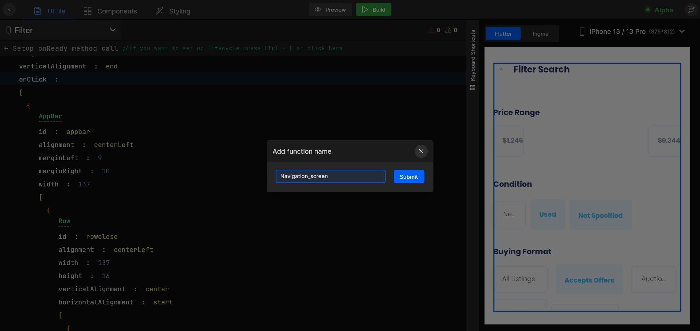
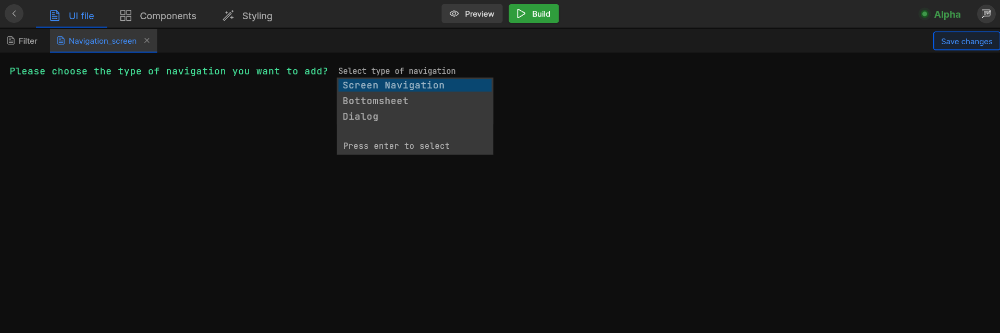
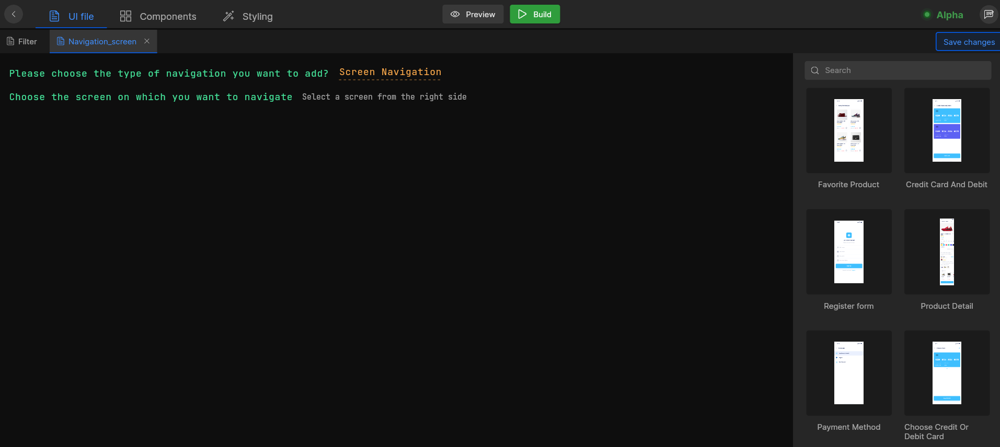
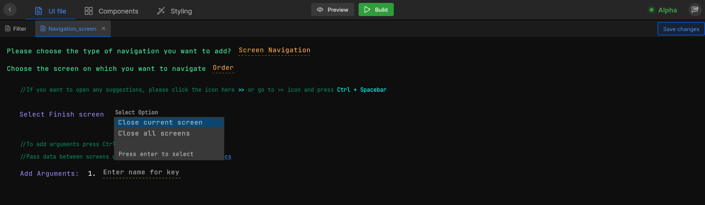
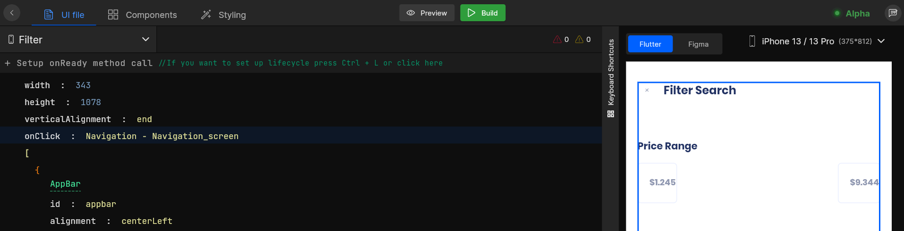
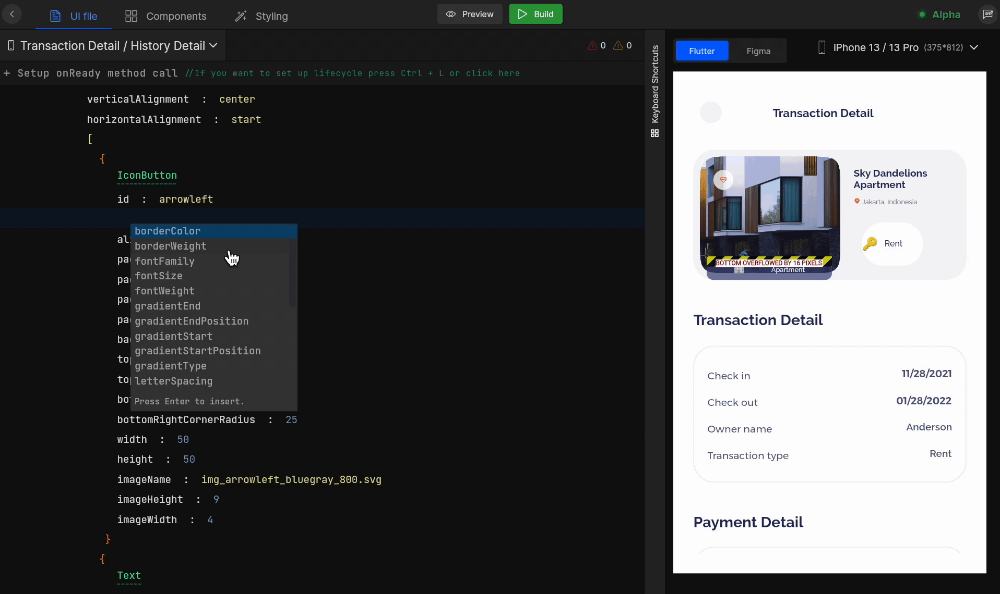

# Navigation

Navigation makes applications more interactive, which helps users navigate in, out, and across the app. Add such navigations to your Flutter app in few simple steps:
## Add Navigation
#### **Step 1:** 
Select the screen from the screen list on which you want to add the navigation action. 

#### **Step 2:** 
Next, go to the **widget** or **view component** you want to add navigation and add the `onClick` property and choose `Navigation` from the list, which will take you to the navigation setup screen.

As you choose **Navigation** action, firstly it will ask you to submit a proper function name for your Navigation action which will be generated for your screen code.

<!-- typewhiteonclick -->



#### **Step 3:** 
You will need to provide input for `Please choose the type of navigation you want to add` you want to perform, where you will have to add the type of Navigation, from the below supported types;

| Type | Description |
| --- | --- |
| **Dialog** | Open or navigate to a dialog  |
| **BottomSheet** | Open or navigate to a bottom sheet |
| **Back Navigation** | Navigate back to the previously visited screen |
| **Screen Navigation** | Navigate to a specifically selected screen from the app’s screen list |



#### **Step 4:** 
If you are selecting **Screen Navigation** you will be asked `Choose the screen on which you want to navigate `, select a screen you want to navigate to from the screens list on the right, you can also filter screen from **Dialog**, **BottomSheet**, and **Screens**.

Once your screen is selected, you will be asked to **Select Finish screen**.



#### **Step 5:** 
As you click on `Select Finish screen`  you will be asked to `Select Option` from the following:

| Type | Description |
| --- | --- |
| **Finish all screens** | All screens from the navigation stack will be removed  |
| **Finish current screen** | Only current screen will be removed from the navigation stack |



#### **Step 6:** 
Once your finish screen setup is done, save your changes by clicking on `Save changes` in the top right corner. 

At this stage, you have added Navigation to your application.



#### Generated code snippet

```js
Container(
  margin: getMargin(top: 1),
  child: Column(
      mainAxisSize: MainAxisSize.min,
      crossAxisAlignment:
          CrossAxisAlignment.start,
      mainAxisAlignment:
          MainAxisAlignment.start,
      children: [
        Align(
          alignment: Alignment.center,
          child: GestureDetector(
              onTap: () {
                  onTapImgHome();
              },
              child: Padding(
                padding: getPadding(
                  left: 4,
                  right: 3),
                child: CommonImageView(
                svgPath:
                    ImageConstant
                    .imgHome,
                    height:
                    getVerticalSize(
                    24.00),
                    width: getHorizontalSize(
                  21.00))))),
                  Padding(
                    padding: getPadding(top: 3),
                    child: Text("lbl_home".tr,
                    overflow: TextOverflow
                      .ellipsis,
                    textAlign:
                      TextAlign.left,
                    style: AppStyle
                      .txtRobotoRegular11
                      .copyWith()))
])),
```

```js
onTapImgHome() {
    Get.offNamed(AppRoutes.loginScreen);
  }
```

## Navigation with Arguments
Perform data sharing between screens, in a few simple steps, while navigating from one screen to the other.

#### **Step 1:** 
Pass data as an **argument** while navigating from one screen to another, press `Ctrl + Enter`. Next, add arguments where you need to `Enter name for key` which will be passed as an argument. The key is used as a **name** for an argument to declare it in your code.

#### **Step 2:** 
`Select argument type` here you need to select the type of argument you want to bind with navigation from the following:

| Type | Description |
| --- | --- |
| **API response** | Bind the response of an API used in an app  |
| **Navigation argument** | Bind an argument saved earlier  |
| **Constant** | Bind a constant from the app constants|

#### **Step 3:** 
If we go with **API response** you will be asked to `Select API` from the APIs available in your app. To know how to add new APIs to your project <a href="./add-apis-and-enviroment-variables">Click here</a>.

#### **Step 4:** 
Next, you need to `Select API response` for the selected API. Choose the response key to bind with your argument from the list. However, you can also bind multiple keys in your argument.

#### **Step 5:** 
Once you add an argument, save your changes by clicking on `Save changes` in the top right corner. 

:::info
If you want to add a new argument press `Ctrl + N`
::: 

At this stage, you have successfully added navigation with arguments to your application.


#### Generated code snippet


```js
class AppRoutes {
  static String loginPageScreen = '/login_page_screen';
  
  static String verifyOtpScreen = '/verify_otp_screen';

  static List<GetPage> pages = [
     GetPage(
      name: loginPageScreen,
      page: () => LoginPageScreen(),
      bindings: [
        LoginPageBinding(),
      ],
    ),
    
    GetPage(
      name: verifyOtpScreen,
      page: () => VerifyOtpScreen(),
      bindings: [
        VerifyOtpBinding(),
      ],
    ),
  ];
}
```

## Back Navigation

Navigate back to the previously visited screens of your app using **back navigation**.

#### **Step 1:** 
Select the screen from the screen list on which you want to add the action.

#### **Step 2:** 
Next, go to the **widget** or **view component** you want to add navigation and add the `onClick` property and choose `Back navigation` from the list. 

Now, it will take you to the navigation setup screen.

At this stage, you have successfully added back navigation by which you will be able to visit your previous screen.




#### Generated code snippet


```js
GestureDetector(
onTap: () {
  onTapImgArrowleft();
},
child: Padding(
    padding:
        getPadding(top: 4),
    child: CommonImageView(
        svgPath: ImageConstant.imgArrowleft,
        height: getVerticalSize(18.00),
        width:  getHorizontalSize(10.00)
    )
  )
)
```

```js
onTapImgArrowleft() {
    Get.back();
}
```