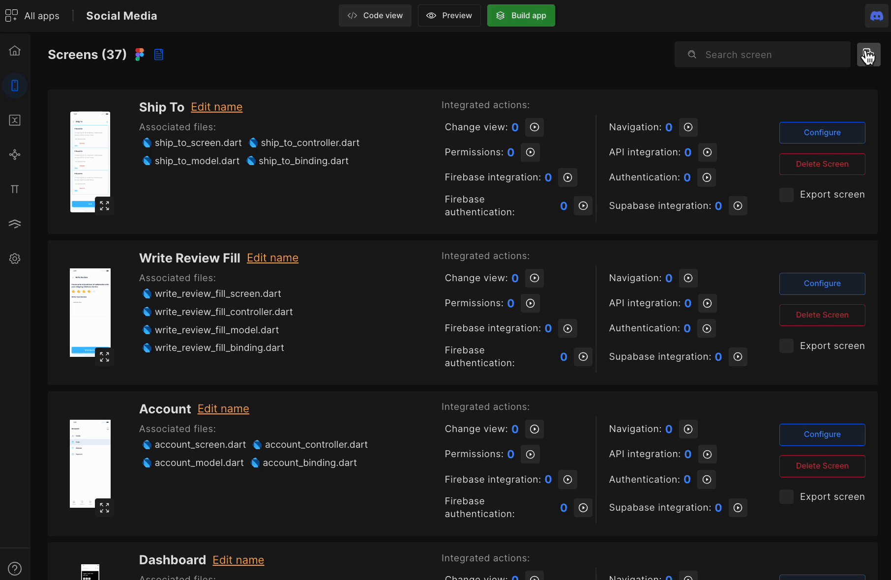

# Setup Splash Screen

The splash screen is the first screen that appears when the app launches. Easily set up your app's splash screen in DhiWise.
## How to setup splash screen

#### **Step 1:** 
On the screen list, click on the **Settings** ⚙️ available in the right corner.

#### **Step 2:** 
There you will have an option to set your splash screen. Simply click on <code className="primary">Change</code> beside the **Splash screen** option and a dialog box will appear where you need to select a screen from the screens listed and click on <code className="primary">Save & Close</code> to save the selected screen as your app’s splash screen.

 
 

Got a question? [**Ask here**](https://discord.com/invite/rFMnCG5MZ7).