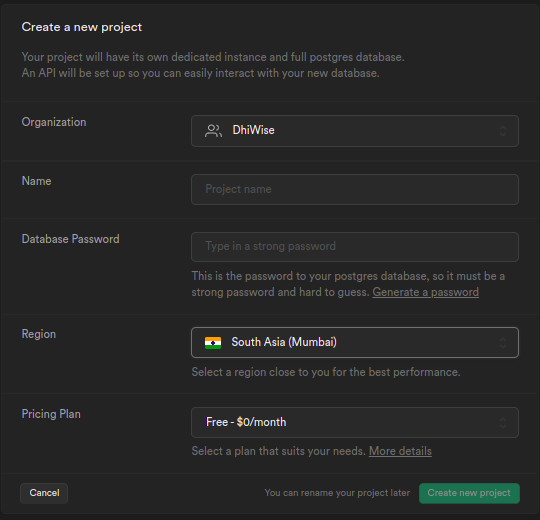
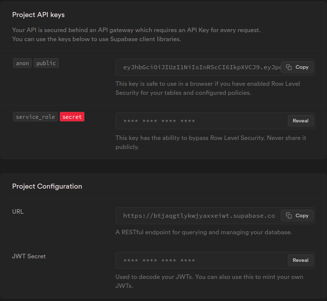

import select from "./img/select.png"
import create from "./img/create.png"
import check from "./img/check-mark.png"
import close from "./img/close.png"

# Supabase Integration
:::info
Currently, this feature is not available on <a href="https://app.dhiwise.com/sign-up" target="_blank">app.dhiwise.com.</a> Stay tuned!
:::

Supabase is an open-source Firebase alternative. With a Postgres Database, Authentication, instant APIs, Real-time subscriptions, and Storage, you can get started on your project. DhiWise supports easy Supabase integration in just 5 steps.


## **How to get the Auth key & URL?**

#### **Step 1:** 
Click on `Sign In`, and create a new account by authenticating with **GitHub**. If you already have an account go with `login`.

#### **Step 2:** 
From the Dashboard click on `New project` and select an organization. If you don’t have an organization then create one using `+ New organization`

- Give your Supabase project a `name`.
- Enter a secure `Database Password`.
- Choose the `region` where your app's backend is hosted.
- Click `Create new project`.



#### **Step 3:** 
Once your project is created you can access the API Key and URL string, Or if you already have an account go to your `organization-> app-> settings-> API`.



## **Working with Data**

  <div className="grid-cols-3 grid gap-20">
    <a href="#select-records" className="Card bigImg">
      
      <h4>
          Select
      </h4>
      <p>Used when want to fetch your data from Supabase.</p>
    </a>
    <a href="#create-records" className="Card bigImg">
      
      <h4 className="">
        Create
      </h4>
      <p>Used when you want to upload your data on Supabase.</p>
    </a>
  </div>   
  <br/>

### Select records

:::note
You must have the Supabase auth key and URL. To know how to get one <a href="/docs/flutter/supabase-integration#how-to-get-the-auth-key--url">click here</a>. 
:::


#### **Step 1:** 
Select the screen from the screen list on which you want to intregate Supabase.


#### **Step 2:** 
Next, go to the view you want to add Integration, and from the suggestion box for the `onClick` property, choose `Supabase integration`, which will take you to the Integration screen. Where you will be asked to `Enter function name`. Enter the name of your function and click `Submit`.

<!-- typewhiteonclick -->

#### **Step 3:** 
After submitting the function name, you will be asked to select a type of Supabase integration. To retrieve data from Supabase, choose `select`.


#### **Step 4:** 
Select a collection from list of collections in `Please select a collection you want to use`, which are available in your supabase application.

#### **Step 5:** 
`Please select a type of record you want to use` 

| Type | Description |
| --- | --- |
| **Single**  | Used to fetch a single record from the database.  |
| **Multiple** | Used to fetch multiple records from the database. |

:::info
For Multiple type, you need to set `data limit`, `order by`, and `order`
:::

#### **Step 6:** 
You can `Handle request` inputs in four ways:

Select operator for comparison before moving forward.

| Type | Description |
| --- | --- |
| **View** | Select any component from your app design. |
| **Constant** | Select a constant you've created in your app. <a href="/docs/flutter/add-app-constants">Learn more</a> |
| **Get from preference** | Select from stored data preference from API integration. |
| **Navigation argument** | Select data that's been passed from one screen to another. <a href="/docs/flutter/navigation#navigation-with-arguments">Learn more</a>  |

:::info
Directly retrieve the data by connecting your view component to your cloud database.
**For instance**, If you handle the request using `view`, you will be asked to select a view from your application screen available on the right-hand side.
:::

#### **Step 7:** 
`Handle response` 

| Type | Description |
| --- | --- |
| **View** | Select any component from your app design. |
| **Save to preference** | Storing the data to preference. |

#### **Select 8:** 
`Handle action` Select the action you wish to take, once the Supabase call has either been accepted successfully or refused due to a mistake.
<div className="grid-cols-3 grid gap-20">
    <div className="card successCard">
      <h4 className="flex items-center">
        <div className="cardIcon">
          
        </div>
          On success
      </h4>
      <p>1. <a href="/docs/flutter/show-alert">Show alert</a>
      <br/>
      2. <a href="/docs/flutter/navigation">Navigation</a></p>
    </div>
    <div className="card errorCard">
      <h4 className="flex items-center">
        <div className="cardIcon" style={{width:"14px"}}>
          
        </div>
          On error
      </h4>
      <p>
      1. <a href="/docs/flutter/show-alert">Show alert</a>
      <br/>
      2. <a href="/docs/flutter/navigation">Navigation</a></p>
    </div>
  </div>   

#### **Step 9:** 
At this stage, you have Supabase added to your application to fetch records!

:::tip Example 
Suppose you want to fetch records from Supabase and populate the item list. Here you can integrate Supabase as discussed above and can bind the response with your list view.
:::


<!--  -->


#### Generated code snippet


```js
class AppRoutes {
  static String loginPageScreen = '/login_page_screen';
  
  static String verifyOtpScreen = '/verify_otp_screen';

  static List<GetPage> pages = [
     GetPage(
      name: loginPageScreen,
      page: () => LoginPageScreen(),
      bindings: [
        LoginPageBinding(),
      ],
    ),
    
    GetPage(
      name: verifyOtpScreen,
      page: () => VerifyOtpScreen(),
      bindings: [
        VerifyOtpBinding(),
      ],
    ),
  ];
}
```

<br/>

### Create records

:::caution
You must have the Supabase auth key and URL. To know how to get one <a href="/docs/flutter/supabase-integration#how-to-get-the-auth-key--url" classname = "highlight">click here</a>. 
:::

#### **Step 1:** 
Choose the screen you wish to integrate Supabase for, from the list of screens.

#### **Step 2:** 
Next, switch to the widget you want to add Integration, and on the `onClick` property, choose `Supabase integration`, which will take you to its integration screen, where you will be asked to **Enter function name** which will be generated in the code. Enter the name for it and click <code className="primary">Submit</code>.

<!-- typewhiteonclick -->
#### **Step 3:** 
After submitting the function name, you will be asked to select a type of Supabase integration. To retrieve data from Supabase, choose to `Create`.

#### **Step 4:** 
Next, select the collection you want to bind from the listed collection for **Please select collection**. A list of collections available with your Supabase account will be displayed in the list. 

#### **Step 5:** 
Select the type of value you want to integrate from **Single** or **Multiple** types.


<!--  -->

#### **Step 6:** 
Now, you will be redirected to API Integration screen, where you can set handle request, and response data.

:::info
Refer: <a href="/docs/flutter/api-integration">API Integration</a> to know more about how to integrate an API.
:::

For handle request below types are supported which can be bind with response;

| Type | Description |
| --- | --- |
| **View** | Select any component from your app design. |
| **Constant** | Select a constant you've created in your app. <a href="/docs/flutter/add-app-constants">Learn more</a>|
| **Get from preference** | Select from stored data preference from API integration. |
| **Navigation argument** | Select data that's been passed from one screen to another. <a href="/docs/flutter/navigation#navigation-with-arguments">Learn more</a> |

#### **Select 7:** 
For  `Handle action` select the action you wish to take, once the Supabase call has either been executed successfully or not.

<div className="grid-cols-3 grid gap-20">
    <div className="card successCard">
      <h4 className="flex items-center">
        <div className="cardIcon">
          
        </div>
          On success
      </h4>
      <p>1. <a href="/docs/flutter/show-alert">Show alert</a>
      <br/>
      2. <a href="/docs/flutter/navigation">Navigation</a></p>
    </div>
    <div className="card errorCard">
      <h4 className="flex items-center">
        <div className="cardIcon" style={{width:"14px"}}>
          
        </div>
          On error
      </h4>
      <p>
      1. <a href="/docs/flutter/show-alert">Show alert</a>
      <br/>
      2. <a href="/docs/flutter/navigation">Navigation</a></p>
    </div>
  </div>  
  <br/>


At this stage, you have Supabase added to your application to fetch records!

<br/>
<br/>

Got a question? [**Ask here**](https://discord.com/invite/rFMnCG5MZ7).