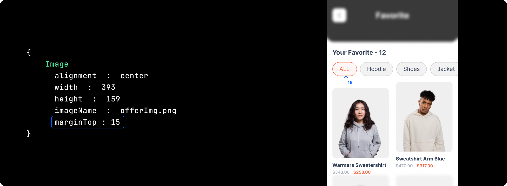

import navigationImg from "../img/navigation.png"

# Margin Top

## Definition and Usage

The `marginTop` property sets the top margin of an element.

:::caution Note

Negative values are not permitted.

:::
 


## Syntax
```js"
marginTop : number
```

## Attribute Values


<table className="table-key keyboardKey">
  <thead>
    <tr>
      <th>Value</th>
      <th>Description</th>
    </tr>
  </thead>
  <tbody>
    <tr>
      <td>number</td>
      <td>Value for marginTop should be in pixels.</td>
    </tr>
  </tbody>
</table>


<br/>
<br/>

 Got a question? [**Ask here**](https://discord.com/invite/rFMnCG5MZ7).