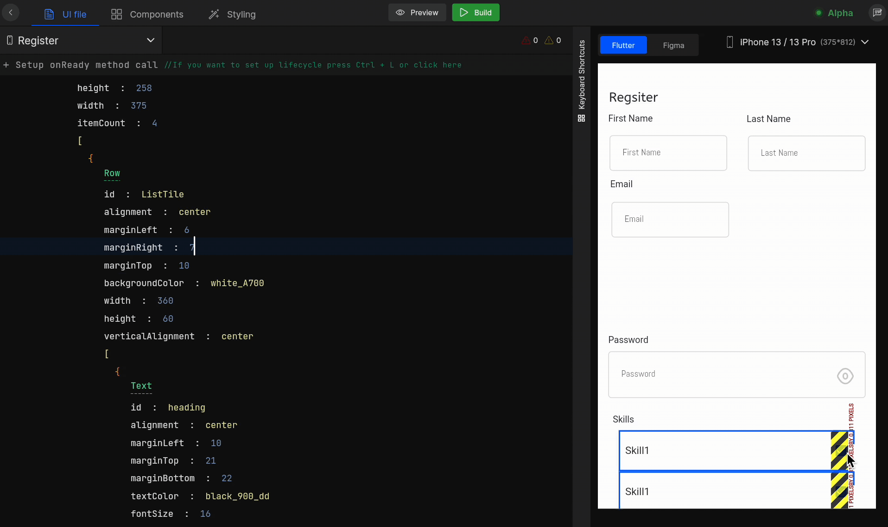

# Resolve Overflow Issues

While designing Flutter UI, one of the most common issues faced is the overflow issue. 

## **What is the overflow issue?**

Overflow occurs when a widget is not able to set itself in the available space on the screen. So it flows out of the screen and is represented with yellow and black striped lines with a message of how and what to fix.

While live rendering screens in DhiWise Flutter builder, overflow issues are being faced. Commonly faced issues from them are mentioned in this document along with their possible solutions. Refer to below to get an idea about how you can resolve them.

:::info
Human designing behaviours which can be designed or solved by viewing them are maybe not be identified in your design. But you can easily fix them right here only.
:::

## **Design Mistakes**

While designing the application UI, if there are some mistakes made while designing in Figma, then it will not fit properly into the design and will result in overflow issues.

To avoid such mistakes follow the <a href="/docs/Designguidelines/intro">design guidelines</a> to design better UI.

<!--  -->

## **Device Resolutions**

Overflow issues are also caused due to the wrong viewport selection. If the design is done for a specific device and if it is rendered on some other device while making the changes in Smart Editor, it will result into overflow issue.
<!-- 
 -->

## **Horizontal overflow issue**

The most commonly faced overflow issue in Flutter is the horizontal overflow issue. It occurs due to the following possible reasons;

<!--  -->
### Horizontal scroll

Sometimes it may happen that the items of a horizontal scroll flow out of the Row, or possible that the horizontal scroll may have not been identified properly. So as a result the item widgets cannot place themselves in the available space.

:::note
Make the Row scrollable if you think you have a **lengthy layout** that might overflow in some screen sizes.
:::

To solve this issue, you can wrap this item into a **Horizontal scroll** widget, so it can provide a space where they are properly fitted into it.

## **Vertical overflow issue**

The most commonly faced overflow issue in Flutter is the vertical overflow issue. It occurs due to the following possible reasons;

<!--  -->
### Vertical scroll

Sometimes it may happen that the items of a vertical scroll flow out of the Column, or possible that the vertical scroll may have not been identified properly. So as a result the item widgets cannot place themselves in the available space.

:::note
Make the Column scrollable if you think you have a **lengthy layout** that might overflow in some screen sizes.
:::

A vertical scroll should be used to wrap the components to avoid the overflow issue for vertical scroll cases.

## **Margin and Padding** 

The overflow from the left and right of the screen occurs when proper margin and padding are missing for the widgets.

Provide the required margin and padding to the widgets so they can fit properly in the design.

<!--  -->

 
 

Got a question? [**Ask here**](https://discord.com/invite/rFMnCG5MZ7).
