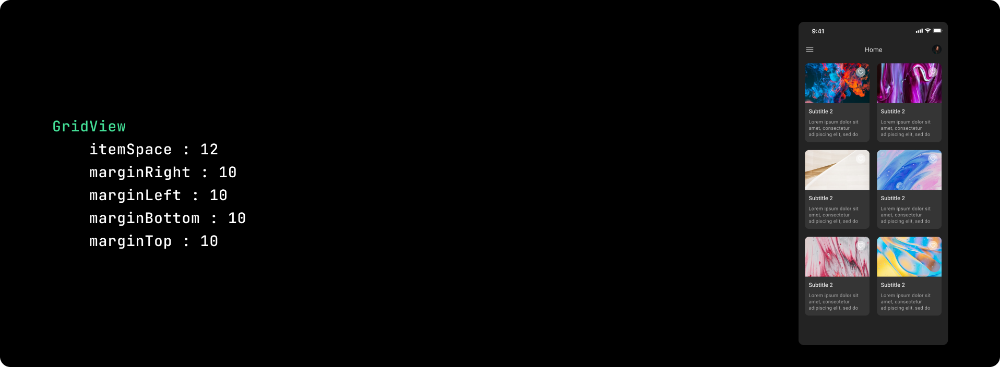
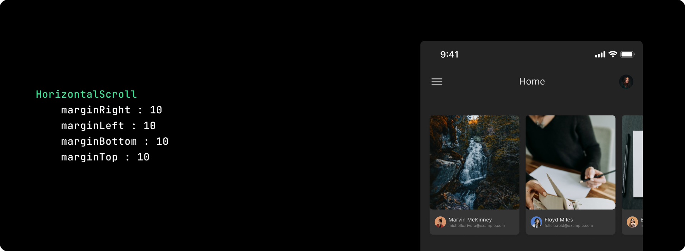
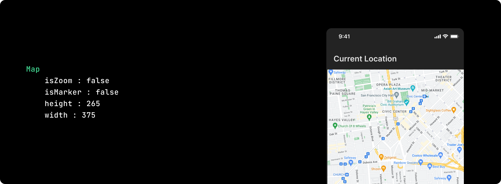
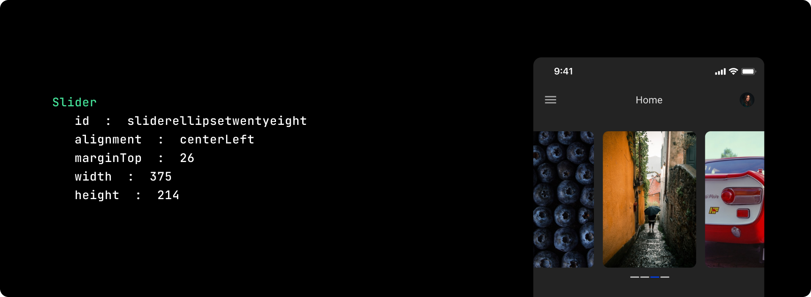

import Tabs from '@theme/Tabs';
import TabItem from '@theme/TabItem';
import navigationImg from "./img/navigation.png"

# Supported Widgets
You can quickly make changes to your design with Smart Editor. After downloading designs from Figma, you may immediately start building an app. If your Figma design requires any changes, you can instantly make them and they will be automatically incorporated into your code. You may also easily add and remove items from your design. Smart Editor provides support for the following widgets.

## Global Attributes
<table className="table-key table-key-link">
  <thead>
    <tr>
      <th>Attribute</th>
      <th>Description</th>
    </tr>
  </thead>
  <tbody>
    <tr>
      <td><a href="/docs/flutter/ui-customisation/globalproperties/height">height</a></td>
      <td>The <kbd>height</kbd> attribute specifies the height of the element, in pixels</td>
    </tr>
    <tr>
      <td><a href="/docs/flutter/ui-customisation/globalproperties/width">width</a></td>
      <td>The <kbd>width</kbd> attribute specifies the width of the element, in pixels.</td>
    </tr>
    <tr>
      <td><a href="/docs/flutter/ui-customisation/globalproperties/margin-left">marginLeft</a></td>
      <td>The <kbd>marginLeft</kbd> property sets the left margin of an element, in pixels.</td>
    </tr>
    <tr>
      <td><a href="/docs/flutter/ui-customisation/globalproperties/margin-right">marginRight</a></td>
      <td>The <kbd>marginRight</kbd> property sets the right margin of an element, in pixels.</td>
    </tr>
    <tr>
      <td><a href="/docs/flutter/ui-customisation/globalproperties/margin-top">marginTop</a></td>
      <td>The <kbd>marginTop</kbd> property sets the top margin of an element, in pixels.</td>
    </tr>
    <tr>
      <td><a href="/docs/flutter/ui-customisation/globalproperties/margin-bottom">marginBottom</a></td>
      <td>The <kbd>marginBottom</kbd> property sets the bottom margin of an element, in pixels.</td>
    </tr>
  </tbody>
</table>

## AppBar
It is the topmost widget. The toolbar and various other typical action buttons are frequently found in the AppBar, which is normally the uppermost component of the app (or sometimes the bottommost). 

A widget or a set of widgets makes up every component in a flutter application. AppBar is a built-in class or widget in a flutter that provides AppBar capabilities out of the box.

<table className="table-key">
  <thead>
    <tr>
      <th>Attribute</th>
      <th>Description</th>
    </tr>
  </thead>
  <tbody>
    <tr>
      <td>color </td>
      <td>Select the color for the element, specified using HEX values.</td>
    </tr>
  </tbody>
</table>

## AutoCompleteTextField
A widget that allows the you to make a selection by **inputting some text and selecting from a set of possible solutions.**

<table className="table-key">
  <thead>
    <tr>
      <th>Attribute</th>
      <th>Description</th>
    </tr>
  </thead>
  <tbody>
    <tr>
      <td>color </td>
      <td>Select the color for the element, specified using HEX values.</td>
    </tr>
    <tr>
      <td>hintText</td>
      <td>Defines a text that suggests what sort of input the field accepts.</td>
    </tr>
    <tr>
      <td>hintTextColor</td>
      <td>Defines the color of hintText, specified using HEX va</td>
    </tr>
    <tr>
      <td>fontSize</td>
      <td>Defines the text's font size in pixels.</td>
    </tr>
  </tbody>
</table>

## BottomBar
A bottom bar is a widget that is **present at bottom of the app.**

It displays a row of small widgets which are used to **navigate between different pages** of the app.

<table className="table-key">
  <thead>
    <tr>
      <th>Attribute</th>
      <th>Description</th>
    </tr>
  </thead>
  <tbody>
    <tr>
      <td>paddingLeft</td>
      <td>Specifies the left space between its content and its border.</td>
    </tr>
    <tr>
      <td>paddingRight</td>
      <td>Specifies the right space between its content and its border.</td>
    </tr>
    <tr>
      <td>paddingTop</td>
      <td>Specifies the top space between its content and its border.</td>
    </tr>
    <tr>
      <td>paddingBottom</td>
      <td>Specifies the bottom space between its content and its border.</td>
    </tr>
  </tbody>
</table>

## Button
Buttons are **graphical control elements** that allow a you to perform tasks such as executing actions, making decisions, looking for items, and so on. 

They can be used in any part of our user interface, including dialogues, forms, cards, toolbars, and so on.

<table className="table-key">
  <thead>
    <tr>
      <th>Attribute</th>
      <th>Description</th>
    </tr>
  </thead>
  <tbody>
    <tr>
      <td>color </td>
      <td>Select the background color for the element, specified using HEX values.</td>
    </tr>
    <tr>
      <td>text</td>
      <td>Specifies the text to be displayed on the button.</td>
    </tr>
    <tr>
      <td>textColor</td>
      <td>Select the text color, specified using HEX values.</td>
    </tr>
    <tr>
      <td>fontSize</td>
      <td>Enter the text's font size in pixels.</td>
    </tr>
    <tr>
      <td>bottomRightRadius</td>
      <td>Define the Bottom Right radius, in pixels.</td>
    </tr>
    <tr>
      <td>bottomLeftRadius</td>
      <td>Define the Bottom Left radius, in pixels.</td>
    </tr>
    <tr>
      <td>topRightRadius</td>
      <td>Define the Top Right radius, in pixels.</td>
    </tr>
    <tr>
      <td>topLeftRadius</td>
      <td>Define the Top Left radius, in pixels..</td>
    </tr>
    <tr>
      <td>paddingLeft</td>
      <td>Specifies the left space between its content and its border.</td>
    </tr>
    <tr>
      <td>paddingRight</td>
      <td>Specifies the right space between its content and its border.</td>
    </tr>
    <tr>
      <td>paddingTop</td>
      <td>Specifies the top space between its content and its border.</td>
    </tr>
    <tr>
      <td>paddingBottom</td>
      <td>Specifies the bottom space between its content and its border.</td>
    </tr>
  </tbody>
</table>

## Calendar
**Displays a calendar of days** for a specific month and lets you choose a day.

The days are laid out in a rectangular grid, with one column for each day of the week. There are controls to adjust the year and month that the grid displays.

## Card

A card is a piece of material used to **represent a group of connected items**, such as an album, a geographical location, a meal, contact information, and so on.

## Checkbox
A checkbox is a **graphical widget that allows you to make a binary** decision, that is, a decision between two mutually exclusive possibilities.

<table className="table-key">
  <thead>
    <tr>
      <th>Attribute</th>
      <th>Description</th>
    </tr>
  </thead>
  <tbody>
    <tr>
      <td>Color  </td>
      <td>Select the background color for the element, specified using HEX values.</td>
    </tr>
    <tr>
      <td>text</td>
      <td>Specifies the text displayed beside the checkbox.</td>
    </tr>
    <tr>
      <td>textColor</td>
      <td>Select the text color, specified using HEX values.</td>
    </tr>
    <tr>
      <td>fontSize</td>
      <td>Defines the text’s font size, in pixels.</td>
    </tr>
  </tbody>
</table>

## CircleImageView
A circular image view is commonly used for displaying an avatar or profile pic.

In Flutter, a widget named CircleImage is used for **creating circular image views** this can be used for circular profile pictures and similar cases.

## Column
A Column is a widget used to **display child widgets in a vertical manner**.

If you want multiple widgets to be displayed in the same vertical column, this is the widget to use.

They run from top to bottom.

<table className="table-key keyboardKey">
  <thead>
    <tr>
      <th>Attribute</th>
      <th>Description</th>
    </tr>
  </thead>
  <tbody>
    <tr>
      <td>Color  </td>
      <td>Select the background color for the element, specified using HEX values.</td>
    </tr>
    <tr>
      <td>verticalAligment</td>
      <td>The vertical-align property defines the vertical alignment of an element. 
<kbd>verticalAligment : center|spaceBetween|spaceEvenly|start|end</kbd></td>
    </tr>
    <tr>
      <td>horizontalAligment</td>
      <td>The vertical-align property defines the vertical alignment of an element. 
<kbd>horizontalAligment : center|spaceBetween|spaceEvenly|start|end</kbd></td>
    </tr>
  </tbody>
</table>

## Dialog
The dialogue is a type of a **widget that appears on the window or screen and might ask for a decision** or include any important information.

The moment a dialogue box appears, all other functions are disabled until you either close it or respond. 

<table className="table-key keyboardKey">
  <thead>
    <tr>
      <th>Attribute</th>
      <th>Description</th>
    </tr>
  </thead>
  <tbody>
    <tr>
      <td>Color  </td>
      <td>Select the background color for the element, specified using HEX values.</td>
    </tr>
  </tbody>
</table>

## Drawer
You can **browse various pages of the application** using Flutter's navigation drawer.

It is a sliding left menu that, when displayed, takes up half of the screen and typically contains the application's most crucial links.

It may be accessed by either using the swipe gesture or the menu icon in the app bar.

## Dropdown
A dropdown button allows you to **choose from a list of options**. The button displays the presently chosen item as well as an arrow that leads to a menu where you can pick another item.

<table className="table-key keyboardKey">
  <thead>
    <tr>
      <th>Attribute</th>
      <th>Description</th>
    </tr>
  </thead>
  <tbody>
    <tr>
      <td>hintText</td>
      <td>Defines a text that suggests what sort of input the field accepts.</td>
    </tr>
    <tr>
      <td>hintTextColor</td>
      <td>Defines the color of hintText, specified using HEX values.</td>
    </tr>
    <tr>
      <td>fontSize</td>
      <td>Defines the text's font size in pixels.</td>
    </tr>
  </tbody>
</table>

## TextField
We often use EditText in our applications in order **to provide an input or text field, especially in forms.**

<table className="table-key keyboardKey">
  <thead>
    <tr>
      <th>Attribute</th>
      <th>Description</th>
    </tr>
  </thead>
  <tbody>
    <tr>
      <td>hintText</td>
      <td>Defines a text that suggests what sort of input the field accepts.</td>
    </tr>
    <tr>
      <td>hintTextColor</td>
      <td>Defines the color of hintText, specified using HEX values.</td>
    </tr>
    <tr>
      <td>fontSize</td>
      <td>Defines the text's font size in pixels.</td>
    </tr>
     <tr>
      <td>paddingLeft</td>
      <td>Specifies the left space between its content and its border.</td>
    </tr>
     <tr>
      <td>paddingRight</td>
      <td>Specifies the right space between its content and its border.</td>
    </tr>
     <tr>
      <td>paddingTop</td>
      <td>Specifies the top space between its content and its border.</td>
    </tr>
     <tr>
      <td>paddingBottom</td>
      <td>Specifies the bottom space between its content and its border.</td>
    </tr>
  </tbody>
</table>

## FloatingActionButton
A floating action button(Fab) is a **circular button that hovers over content** to promote a main action in the app.

## FloatingTextField
When the input field is empty and unfocused, the **label is displayed on top of the input field**.

When the input field receives focus, the label moves above, either vertically adjacent to, or to the center of the input field.

<table className="table-key keyboardKey">
  <thead>
    <tr>
      <th>Attribute</th>
      <th>Description</th>
    </tr>
  </thead>
  <tbody>
    <tr>
      <td>hintText</td>
      <td>Defines a text that suggests what sort of input the field accepts.</td>
    </tr>
    <tr>
      <td>hintTextColor</td>
      <td>Defines the color of hintText, specified using HEX values.</td>
    </tr>
    <tr>
      <td>fontSize</td>
      <td>Defines the text's font size in pixels.</td>
    </tr>
  </tbody>
</table>

## Grid
GridView is a Flutter widget that **displays objects in a 2-D array** (two-dimensional rows and columns).

It will be used to display objects in a Grid, as the name implies. By tapping on the desired item in the grid list, we can select it.

<table className="table-key keyboardKey">
  <thead>
    <tr>
      <th>Attribute</th>
      <th>Description</th>
    </tr>
  </thead>
  <tbody>
    <tr>
      <td>itemSpace</td>
      <td>Specifies the space between the desired item, in pixels</td>
    </tr>
  </tbody>
</table>

## HorizontalScroll
A horizontal scroll bar makes it possible for you to **scroll the content of a window to the left or right.**

## IconButton
Flutter IconButton works similarly to a button, but with an icon instead of a button. 
## ImageView
You can **modify image attributes** like width, height, margin-top, margin-bottom, margin-left, and margin-right using the image property.

You just need to select the image on your screen and you will be redirected to the image property where you can modify your image size and margin.

## Line
A thin horizontal line, with padding on either side. In the material design language, this **represents a divider.**

Dividers can be used in lists, Drawers, and elsewhere to separate content.

<table className="table-key keyboardKey">
  <thead>
    <tr>
      <th>Attribute</th>
      <th>Description</th>
    </tr>
  </thead>
  <tbody>
    <tr>
      <td>Color</td>
      <td>Select the color for the element, specified using HEX values.</td>
    </tr>
  </tbody>
</table>

## List
The most popular elements of any web or mobile application are lists. 

It is a **group of objects** which can be vertical or horizontal. 

<table className="table-key keyboardKey">
  <thead>
    <tr>
      <th>Attribute</th>
      <th>Description</th>
    </tr>
  </thead>
  <tbody>
    <tr>
      <td>Orentation</td>
      <td>Specifies List’s orientation values. <kbd>orientation : Vertical|Horizontal</kbd></td>
    </tr>
    <tr>
      <td>itemSpace</td>
      <td>Specifies the space between the desired item, in pixels.</td>
    </tr>
  </tbody>
</table>

## Map
A Map widget is used for **integrating google maps** into your app.

<table className="table-key keyboardKey">
  <thead>
    <tr>
      <th>Attribute</th>
      <th>Description</th>
    </tr>
  </thead>
  <tbody>
    <tr>
      <td>isZoom</td>
      <td> If the widget for the map allows zooming, it will be indicated by the  <kbd>isZoom : true </kbd>attribute. 
      <kbd>isZoom : true|false</kbd></td>
    </tr>
    <tr>
      <td>isMarker</td>
      <td>The isMarker attribute defines whether the Map’s marker should be visible or not at certain coordinated points. <kbd>isMarker : true|false</kbd></td>
    </tr>
  </tbody>
</table>

## OTPView
Used for a specific purpose, such as when **one-time password verification** is necessary.

<table className="table-key keyboardKey">
  <thead>
    <tr>
      <th>Attribute</th>
      <th>Description</th>
    </tr>
  </thead>
  <tbody>
    <tr>
      <td>totalCount</td>
      <td>Defines the number of views. </td>
    </tr>
  </tbody>
</table>

## Pager
The Pager widget helps you to **switch between different screens** in their flutter app.

This is a page-by-page scrollable list.

## PagerIndicator
Flutter Pager indications are the dots that appear at the top or bottom of the mobile screen. The number of **pages in a series is indicated by pager indicators**, which also indicate which page is presently being displayed.

<table className="table-key keyboardKey">
  <thead>
    <tr>
      <th>Attribute</th>
      <th>Description</th>
    </tr>
  </thead>
  <tbody>
    <tr>
      <td>indicatorHeight</td>
      <td>Sets the indicator height, in pixels.</td>
    </tr>
    <tr>
      <td>indicatorWidth</td>
      <td>Sets the indicator width, in pixels.</td>
    </tr>
    <tr>
      <td>totalCount</td>
      <td>Sets the count of pages in series</td>
    </tr>
  </tbody>
</table>

## Radio
A radio button, often known as an **options button**, is a button that **stores a Boolean value**. 

It lets you to select only one option from a list of possibilities.

<table className="table-key keyboardKey">
  <thead>
    <tr>
      <th>Attribute</th>
      <th>Description</th>
    </tr>
  </thead>
  <tbody>
    <tr>
      <td>color </td>
      <td>Select the background color for the element, specified using HEX values.</td>
    </tr>
    <tr>
      <td>text</td>
      <td>Specifies the text to be displayed.</td>
    </tr>
    <tr>
      <td>textColor</td>
      <td>Select the text color, specified using HEX values.</td>
    </tr>
    <tr>
      <td>fontSize</td>
      <td>Enter the text's font size in pixels.</td>
    </tr>
    <tr>
      <td>orientation</td>
      <td>Specifies List’s orientation values. <kbd>orientation : Vertical|Horizontal</kbd></td>
    </tr>
  </tbody>
</table>

## RatingBar
The Rating Bar, as the name suggests, is used to **rate content** within the app.

As a rating bar/indicator item, any widget can be utilized.

It allows for a vertical arrangement also.

You have the option of setting a minimum and maximum rating.

<table className="table-key keyboardKey">
  <thead>
    <tr>
      <th>Attribute</th>
      <th>Description</th>
    </tr>
  </thead>
  <tbody>
    <tr>
      <td>selectedCount</td>
      <td>Displays the rating's selected count.</td>
    </tr>
    <tr>
      <td>totalCount</td>
      <td>Specifies the rating's total count.</td>
    </tr>
  </tbody>
</table>

## Row
A widget that displays its **children in a horizontal array**.

If you want multiple widgets to be displayed in the same horizontal row, this is the widget to use.

They run from left to right.

<table className="table-key keyboardKey">
  <thead>
    <tr>
      <th>Attribute</th>
      <th>Description</th>
    </tr>
  </thead>
  <tbody>
    <tr>
      <td>Color </td>
      <td>Select the color for the element, specified using HEX values.</td>
    </tr>
    <tr>
      <td>verticalAligment</td>
      <td>The vertical-align property defines the vertical alignment of an element. <kbd>verticalAligment : center|spaceBetween|spaceEvenly|start|end</kbd></td>
    </tr>
    <tr>
      <td>horizontalAligment</td>
      <td>The horizontal-align property defines the horizontal alignment of an element. <kbd>horizontalAligment : center|spaceBetween|spaceEvenly|start|end</kbd></td>
    </tr>
    <tr>
      <td>Alignment</td>
      <td>The alignment property defines the alignment of an element. <kbd>Alignment : center|spaceBetween|spaceEvenly|start|end</kbd></td>
    </tr>
  </tbody>
</table>

## ScrollView
Slivers are used to **generate custom scroll effects** in this ScrollView.

<table className="table-key keyboardKey">
  <thead>
    <tr>
      <th>Attribute</th>
      <th>Description</th>
    </tr>
  </thead>
  <tbody>
    <tr>
      <td>indicatorHeight</td>
      <td>Sets the indicator height, in pixels.</td>
    </tr>
    <tr>
      <td>indicatorWidth</td>
      <td>Sets the indicator width, in pixels.</td>
    </tr>
    <tr>
      <td>totalCount</td>
      <td>Sets  the count of pages in series</td>
    </tr>
  </tbody>
</table>

## SearchView
Even though you have a big number of things, finding a specific item from the list is tough. As a result, we make it simple to construct search views. 

Search view widgets provide an edit area where you can add any term and then filter out the list based on the input word.

<table className="table-key keyboardKey">
  <thead>
    <tr>
      <th>Attribute</th>
      <th>Description</th>
    </tr>
  </thead>
  <tbody>
    <tr>
      <td>color </td>
      <td>Select the color for the element, specified using HEX values.</td>
    </tr>
    <tr>
      <td>hintText</td>
      <td>Defines a text that suggests what sort of input the field accepts.</td>
    </tr>
    <tr>
      <td>hintTextColor</td>
      <td>Defines the color of hintText, specified using HEX values.</td>
    </tr>
    <tr>
      <td>fontSize</td>
      <td>Defines the text's font size in pixels.</td>
    </tr>
  </tbody>
</table>

## SeekBar
In Flutter, a SeekBar is a material design widget that allows you to **select a range of values**.

A SeekBar is **an extension of ProgressBar that adds a draggable thumb.**

With a SeekBar, you can choose from a continuous or discrete collection of values.

<table className="table-key keyboardKey">
  <thead>
    <tr>
      <th>Attribute</th>
      <th>Description</th>
    </tr>
  </thead>
  <tbody>
    <tr>
      <td>percentage</td>
      <td>Specifies how much of the task has been completed.</td>
    </tr>
    <tr>
      <td>endRange</td>
      <td>Sets the end range.</td>
    </tr>
    <tr>
      <td>startRange</td>
      <td>Sets the start range.</td>
    </tr>
  </tbody>
</table>

## Slider
The Slider is **a slideshow for cycling through a series of content.**

It provides a straightforward recycler-like structure by working within a Motion Layout.

<table className="table-key">
  <thead>
    <tr>
      <th>Attribute</th>
      <th>Description</th>
    </tr>
  </thead>
  <tbody>
    <tr>
      <td>Color  </td>
      <td>Select the background color for the element, specified using HEX values.</td>
    </tr>
  </tbody>
</table>

## Stack
Stack is a widget with children that are positioned relative to the box's edges. 

This widget is super useful if you want to easily **overlap** multiple children, such as having some text and an image overlaid with a gradient and a button at the bottom.

## StaggeredGrid
Staggered Grid View is a **layout for displaying data** in a grid format.

It is made up of containers that are arranged in rows and columns of various sizes.

<table className="table-key keyboardKey">
  <thead>
    <tr>
      <th>Attribute</th>
      <th>Description</th>
    </tr>
  </thead>
  <tbody>
    <tr>
      <td>itemSpace</td>
      <td>Specifies the space between the desired item, in pixels</td>
    </tr>
  </tbody>
</table>

## Switch
A switch is a **two-state user interface** element that can be toggled between ON (Checked) and OFF (Unchecked).

It's a button with a thumb slider that you can move back and forth to select an ON or OFF option.

## Tab
It is used to **switch between multiple child views** using interactive user interface elements.

The tabs are mostly used for navigating on mobile devices.

## Text
The text property allows you to **modify the text** along with **styles** such as colors, size, weight, letter spacing, margin, and many others.

If you want to edit your text, all you have to do is select the text element on the screen and you'll be redirected to the property for that text, where you can change the properties that are already there and even add new ones.

<table className="table-key keyboardKey">
  <thead>
    <tr>
      <th>Attribute</th>
      <th>Description</th>
    </tr>
  </thead>
  <tbody>
    <tr>
      <td>letterSpace</td>
      <td>Specifies the text that will be displayed.</td>
    </tr>
    <tr>
      <td>text</td>
      <td>Specifies the text that will be displayed.</td>
    </tr>
    <tr>
      <td>color</td>
      <td>Select the color for the element, specified using HEX values.</td>
    </tr>
    <tr>
      <td>fontSize</td>
      <td>Defines the text's font size in pixels.</td>
    </tr>
    <tr>
      <td>fontWeight</td>
      <td>Set the font weight for the element.</td>
    </tr>
  </tbody>
</table>

## WebView
This plugin is used in the Flutter application to **display web pages.**

 
 

Got a question? [**Ask here**](https://discord.com/invite/rFMnCG5MZ7).
