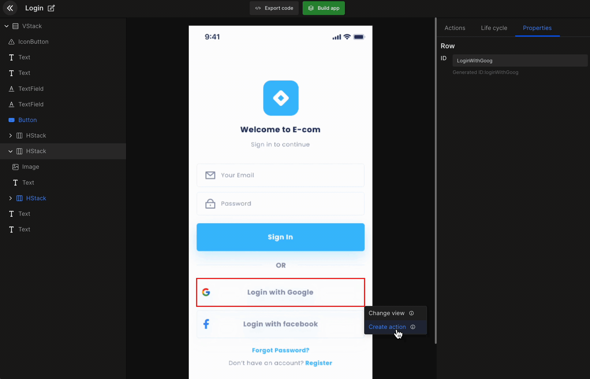
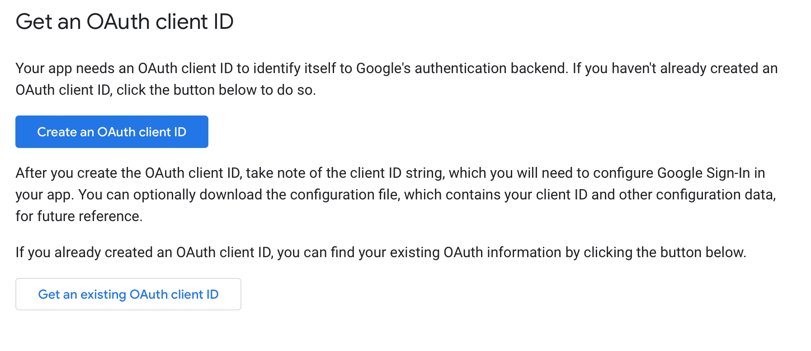
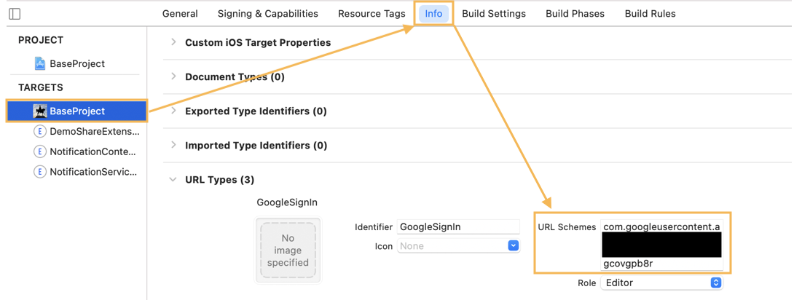
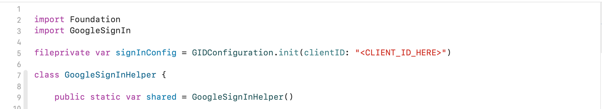
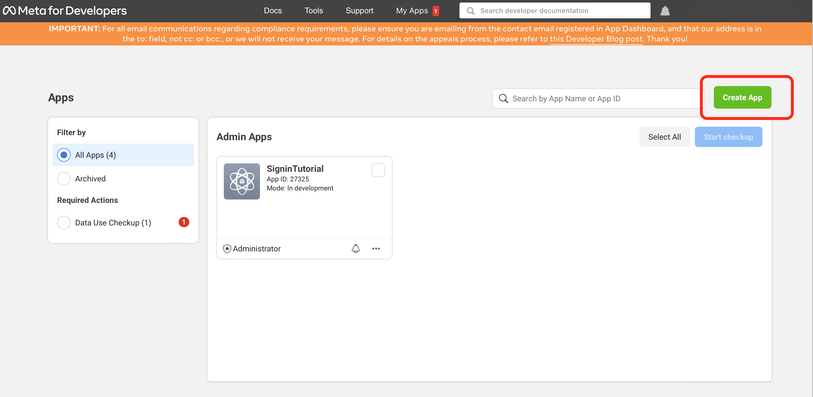
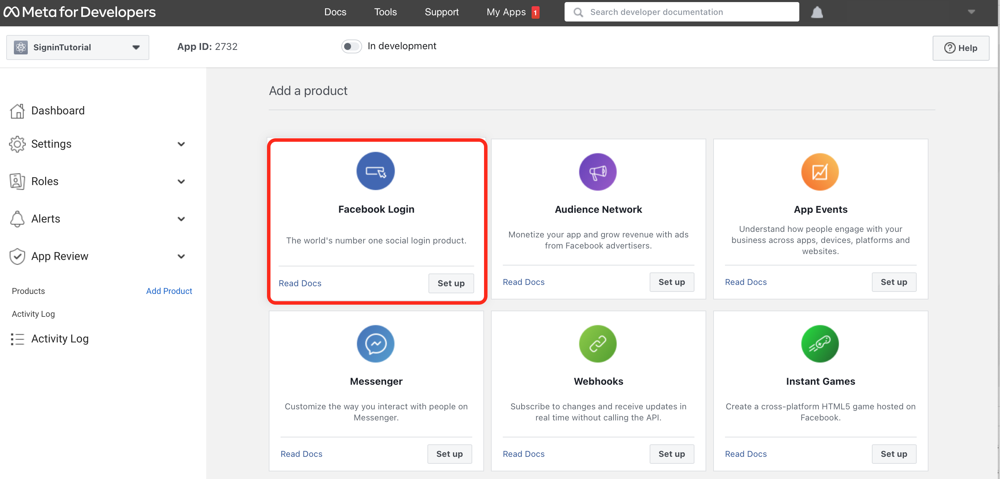
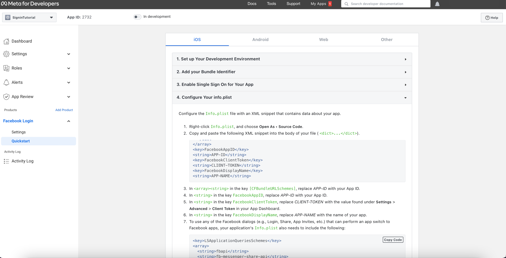
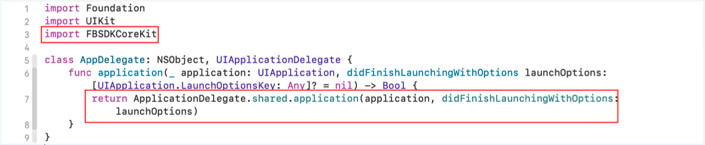
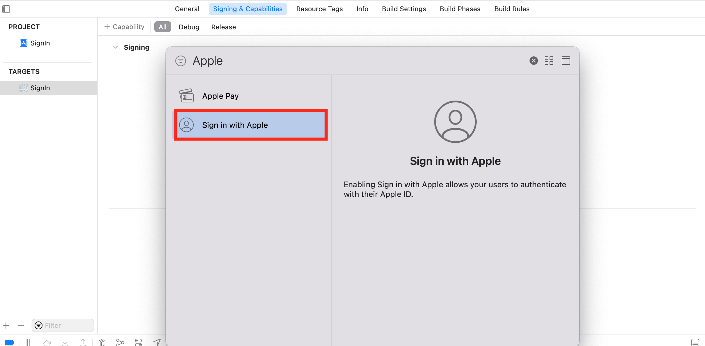

# Setup Authentication

You can set social authentication (Google and Facebook) using the action to manage login/register on your app



## SignIn with Google

Integrate Google SignIn Authentication, with required helper classes generated, but there are some credentials required to be set up prior to authenticate your application. Please follow the steps below for the setup:

#### 1)  Get an OAuth client ID
Go to https://developers.google.com/identity/sign-in/ios/start-integrating. There you can see ‘Create an OAuth client ID’ and ‘Get an existing OAuth Client ID’ options to create an OAuth id for your application.




#### 2)  Add a URL scheme for Google Sign-In to your project

- Open your project configuration double-click the project name in the left tree view. Select your app from the TARGETS section, then select the Info tab, and expand the URL Types section.

- Click the + button, and add your reversed client ID as a URL scheme.




#### 3) Add Client ID

In Dhiwise Generated application google configuration object is declared in GoogleSignInHelper Class. Add your Client id in the GoogleConfig object.



#### Generated code snippet

In Social Authentication, a helper file for the selected authentication type will be added at path Helper -> GoogleAuthentication.swift in the project.

The authentication call will be generated in View file.

```js title="socialAuth.swift"
@StateObject var exampleViewModel = ExampleViewModel()

//Google Authentication
Button(
  action: {
    exampleViewModel.googleSignIn()
  },
  label: {
    Text(StringConstants.kLblGoogleAuth)
  }
)

//Facebook Authentication: facebookSignIn
//Apple Authentication: appleSignIn
```

Authentication related response handle methods will be generated in ViewModel.swift.

```js title="viewModel.swift"
class ExampleViewModel: ObservableObject {
  @Published var googleSignInResponse: GoogleSignInResponse?

  func googleSignIn() {
    GoogleSignInHelper.shared.signIn(completion: { response in
      if let response = response {
        self.onSuccessGoogleSignIn(response: response)
      } else {
        self.onErrorGoogleSignIn()
      }
    })
  }

  func onSuccessGoogleSignIn(response: GoogleSignInResponse) {
    self.googleSignInResponse = response
    //create action code - navigation, api call, alert
  }

  func onErrorGoogleSignIn() {
    //create action code - navigation, api call, alert
  }
}
```

## SignIn with Facebook

DhiWise lets you integrate Facebook SignIn Authentication, with required helper classes generated, but there are some credentials required to be set up priorly to authenticate your application. Please follow the steps below for the setup:

#### 1) Create App

Create your account on https://developers.facebook.com and create iOS platform app.



#### 2) Add a Product

Add Facebook login product into your app.




#### 3) Follow the Steps provided by Facebook.

Facebook Sign requires Bundle id, app id, client token in the info list of our app. After selecting ‘Facebook login product’ Facebook navigate to the below page for further setup.




#### 4) Add DidFinishLanchingOption in AppDelegate.

Add below-highlighted line into AppDelegate file. Which are in 'Application' Directory of project.




## SignIn with Apple

DhiWise lets you integrate Apple SignIn Authentication, with required helper classes generated, but there are some credentials required to be set up priorly to authenticate your application. Please follow the steps below for the setup:




<br/>
<br/>

Got a question? [**Ask here**](https://discord.com/invite/rFMnCG5MZ7).