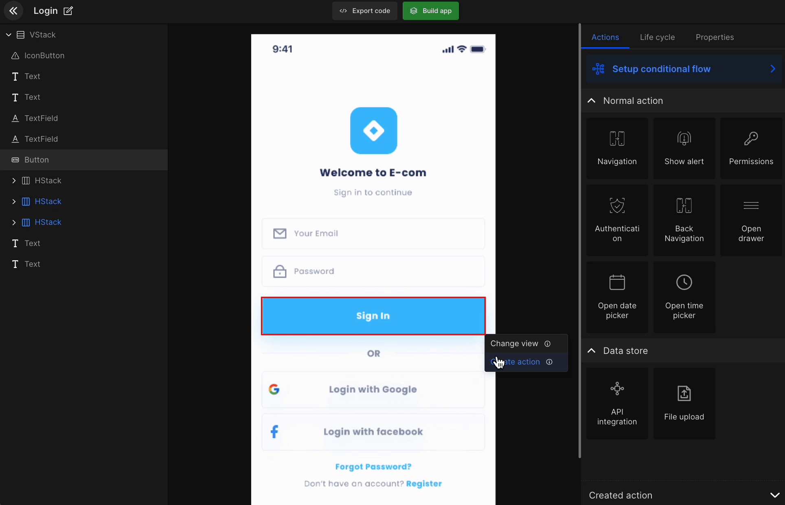
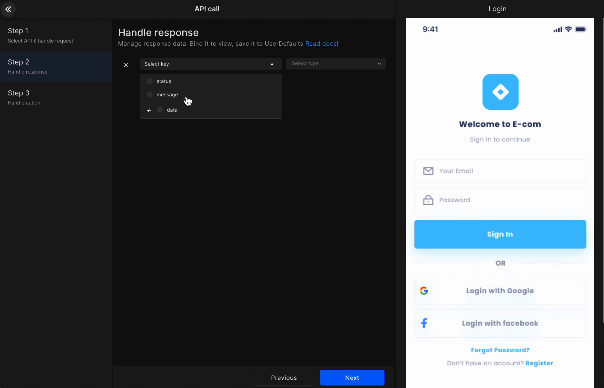
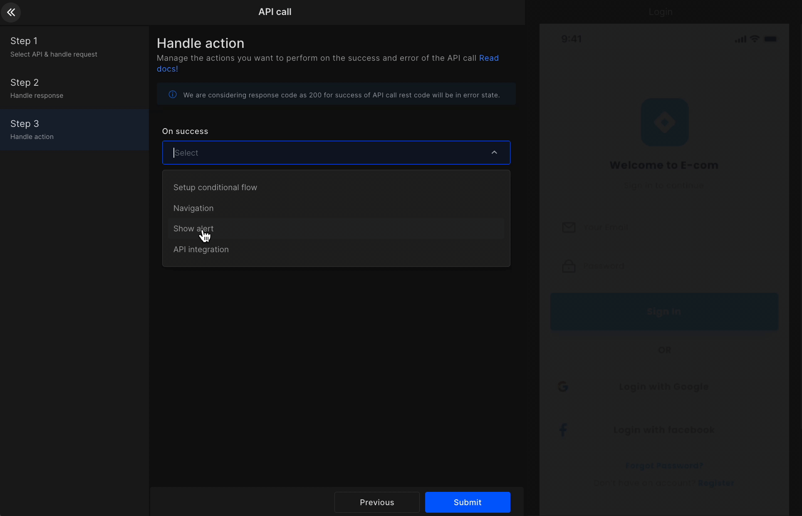

import navigationImg from "./img/navigation.png"
import AlertImg from "./img/Alert.png"
import ApiIntegrationImg from "./img/APIIntegration.png"

# API Integration

Integrate APIs into apps UI components or screens via <a href="/docs/ios/create-actions">Create Actions</a>  or <a href="/docs/ios/manage-app-lifecycle">Manage Controller Lifecycle</a> . However, first, you need to either upload your API postman file or manually add APIs from <a href="/docs/ios/add-apis-and-enviroment-variables">Add APIs and Enviroment variables</a>.

<iframe width="100%" height="500" src="https://www.youtube.com/embed/BPGID6rAeKs" title="Integrate APIs on DhiWise mobile app builders" frameborder="0" allow="accelerometer; autoplay; clipboard-write; encrypted-media; gyroscope; picture-in-picture" allowfullscreen></iframe>

#### Step 1

Search the API you want to access. Then select the required header, parameter, and body. 

:::info
In Body, select the view from which you want to assign input data to the API request. You will get the code with API request variables assigned to this view's value.
For example, in the below gif we selected the username and the password text fields. 
:::



#### Step 2

Manage response data and bind it to the respective view. Select the required key and view.

:::info
Save the data to preference to showcase it at other places in your application with the lifecycle feature in screens for Android and Flutter app builders.
:::



#### Step 3

Manage the action you want to perform on the success or error of your API call. In dropbox, it will show you the options which we have already covered like <a href="/docs/ios/navigation">Navigation</a>, <a href="/docs/ios/show-alert">Alert Box</a>, <a href="/docs/ios/api-integration">API integration</a>, and such.


<div className="grid grid-cols-3 gap-20">
      <a className="Card" href="/docs/ios/navigation">
        
        <h4>Navigation</h4>
      </a>
      <a className="Card" href="/docs/ios/show-alert">
        
        <h4>Show Alert</h4>
      </a>
      <a className="Card" href="/docs/ios/api-integration">
        
        <h4>API integration</h4>
      </a>
    </div>

<br/>



#### Generated code snippet

In API Integration, the dependent `Alamofire` class will be added under Services > `APIManager.swift` and the common functions related to it are under Services > `APIServices.swift` in the project.

ExampleViewModel: The API call method will be generated in the Model class, with onSuccess and onError methods, with related variables.

```js title="ExampleView.swift"
@StateObject var exampleViewModel = ExampleViewModel()

Button(
  action: {
    exampleViewModel.createLogin()
  },
  label: {
    Text(StringConstants.kLblCallAPI)
  }
)
```

```js title="ExmapleViewModelSwift.swift"
class ExampleViewModel: ObservableObject {
  @Published var passwordText: String = ""
  @Published var emailText: String = ""
  @Published var isLoaderShow: Bool = false
  @Published var createLoginResponse: CreateLoginResponse?

  func createLogin() {
    isLoaderShow = true

    let createLoginRequest = CreateLoginRequest(password: passwordText, username: emailText)
    APIServices.shared.callCreateLogin(parameters: createLoginRequest.dictionary ?? [:]) {
      response in
      self.isLoaderShow = false
      if let response = response {
        self.onSuccessCreateLogin(response: response)
      }
    } failure: { error in
      self.isLoaderShow = false
      self.onErrorCreateLogin(error: error)
    }
  }

  func onSuccessCreateLogin(response: CreateLoginResponse) {
    //create action code - navigation, api call, alert
  }

  func onErrorCreateLogin(error: String) {
    //create action code - navigation, api call, alert
  }
}
```

<br/>
<br/>

Got a question? [**Ask here**](https://discord.com/invite/rFMnCG5MZ7).