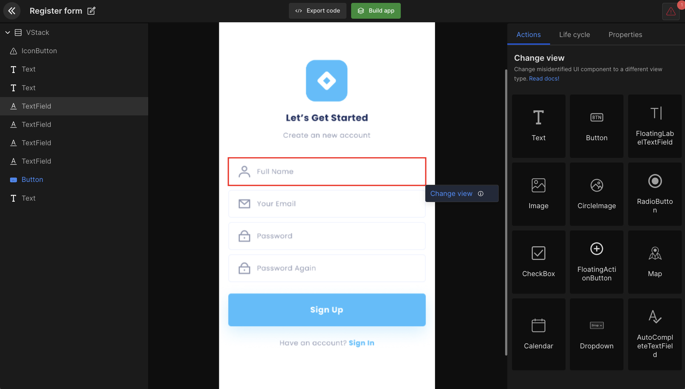

# Change View

Change view is a feature that allows developers to change the view type of the UI design components to their respective purpose. 

## How does change view work?

The option "**Change view**" is to change the existing UI view component to asignny other if required.

:::tip Example
A Text can be changed to TextField if requires as DhiWise accuracy depends on the app design.
:::

:::info
Check out our <a href="/docs/Designguidelines/intro">Figma design articles</a> to learn the best design practices to utilize DhiWise to its full potential 
:::

### View components

Fragment | TextView | AppCompatButton | EditText |TextInputEditText | ImageView | CircleImage RadioButton | AppCompatCheckBox | FloatingActionButton | FrameLayout | LinearLayout -H | LinearLayout - V | RadioGroup | RecyclerView | RecyclerViewGridLayout | TabLayout | ViewPager 2  ToolBar | BottomBar | GoogleMap | Calendar | Dropdown | DrawerItem | AutoCompleteTextField | SearchView | WebView 

<!--  -->

### All UI components are configurable in "Detail view"

#### Depending on the view you have selected, 

A popup will appear to setup **view properties**.

:::tip Example
We have selected "TextField", add properties value in the popup. Click on "Continue" to finish adding the view properties.
:::

The same view can be used at multiple places in the same design. If you have selected converting view for one component, then the iOS app builder algorithm will find all the similar views from the Figma file uploaded and show you the list.

You can either "**Select all**" components to convert or you can select specific. Once done, click on the "**Convert to TextField**" button to successfully change the view type.

<!--  -->

Similar to this, you can select any other view type and follow the steps to convert it to your desired view type. 

 
 

Got a question? [**Ask here**](https://discord.com/invite/rFMnCG5MZ7).

