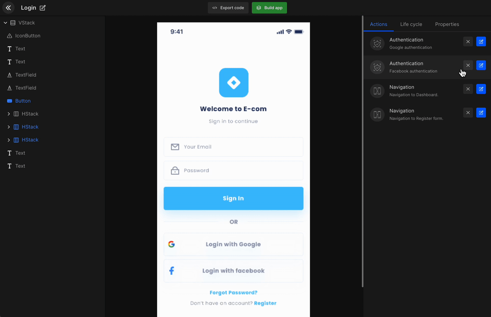
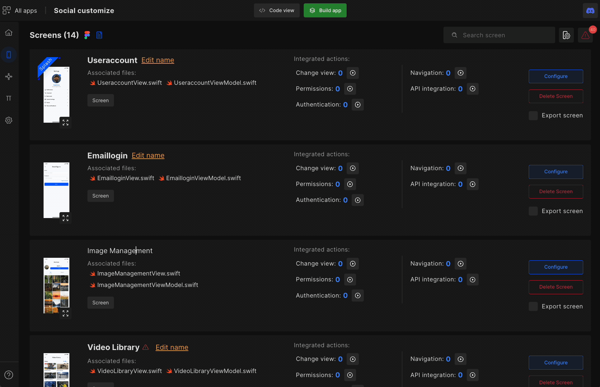
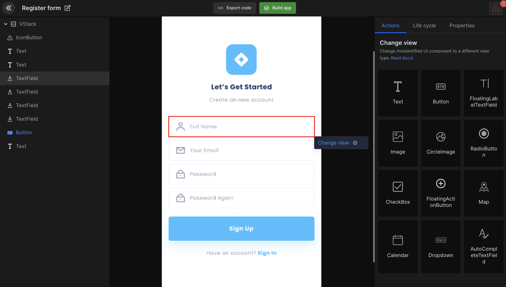
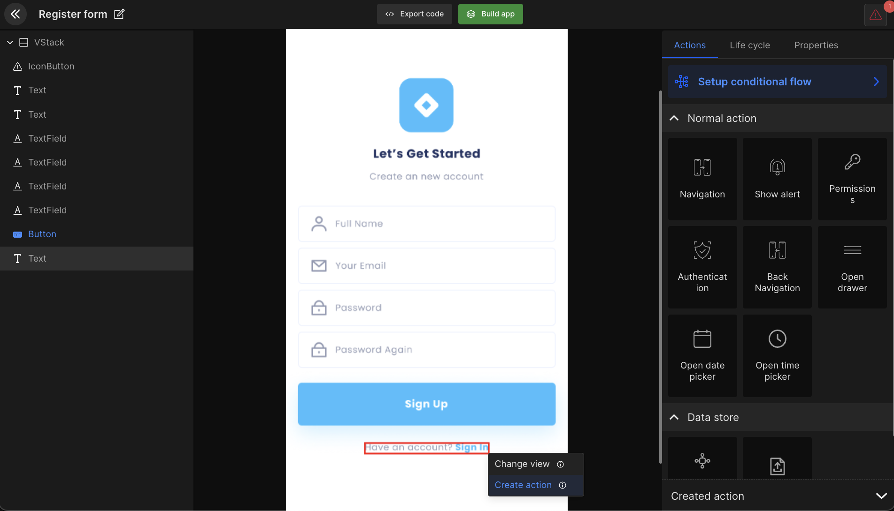
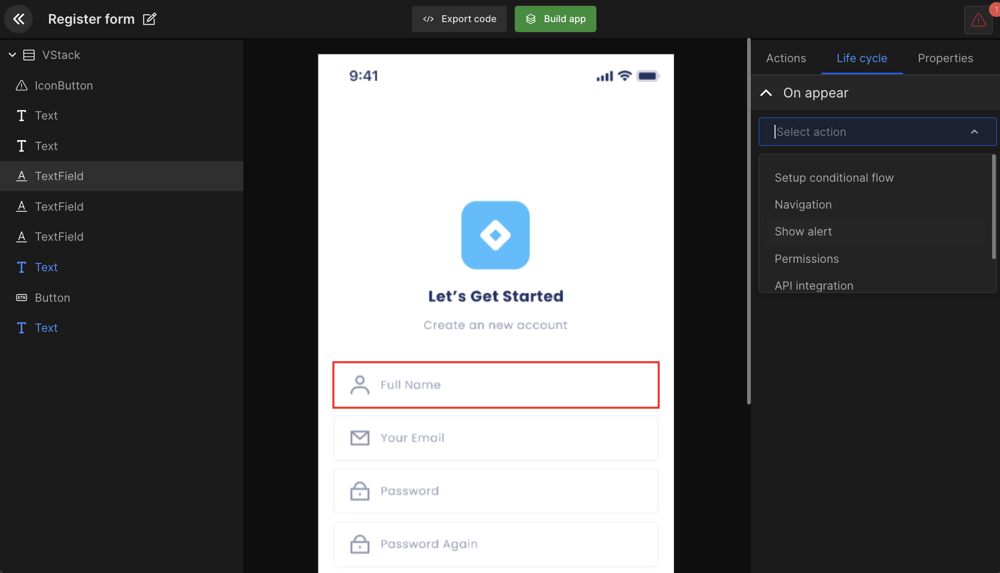

# Configure Screens

Generate the code for the UI view component and bind your APIs to your design view components, all in minutes.

## **What is Screens feature?**

The Screens is a core feature of the iOS app builder. In screens, developers can customize SwiftUI View components, map out screen actions, & set up lifecycle method and get a complete design code.

## **Introduction to Screens - Configure UI** 

Files fetched from Figma are displayed on screens. 

The screens feature is where most app development will take place. For example, API integration, navigations, mapping out actions, and lifecycle. 

:::note
It might take a few minutes to fetch details of your Figma file on screens when creating a new app.
:::

Before your design is fetched will get a pop-up shown in the gif below to select a viewport size and set the splash screen.

### Viewport selection

Select the viewport size you had in mind when you started our creating your app design.

### Set splash

Select an initial screen that appears at the start of your app.

### Change name 

Change the name of your app screen for better code readability. 

### Update Figma design changes to DhiWise?

To update the (latest) Figma design changes to the (older) design in DhiWise, click on the refresh icon in settings. 

Thereafter, the design in DhiWise is resynced with the design in Figma. However, upon refresh, any integrated actions is lost for the screens which were updated.

:::tip Example
For example, if originally the screen had a back navigation UI component, but the updated screen design removed the back navigation then naturally the integrated action is erased.  
:::

### How to Export code of a single file?

Developers can download files, export, or copy code for the selected screens. Then integrate those screen codes into their application on their favorite IDE.

This feature gives the choice to either build the whole application or only work on the screens you want and export the code as quickly as possible.

### Configure screen components

Most of your app development tasks place inside detail view, you get options such as change view, create action, lifecycle, and add validation.

### Change view - Change component view type

DhiWise had identified your design screen components and attached the respective code. 

:::tip Example
For example, if your Figma design screen has a radio button view component DhiWise will identify it as a radio button and generated the code respectively. Furthermore, you can make changes to the view component if it's misidentified. 
:::

View types we provide are:

Fragment | TextView | AppCompatButton | EditText |TextInputEditText | ImageView | CircleImage RadioButton | AppCompatCheckBox | FloatingActionButton | FrameLayout | LinearLayout -H | LinearLayout - V | RadioGroup | RecyclerView | RecyclerViewGridLayout | TabLayout | ViewPager 2  ToolBar | BottomBar | GoogleMap | Calendar | Dropdown | DrawerItem | AutoCompleteTextField | SearchView | WebView 

## **How to create action for UI components?**

Map out your application flow with our interactive UI.  Choose from the 4 actions to create your design view component.  

:::tip Example
For example, let's say you wish to create an action for your login button then first you need to add or upload your API postman file then choose the view component you wish to integrate API for. It's that simple. Click here to learn more. 
:::

The actions are:
Navigation | Show Alert | Back Navigation | API integration  

## **How to set up On appear method in Life cycle?**

Choose the required action from the view controller life cycle for all screens. You will get five actions such as Navigate, show alert, and API integration.

In the below gif you can see how to create navigation, the edit history, and edit or delete your action. 

 
 

Got a question? [**Ask here**](https://discord.com/invite/rFMnCG5MZ7).