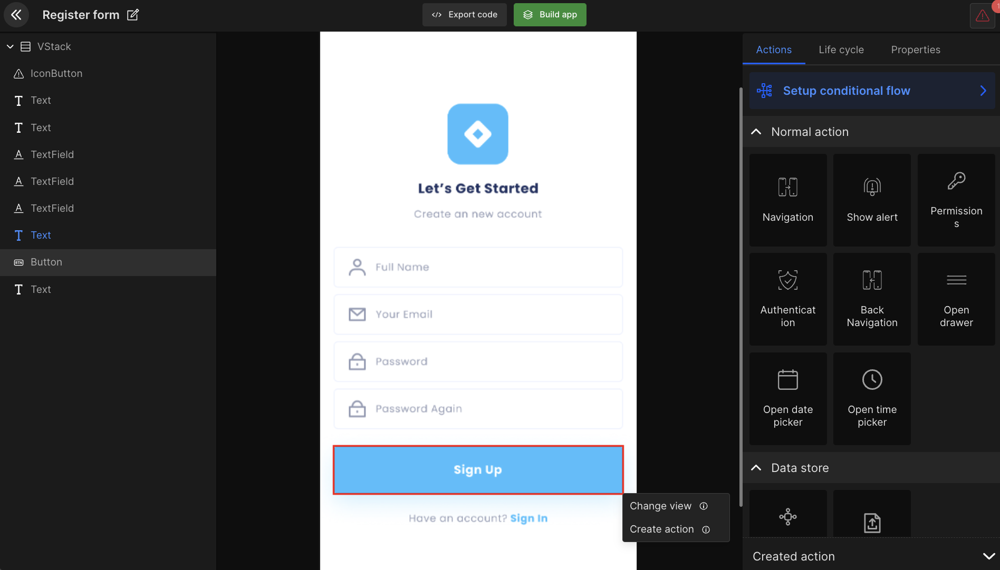

# Create Action

An app screen has multiple components many of which perform some action. The feature "**Create action**" configures which action those components will perform. It can be navigation, API integrations, or any other. 

<iframe width="100%" height="500" src="https://www.youtube.com/embed/WI9fL46Hk3w" title="5 Add navigation in your app screens in your app" frameborder="0" allow="accelerometer; autoplay; clipboard-write; encrypted-media; gyroscope; picture-in-picture" allowfullscreen></iframe>

## How to set up Action
Select the UI component and right-click on it. Then select the "**Create action**" option and it will show another dropdown with multiple actions.

Select required action for any UI component. 

 
 

Got a question? [**Ask here**](https://discord.com/invite/rFMnCG5MZ7).