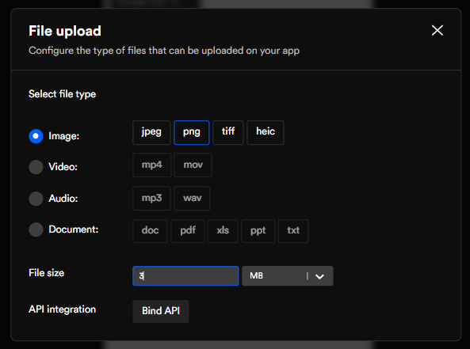

import navigationImg from "./img/navigation.png"
import AlertImg from "./img/Alert.png"
import ApiIntegrationImg from "./img/APIIntegration.png"

# File Upload

Upload files you wish in your app by setting up file upload in a few easy steps in DhiWise.

:::caution
The upload file API is required before your start API binding
:::

## Select the file and data type

<!--  -->
<!--  -->

## Bind API 

Integrate the file upload API. However, the API should already be added. 

#### Step 1:
Only the upload file API will be available in the list

<table>
  <tbody>
    <tr>
      <td><b>Header</b></td>
      <td>Content-type multipart/form-data</td>
    </tr>
    <tr>
      <td><b>FormData</b></td>
      <td>Selected file or constant</td>
    </tr>
  </tbody>
</table>

#### Step 2:
Handle API response

<table>
  <tbody>
    <tr>
      <td><b>Key</b></td>
      <td>Give the key a name</td>
    </tr>
    <tr>
      <td><b>Select type</b></td>
      <td> View or save to preference</td>
    </tr>
  </tbody>
</table>

:::info
**View**:  Select the view to which you want to show this API key's data. You will get the code with API response variables assigned to this view's value.

**Save to preference**: The data will be saved in the API response 
:::

#### Step 3:
Select response for on-success or failure. The responses can be from <a href="/docs/ios/navigation">Navigation</a>, <a href="/docs/ios/show-alert">Show Alert</a>, or <a href="/docs/ios/api-integration">API Integration</a>.

<div className="grid grid-cols-3 gap-20">
  <a className="Card" href="/docs/ios/navigation">
    
    <h4>Navigation</h4>
  </a>
  <a className="Card" href="/docs/ios/show-alert">
    
    <h4>Show Alert</h4>
  </a>
  <a className="Card" href="/docs/ios/api-integration">
    
    <h4>API integration</h4>
  </a>
</div>
<br/>


#### Generated code snippet

```js title="fileUpload.swift"
@StateObject var exampleViewModel = ExampleViewModel()

.actionSheet(
  isPresented: $exampleViewModel.isActionSheetShow,
  content: {
    ActionSheet(
      title: Text("Choose"),
      buttons: [
        .default(
          Text("Camera"),
          action: {
            if UIImagePickerController.isSourceTypeAvailable(.camera) {
              exampleViewModel.pickerSource = .camera
              exampleViewModel.isImagePickerShow = true
            } else {
              exampleViewModel.showAlert("Error", "Camera is not available!")
            }
          }),
        .default(
          Text("Photo Library"),
          action: {
            exampleViewModel.pickerSource = .photoLibrary
            exampleViewModel.isImagePickerShow = true
          }),
        .destructive(Text("Cancel")),
      ])
  }
)
.sheet(
  isPresented: $exampleViewModel.isImagePickerShow,
  content: {
    MediaPicker(sourceType: exampleViewModel.pickerSource, mediaTypes: ["public.image"]) {
      image, url in
      if let image = image {
        exampleViewModel.selectedImage = image
        DispatchQueue.main.asyncAfter(deadline: .now() + 0.5) {
          exampleViewModel.createUpload()
        }
      }
    }
  })
```

<br/>
<br/>

Got a question? [**Ask here**](https://discord.com/invite/rFMnCG5MZ7).