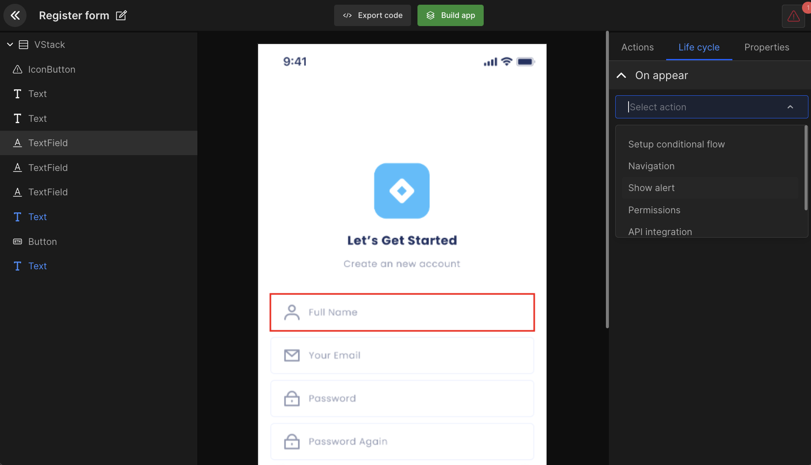
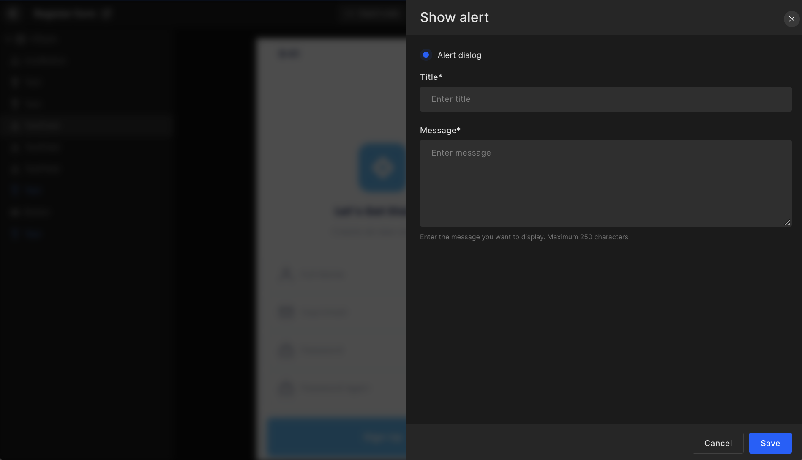

# Manage App Lifecycle

Currently, the DhiWise iOS app builder supports only the onAppear method.

Below is the list of actions supported in the life cycle: Show alert, permission, API integration, & Back Navigation.

<!--  -->


## Navigation

- Select `Navigation` and it will show a list of all the application screens, and you can select any particular screen to map out the user path.
- Also, you can directly search the navigation screen and manage close screen status.

The life cycle set on any screen will be displayed as below. Also, you can edit or delete any particular action.


```js title="lifecycleNavigation.swift"
@StateObject var exampleViewModel = ExampleViewModel()

NavigationView {
  VStack {
    NavigationLink(
      destination: NewView(),
      tag: "NewView",
      selection: $exampleViewModel.nextScreen,
      label: {
        EmptyView()
      }
    )
  }
}
.onAppear {
  exampleViewModel.nextScreen = "NewView"
}
```

## Alerts

You can set up an "**Alert dialog**" for any UI component by entering "**Title**" and "**Message**". 



```js title="lifecycleShowAlert.swift"

@StateObject var exampleView1Model = ExampleView1Model()

VStack {
}
.onAppear {
    exampleView1Model.showAlert("Alert Title", "Alert Message")
}
```

```js title="lifecycleShowAlert2.swift"

class ExampleView1Model: ObservableObject {
    @Published var isAlertShow = false
    @Published var alertTitle = ""
    @Published var alertDescription = ""

    func showAlert(_ title: String, _ message: String) {
        isAlertShow = true
        alertTitle = title
        alertDescription = message
    }
}
```

## API integration

You can add API in any screen by selecting API from creating action or view life cycle. However, first, you should have added your API postman file or added APIs manually from the API integration feature.

#### Step 1

Search the API you want to access. Then select the required header, parameter, and body. Now you have to add a response as seen in the below gif.

#### Step 2 

Manage response data and bind it to the respective view. Select the required key and view. 

#### Step 3

Manage the action you want to perform on the success or error of your API call. In dropbox, it will show you the options which we have already covered like navigation, alert.


<!--  -->
<!--  -->

<br/>
<br/>

Got a question? [**Ask here**](https://discord.com/invite/rFMnCG5MZ7).
