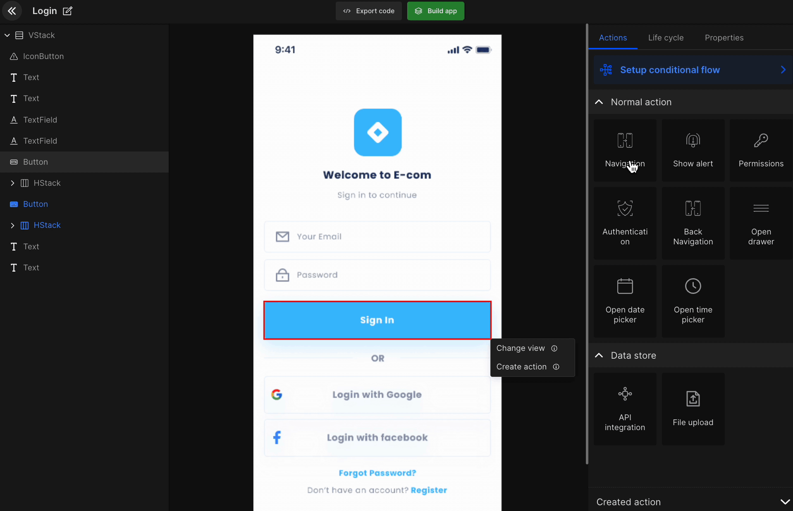
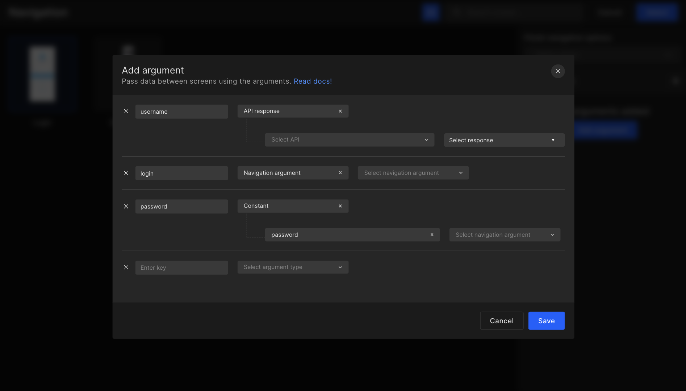
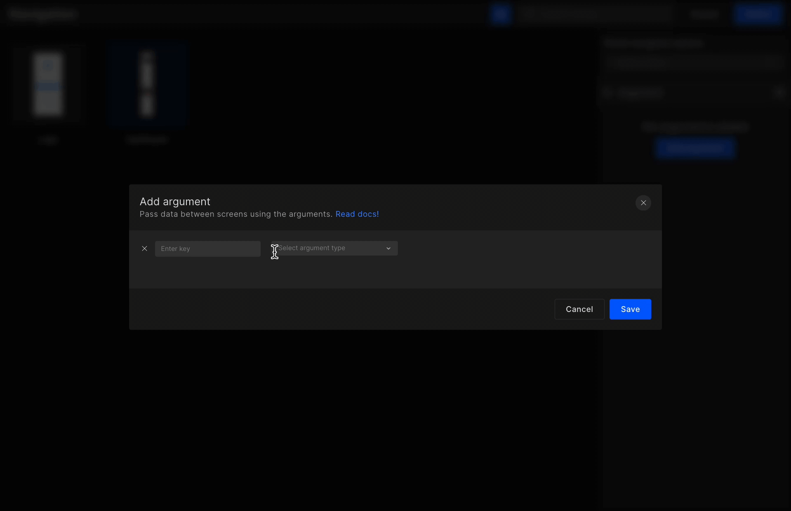
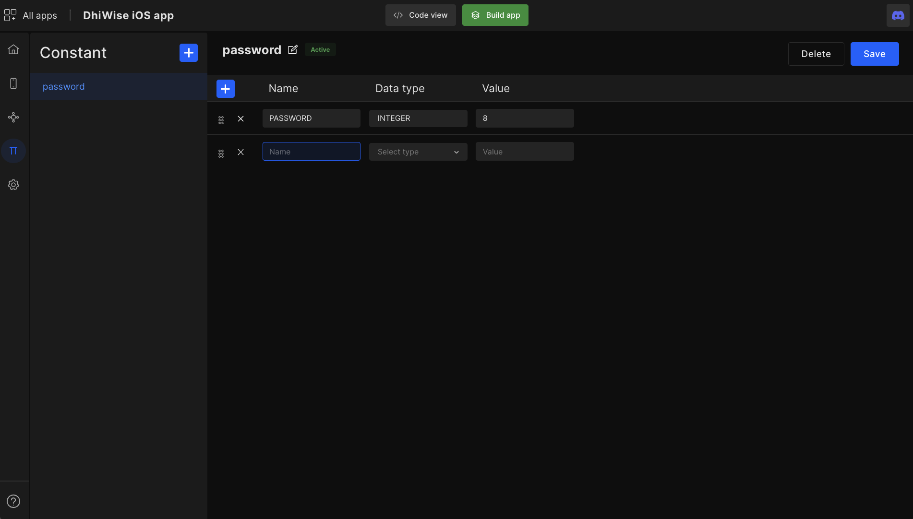
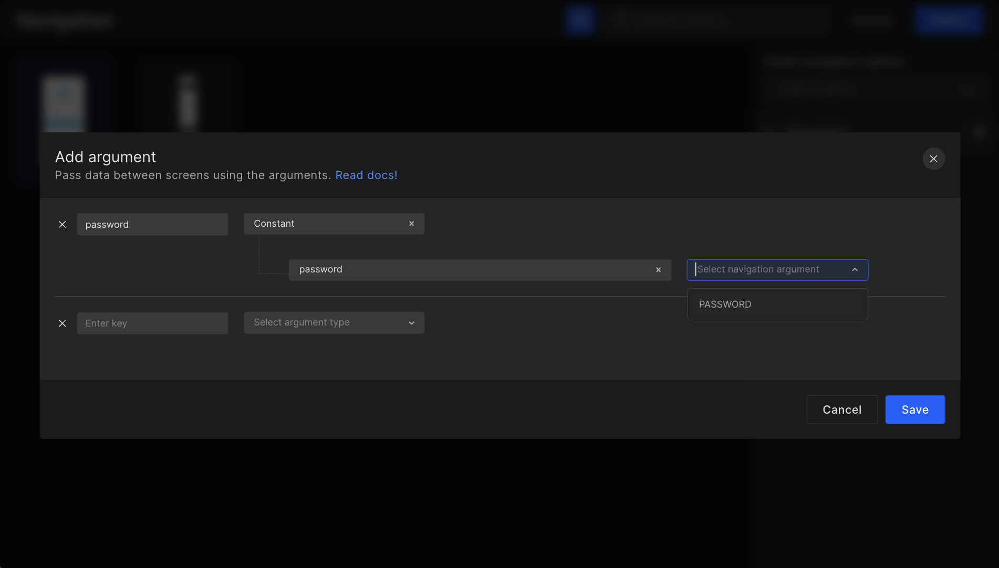
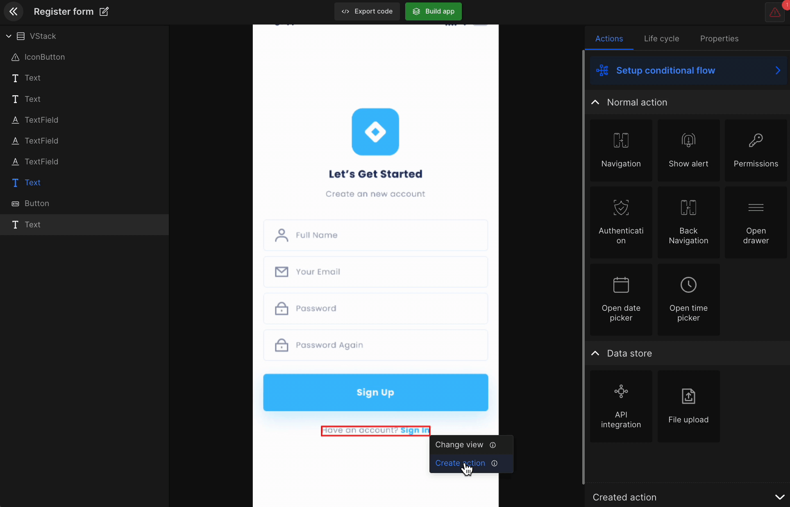

# Navigation

Navigation makes applications more interactive, which helps users navigate in, out, and across the app. Add such navigations to your iOS app in few simple steps:

## **Add Navigation**

Integrate the navigation action to screen view components and navigate between screens.
1. Click on configure in the **screens** feature.
2. Select the **view component**. 
3. Click on `create action`.
4. Select navigation.

The next page will consist of all the screen in your app. Among them select the screen you wish to navigate to. Additionally, you can configure the **finish activity**, & **arguments**.

- **Finish activity**:
Select whether to close all background screen activity or only the previous screen activity.

Once done, click on "**Select**" to move to the screens page and set up other actions.



## **Navigation with Arguments**

The add navigation feature will allow developers to share data from the present screen to the screen they are navigating to. The data will be received from constants, API response, & navigation arguments. To know more, refer to the below doc. 


<!--  -->



### What is data sharing?
Share the current screen data to another screen without the need for storing it. The data which can be set from one screen to another are API response, navigation argument, and constant.

<iframe width="100%" height="500" src="https://www.youtube.com/embed/FJlOf5F_kCw" title="Data sharing in DhiWise | Navigation argument" frameborder="0" allow="accelerometer; autoplay; clipboard-write; encrypted-media; gyroscope; picture-in-picture" allowfullscreen></iframe>

### How to add an argument using API response?

Let's suppose you want to show the order details on the checkout page without retrieving data from the server n number of times, you can easily share the same data through selecting **navigation > argument > API responses**.

:::info
The app screen should have API integrated for the API response to be fetched in the add argument.
:::



### Add navigation argument using constant

Another way of passing data between screens is through constants. Create a constant in the constant feature, then go to the screens feature and select the screen from which you wish to pass the data into the other screen using **create action > navigation > add argument > constants**.







#### Generated code snippet

In Navigation, below code is added in View.swift file. The view is binded to NavigationView and a NavigationLink with destination is attached. 

An instance of ViewModel is created where the related binding variable is used to navigate to the next screen.


```js title="Navigation1.swift"
@StateObject var exampleViewModel = ExampleViewModel()

NavigationView {
  VStack {
    Button(
      action: {
        exampleViewModel.nextScreen = "NewView"
      },
      label: {
        Text(StringConstants.kLblOpenNewView)
      }
    )
  }
}

NavigationLink(
  destination: NewView(),
  tag: "NewView",
  selection: $exampleViewModel.nextScreen,
  label: {
    EmptyView()
  })
```

```js title="ExampleViewModel.swift"
class ExampleViewModel: ObservableObject {
    @Published var nextScreen: String? = nil
}
```

## **Back Navigation**

The back navigation action will take you to the previous screen. Implement this action on the back navigation view component in your app design.

Follow the below steps starting from your dashboard screen.

1. Go to **screens**

2. Select the required screen

3. Click on `configure`

4. Select the back navigation component

5. Click on `create action`

6. Select `back navigation`

Actions set on any screen will be displayed as below. Also, you can **edit** or **delete** any particular action.




#### Generated code snippet

Once the app is built the below code is generated in the **View.swift** file for back navigation.


```js title="backnavigation.swift"
@Environment(\.presentationMode) var presentationMode: Binding<PresentationMode>

Button(
  action: {
    self.presentationMode.wrappedValue.dismiss()
  },
  label: {
    Text(StringConstants.kLblBack)
  })
```

<br/>
<br/>

Got a question? [**Ask here**](https://discord.com/invite/rFMnCG5MZ7).