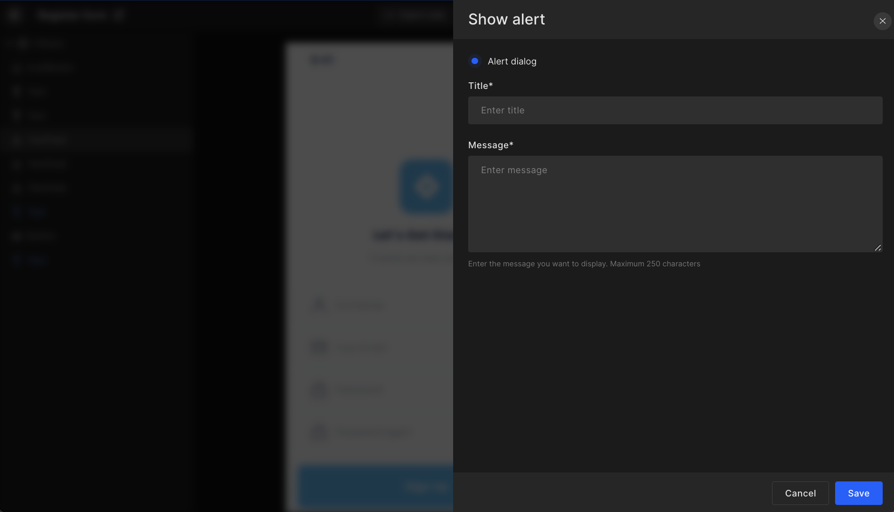

# Show Alert

Developers can set up Alert dialog for any UI component by entering "**Title**" and "**Message**" for the alert dialog. For Alert dialog, you can add up to 250 characters message and for a snack bar or toast, you can add a message up to 100 characters.

Click on `Save` to move to the screens page and set up other actions.




#### Generated code snippet

A custom extension is used for alert dialog which is added under CustomViews ➝ CustomDialogExtension ➝ CustomDialogExtension.swift

Below is the code generated in View.swift file for the alert dialog.

```js title="alertDialog.swift"

@StateObject var exampleViewModel = ExampleViewModel()

VStack {
  Button(
    action: {
      exampleViewModel.isDialogViewShow = true
    },
    label: {
      Text(StringConstants.kLblOpenDialogView)
    })
}
.customDialog(isShowing: $exampleViewModel.isDialogViewShow) {
  DialogView(dialogViewModel: DialogViewModel(_isOpen: $exampleViewModel.isDialogShow))
} onTapOutside: { value in
  if value {
    exampleViewModel.isDialogViewShow = false
  }
}
```