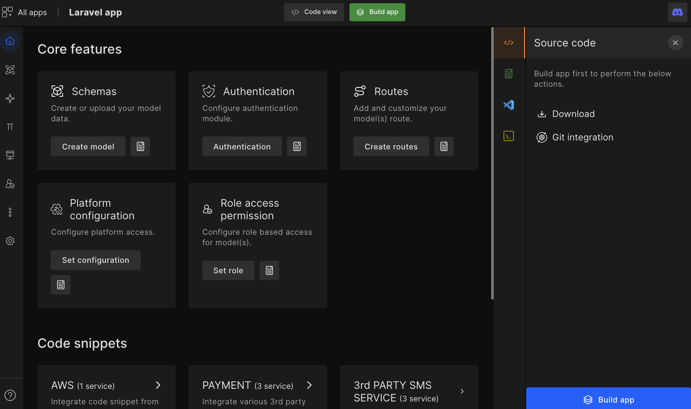
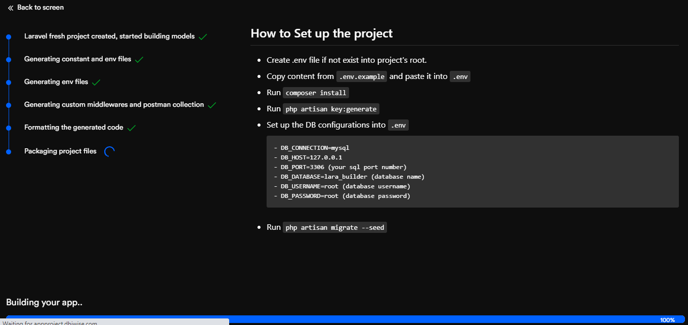
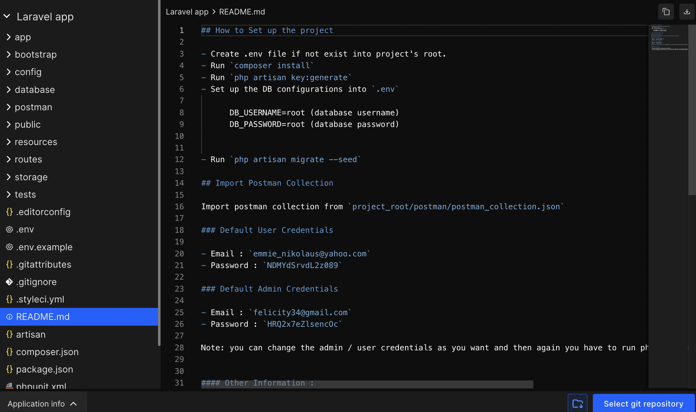

# Build and Review code

## Build App

As an individual developer or a company, we need to share the progress of the development with clients or internal teams for review at multiple stages of development. Also, feedback received from them needs to be implemented in the next releases. Considering that in mind, DhiWise stands with you in dealing with your day-to-day activities.

**You can build your Laravel app right after entering models, routes, and permissions. That will help you generate CRUD operations. You can build an app right after that or at a time after this.**

Click on the `Build app` button to generate code for the first time in any application.  

:::note
The selected architecture code cannot be changed later and the code will already generate in the same architecture.
:::

`

It will redirect you to a page where the DhiWise Laravel builder starts generating the code. You can see the progress of code generation along with the process that's been happening.

<!--  -->

#### Once the code gets generated

- You will be redirected to the code screen and from there you can download the **source code**.

- You can still make changes to the application using Laravel app builder features starting from modules, routes, permissions, and others.

- You can directly apply features to your application with just a click from the configuration. Then again you can re-build the app at any time.

# Review Code

Building a quality product is hard, developers need to keep a checklist for managing code and the logic in the best possible way. It's essential to produce clean and scalable code to sustain a product/application in the market. With the help of the DhiWise Laravel app builder, you can achieve the same.

<h3> To review the code, first, you need to build the app.</h3>

Once you finish building the app, you can visit the "Code" screen and review the code generated using the Laravel app builder. You can view the code and "Download source code" when needed.

In the left panel, you can see the folder structure depending on the selected code architecture. The folder structure of the application will be created automatically depending on the design, actions performed and configurations selected by you.

We recommend you to check the README.md file, this file consists of the following information: 

- How to set up the project

- Default Admin user credentials

- Default user credentials 

- Other information

 
 

Got a question? [**Ask here**](https://discord.com/invite/rFMnCG5MZ7).