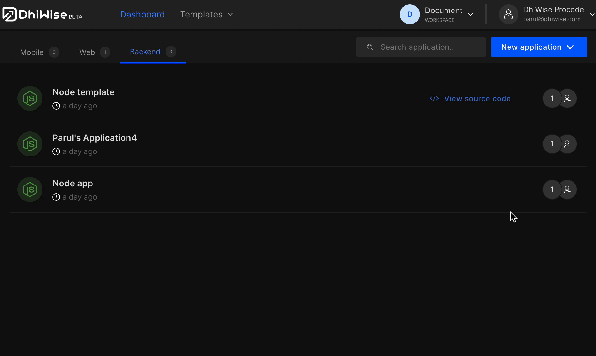
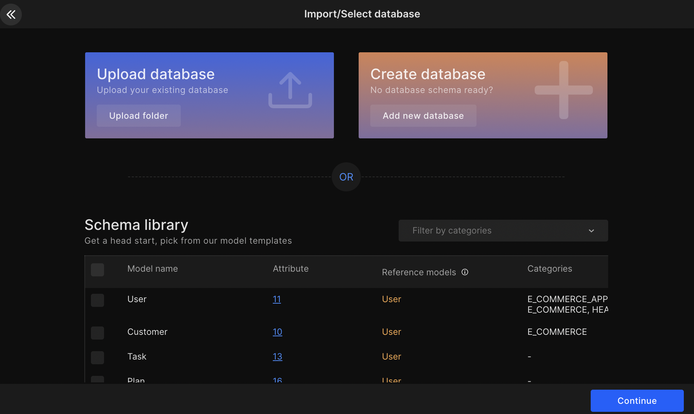
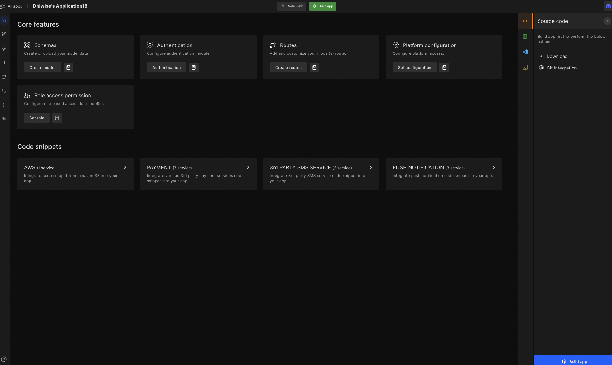

# Build a Laravel App

Laravel app builder is a developer-centric platform to build backend CRUD APIs with additional features to boost productivity time by twofold!

Laravel app builder also gives developers total code ownership. The code it generates is bug-free, which gives developers code consistency with zero effort. 

## **Create Application**

Click on `New application`.

### Create a new app

#### **Step 1:** 
Select platform as **Bakend** to create a Backend. Next, enter your `Application name` and select `Technology` from the drop-down as **Laravel**.

#### **Step 2:** 

Click <code className="primary">Create a new app</code>. 

## **Upload, pick, or create new schema data** 

If you have schema data you can upload it, or choose from the given samples below.  

:::info
The model framework we support are: 

sailsjs, totaljs, nestjs, loopbackjs, fastifyjs.
:::

You can create new schema data from <a href="/docs/laravel/models">Models</a>

## **Manage CRUD**

- <e className="hightlight">Create or Upload schema data</e> - Configure your model attributes. 
- <e className="hightlight">Setup model permission</e> - Configure CRUD operations for each model. 
- <e className="hightlight">Setup model-wise routes</e> - Autogenerated routes with query builder and more. 
- <e className="hightlight">Role access</e> - Create different roles according to platform requirements.

<!--  -->

## **Build App**

Now, developers can add features like auth constant, role access, etc. Then **build app**, or directly **build app (in MVC or Clean code) and download the source code**.

These simple steps will help you reduce many of the monotonous tasks involved in building a backend and increase your work productivity.

 
 

Got a question? [**Ask here**](https://discord.com/invite/rFMnCG5MZ7).