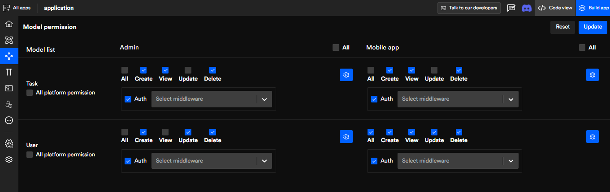
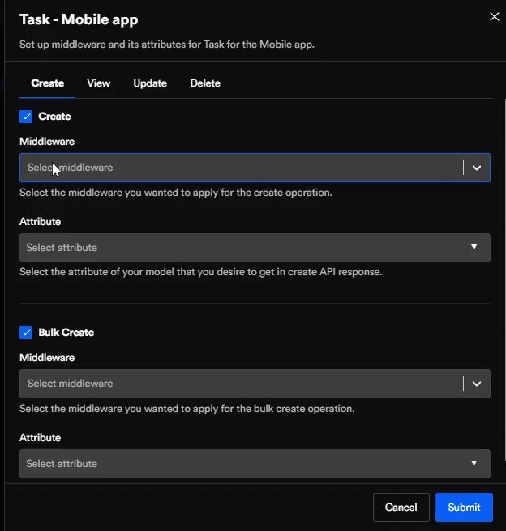

# Model Permissions

Model permission (**controllers method setup**) helps developers create model-wise CRUD APIs for different platforms. Moreover, developers can set up custom middleware and its attributes for specific models under any platform.

Furthermore, developers can apply middleware on APIs like bulk create & bulk update, plus configure hard delete.

Controller method set up of CRUD APIs for the respective platform. 

:::note
Decide which platform has access to which information, for example, in some models, only the master user has the authority to delete and no other. However, the master user first needs to authenticate himself.
:::

## Model list

Map out require permissions to those models for their respective platforms such as **mobile app**, **front(website)**, **desktop**, and **admin**.  

## Under each platform,

- You can either give all CRUD permission or just a few. And, set authentication for each platform.

- You will see the setting icon in blue. Once you click on it a side panel will appear where you can do additional configurations.

On the top right-hand corner, you have the reset button which will reset all the models.

<!--  -->

## Set up Middleware

- You can set up **middleware** and its **attribute** for their respective model and platform. 

- Similarly, you can set the **middleware** you want to apply for certain **CRUD** operations. Then, select the **attributes** of your model you wish to receive API response for. 

- In **create** and **update**, you also have the bulk option to configure and provide access to large query requests at once. Then, click on `Submit`.

<!--  -->

 
 

Got a question? [**Ask here**](https://discord.com/invite/rFMnCG5MZ7).