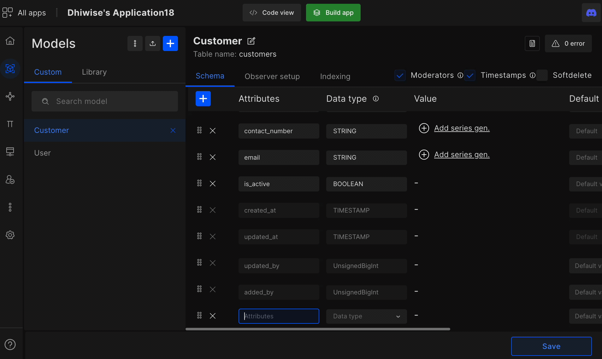

# Models

Models feature helps developers quickly (in minutes) define their model attributes or upload schema data, or paste model attributes then generates model-related CRUD APIs, routes, and more.

## Create or upload schema models

The model framework we support are: sailsjs, totaljs, nestjs, loopbackjs, fastifyjs.

- Upload your **SQL scheme data** for multiple or individual models. (MS SQL, PostgreSQL, and MySQL)

- Create new models on DhiWise.

- Or simply paste your model attributes (**new models > model attributes**) to create models. 

:::note
Now, if you already have **attributes** for your model, paste them inside **model attributes** to quickly create your models.  
:::

## Choose model templates from our model library

Inside the library, you will find predefined models and their attributes for you to customize as per your needs to quickly create models.

<!--  -->

## Schema

- Create attributes for your models, configure their data type and keep its value constant, give authority to either admin or user or keep it null.

- Additionally, simply type in your attribute, and DhiWise will auto-fill the appropriate data type for you.

- The data type we have are:

    STRING, TEXT, CHAR, BOOL, INTEGER, BIGINT, FLOAT, REAL, DOUBLE, DECIMAL, DATE, DATEONLY, TIMESTAMP, ENUM, JSON, JSONB, ARRAY, TINYSTRING, TINYINTEGER, UnsignedBigInt

## Advanced settings

In advanced developers can configure attributes to be either required or unique or auto-increment and set conditions for your attributes like max and min length, even convert attribute values to lower case and trim excess spaces before and after the input.

- With the pattern, you can keep filters for your attributes. 

- If you fill the check box option "Private" the information for the particular model attributes will be secure.

:::info
**Moderators**: Added By & Updated By fields will be added by checking this checkbox

**TIMESTAMP**: Created At & Updated At fields will be added by checking this checkbox
:::

## What is Observer set up?

The **Observer setup** helps developers manipulate data before and after it goes to the database. DhiWise provides a lot of posts and pre-observer setup

`retrieved, creating, created, updating, updated, saving, saved, deleting, deleted, restoring, restored, replicating`

## What is indexing?
**Indexing** easily index a large number of data with just a few simple configurations

 
 

Got a question? [**Ask here**](https://discord.com/invite/rFMnCG5MZ7).