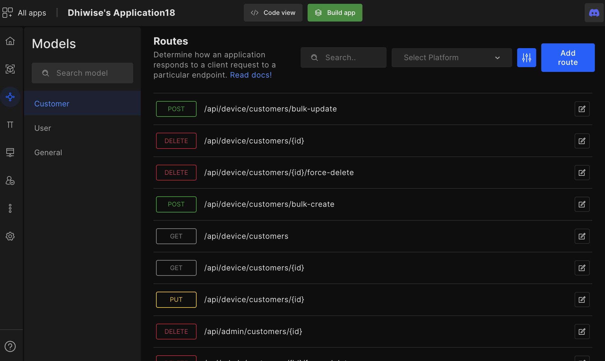
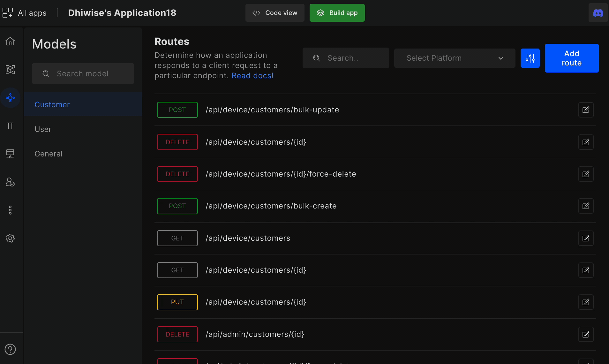

# Routes

Once the models are created, DhiWise auto-generates routes (The pathway of APIs). Furthermore, new routes can be added and edited with the help of query builder and its advance configuration options.   

Therefore, instead of writing lengthy code manually for routes, models, and APIs, developers can simply click a few options to add, edit, manage and configure routes for multiple models within minutes.

## View routes

On the left-hand side, you can see the models you have created. You can select the model in which route you want to **edit** or altogether create add a **new route**.

You can ever filter routes quickly by clicking on the **filter symbol** in the top right-hand corner. 

You can see all your model routes. 

## Add route

Configure and add a route, you will see four categories such as basic, advance, and configuration.

In basic you have to input all the below details:

<table>
    <tr>
        <td>Models</td>
        <td>Choose your model</td>
    </tr>
    <tr>
        <td>Platform</td>
        <td>Here the platform that you have already selected will come up the platform such as admin, mobile, front(website), and desktop. </td>
    </tr>
    <tr>
        <td>Methods</td>
        <td>Choose from the HTTP methods below :
         
<code>POST | GET | PUT | DELETE | PATH | HEAD | OPTIONS | PURGE | LINK | UNLINK | PATCH | OPTIONS</code></td>
    </tr>
    <tr>
        <td>Routes</td>
        <td>Enter API route (path) used to call appropriate API</td>
    </tr>
    <tr>
        <td>Controller</td>
        <td>Enter the name of the controller from where the function is called</td>
    </tr>
    <tr>
        <td>Action</td>
        <td>Enter the function name you would like to create in the controller</td>
    </tr>
    <tr>
        <td>Attributes</td>
        <td>Your</td>
    </tr>
    <tr>
        <td>Attributes</td>
        <td>Select request parameters (attributes) for your route</td>
    </tr>
    <tr>
        <td>Descriptions</td>
        <td>Enter the description for the route here</td>
    </tr>
</table>

 
 

Got a question? [**Ask here**](https://discord.com/invite/rFMnCG5MZ7).