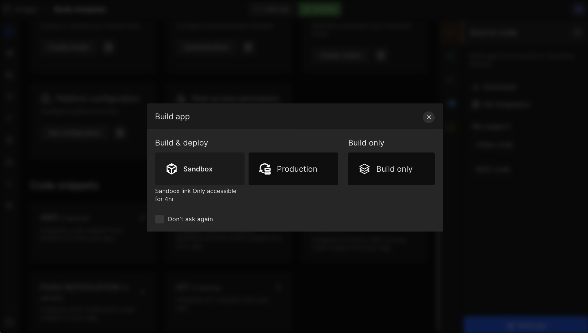
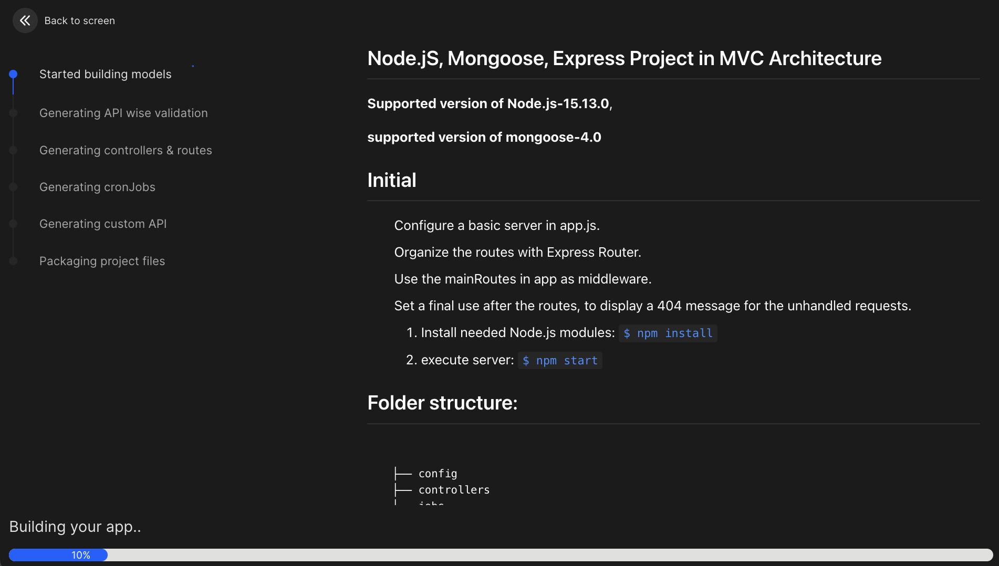
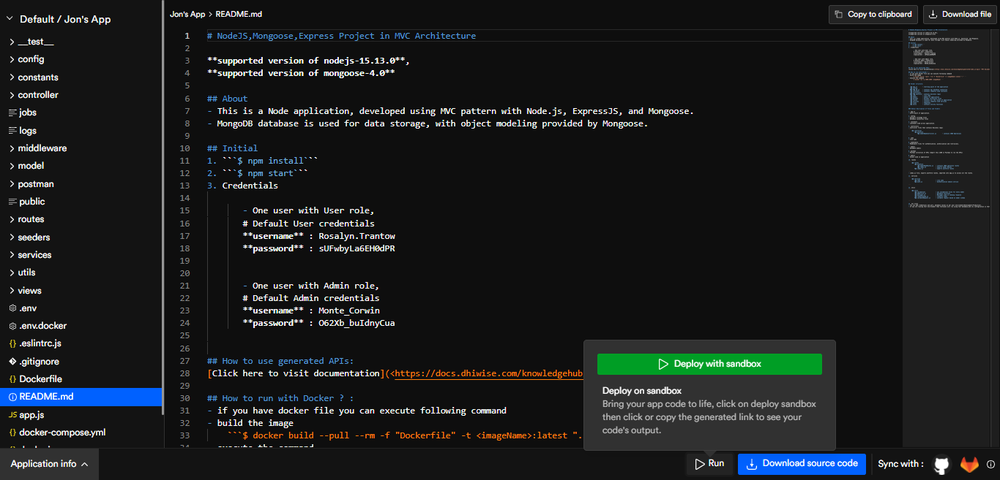
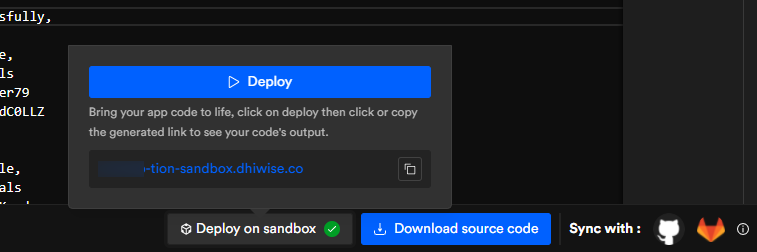

# Build and Review code

## Build App

As an individual developer or a company, we need to share the progress of the development with clients or internal teams for review at multiple stages of development. Also, feedback received from them needs to be implemented in the next releases. Considering that in mind, DhiWise stands with you in dealing with your day-to-day activities.

You can build your Node.js app right after entering models, routes, and permissions. That will help you generate CRUD operations. You can build an app right after that or at a time after this.

Click on the `Build app` button to generate code for the first time in any application. 

It will redirect you to a page where the DhiWise Node.js builder starts generating the code. You can see the progress of code generation along with the process that's been happening.

<!--  -->

#### Once the code gets generated

- You will be redirected to the code screen and from there you can download the **source code**.

- You can still make changes to the application using Node.js app builder features starting from modules, routes, permissions, and others.

- You can directly apply features to your application with just a click from the configuration. Then again you can re-build the app at any time.

- Deploy your code on **sandbox** to test APIs without downloading the code or any other inconveniences. 

## Deploy your code to production

- DhiWise will provide you with a server to host your application with a domain name that will always remain the same for that application.

- You can also review your API swagger file, or download it.

- You can review your server log and server details.

<!--  -->
<!--  -->

You will be redirected to the code generation page. You can see the **progress** of code generation along with the **process** that's been happening. Also, you will be able to **count files** generated in the previous build.

That's it, this is how you can build an app and redirect it to the code screen.

## Review Code

Building a quality product is hard, developers need to keep a checklist for managing code and the logic in the best possible way. It's essential to produce clean and scalable code to sustain a product/application in the market. With the help of the DhiWise Node.js app builder, you can achieve the same.

<h3> To review the code, first, you need to build the app.</h3>

Once you finish building the app, you can visit the "**Code**" screen and review the code generated using the Node.js app builder. You can view the code and "**Download source code**" when needed.

In the left panel, you can see the folder structure depending on the selected code architecture. The folder structure of the application will be created automatically depending on the design, actions performed and configurations selected by you.

<!--  -->

We recommend you to check the README.md file, this file consists of the following information: 

- Version support details

- How to run the project

- Directory structure (Based on code architecture)

- Directory details
You will be able to see all the directories details here, below is the list of directories : 

- app.js | config | constants | controller | entity | helperjobs | logs | middleware | models | postmanpublic | routes | services | utils | validation | views

Depending on the code architecture some of the directories may or may not be generated. For example in MVC code, entity and helper directory won't be available.

<h3>Docker file</h3>

The docker file in your app code has your code environment defined. Therefore, run your code anywhere effortlessly as long as you have Docker in the system where you wish to run your code. 

<h3>Sandbox</h3>

Click on "**Sandbox**" and get the deploy link within minutes. It will help you test your code. Moreover, your app APIs without needing to download the source and its dependencies.

<!--  -->

<h3>Deploy your code to production</h3>

- DhiWise will provide you with a server to host your application with a domain name that will always remain the same for that application.

- You can also review your API swagger file, or download it.

- You can review your server log and server details.

<iframe width="100%" height="500" src="https://www.youtube.com/embed/yqD4buhbOZU" title="YouTube video player" frameborder="0" allow="accelerometer; autoplay; clipboard-write; encrypted-media; gyroscope; picture-in-picture" allowfullscreen></iframe>

 
 

Got a question? [**Ask here**](https://discord.com/invite/rFMnCG5MZ7).