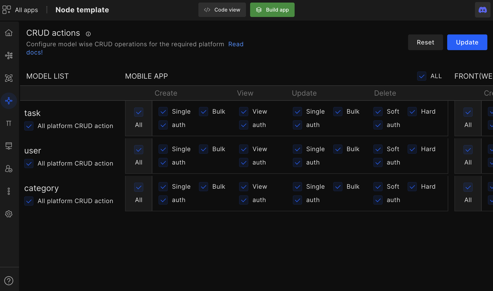
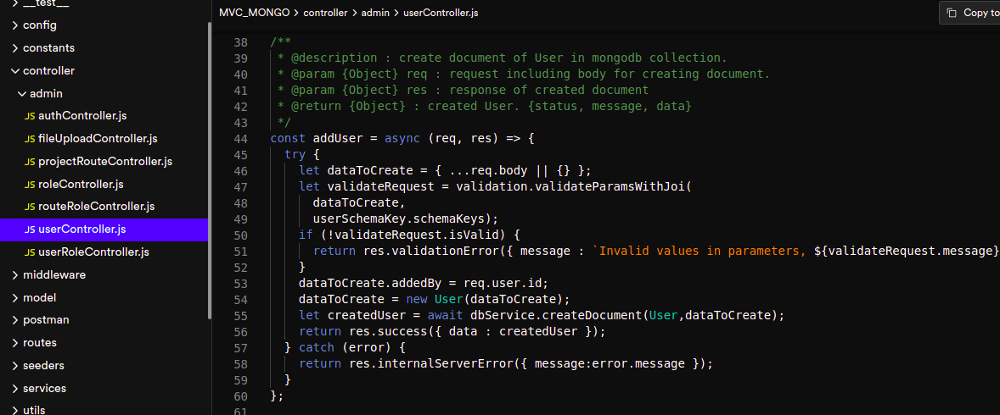
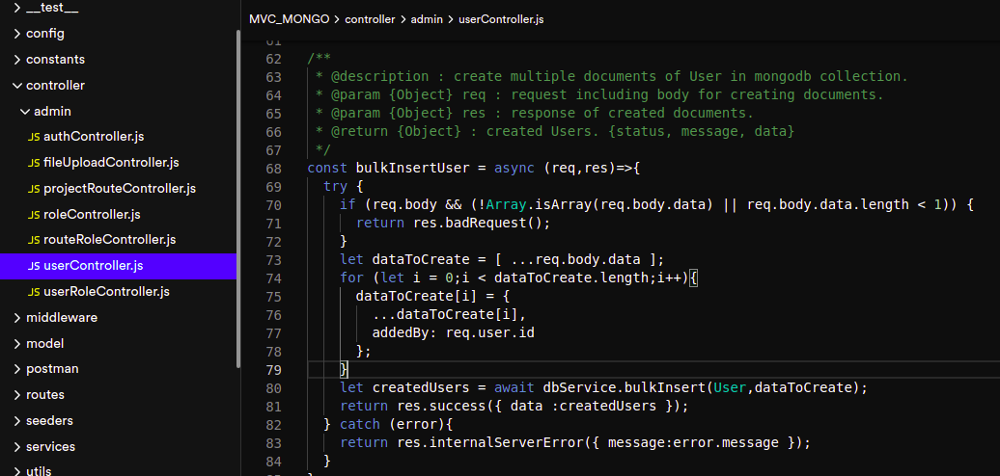
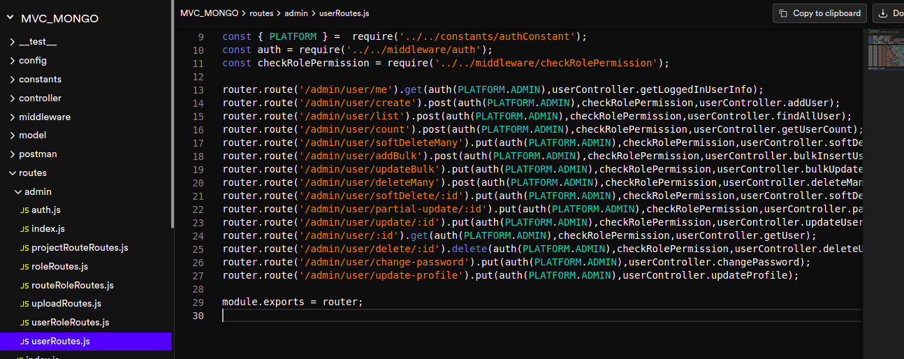

# CRUD Actions

CRUD action (**controllers method setup**) helps developers create model-wise CRUD APIs for different platforms. Moreover, developers can set up custom middleware and apply them to APIs like bulk create & bulk update, etc.

Decide which platform has access to which information.

#### Model list

Configure your model-wise permissions for the respective platform such as **Mobile app**, **front** (**website**), **desktop**, and **admin**.

## Set up CRUD actions

- You can either give **all CRUD permission** or just a few; Set authentication for each platform.

- Developers also have the option to bulk create in order to configure and provide access to large query requests at once.

- Select Auth to apply an auth policy to the CRUD actions.

On the top right-hand corner, you have the **reset button** which will reset all the models.

<!--  -->

#### Generated code snippet

 
 

Got a question? [**Ask here**](https://discord.com/invite/rFMnCG5MZ7).