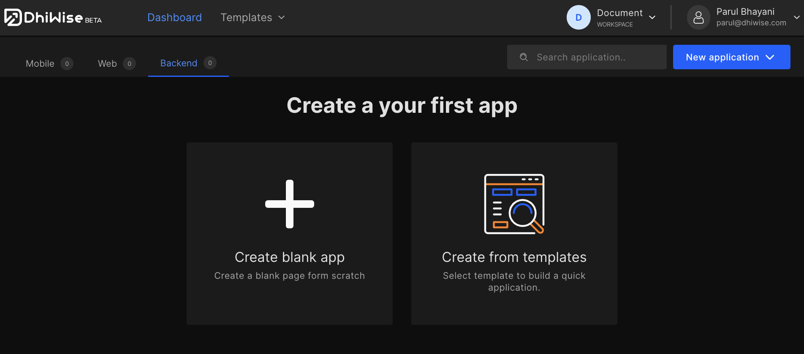
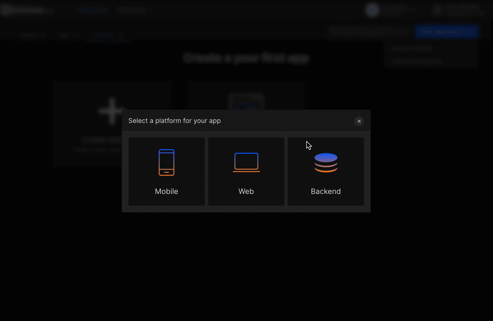
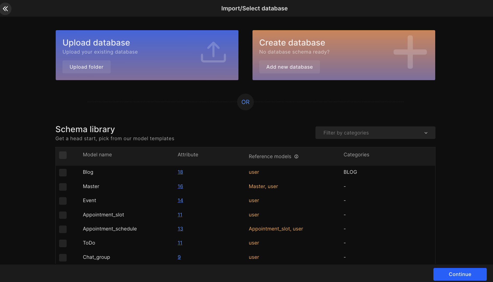
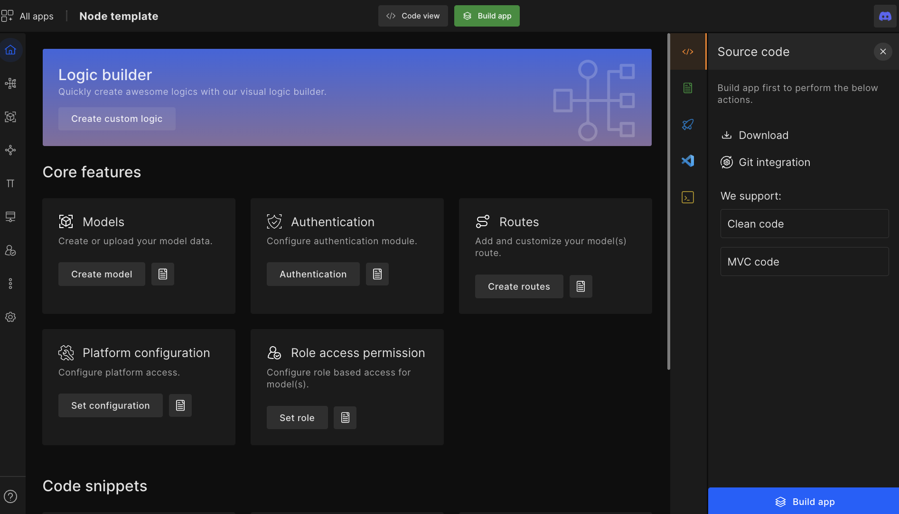

# Build a Nodejs App

Node.js app builder is a developer-centric platform to build backend CRUD APIs along with other essential features to boost developers' productivity time by twofold!

Most importantly, the Node.js app builder gives developers total code ownership. The code it generates is bug-free, which leads to developers having code consistency with zero efforts. 

:::info
Our Node.js app builder is now open-source on <a href="https://github.com/DhiWise" target="_blank">GitHub</a>. 

We welcome all contributions to our <a href="https://github.com/DhiWise" target="_blank">open source project</a>. Join our efforts to create a ProCode platform that reduces redundant work and increases productivity!
:::

## **Create Application**

Click on `New application`

You will have three options to create an application

1. <a href="/docs/node/intro#create-a-new-app">Create a new app</a>: Create an application from scratch by providing Architecture type and Database type.

2. <a href="/docs/node/intro#create-from-template">Create from Template</a>: In case you do not have an database, create a database from the range of built-in templates.

### Create a new app

#### **Step 1:** 
Select platform as **Bakend** to create a Backend. Next, enter your `Application name` and select `Technology` from the drop-down as **Node.js**.

#### **Step 2:** 

Also, select **Architecture type** and **Database type**. And click <code className="primary">Create a new app</code>. 

### Create from Template

#### **Step 1:** 
Go to **Templates** and from dropdown select `Backend`.

#### **Step 2:** 
Enter your `Application name`, and select **Architecture type** and **Database type** based on category of your application. Click <code className="primary">Find Templates</code>.  

#### **Step 3:**
Select a template based on category of your choice. 

#### **Step 4:**
Next, click on <code className="primary">Use template</code>

## **Upload, pick, or create new schema data** 

If you have schema data you can upload it, or choose from the given samples below.  

:::info
If you choose MongoDB, then these are the frameworks we support:

Mongoose | Sails.js | Total.js | NestJS | LoopBack | Fastify
:::

You can create new schema data from <a href="/docs/node/models/">Models</a>

## **Manage CRUD**

- <e className="hightlight">Create or Upload schema data</e> - Configure your model attributes. 
- <e className="hightlight">Setup model permission</e> - Configure CRUD permission for each model. 
- <e className="hightlight">Setup model-wise routes</e> - Access autogenerated routes, add routes, and more. 
- <e className="hightlight">Role access</e> - Create different roles according to platform requirements.

## **Build App**

Now, developers can either add features like auth constants, role access, etc then **build App**, or directly **build App (in MVC or Clean code) and download the source code**.

:::info
Additionally, developers can download their API postman file, and upload it to our other frontend technologies to quickly build their overall app. 
:::

These simple steps will help you reduce many of the monotonous tasks involved in building a backend and increase your work productivity.

 
 

Got a question? [**Ask here**](https://discord.com/invite/rFMnCG5MZ7).

