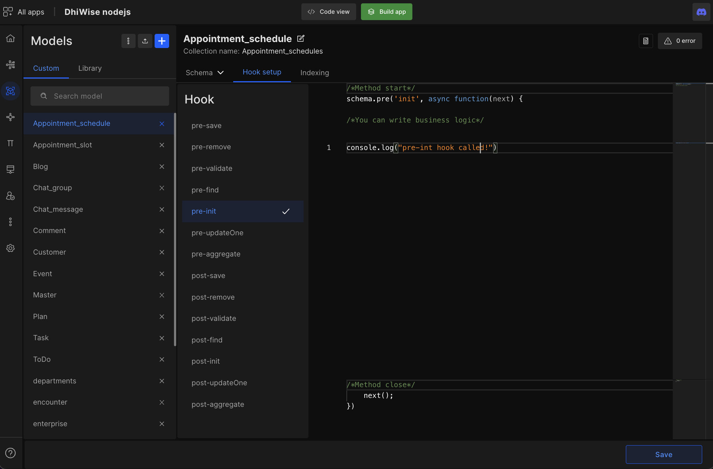
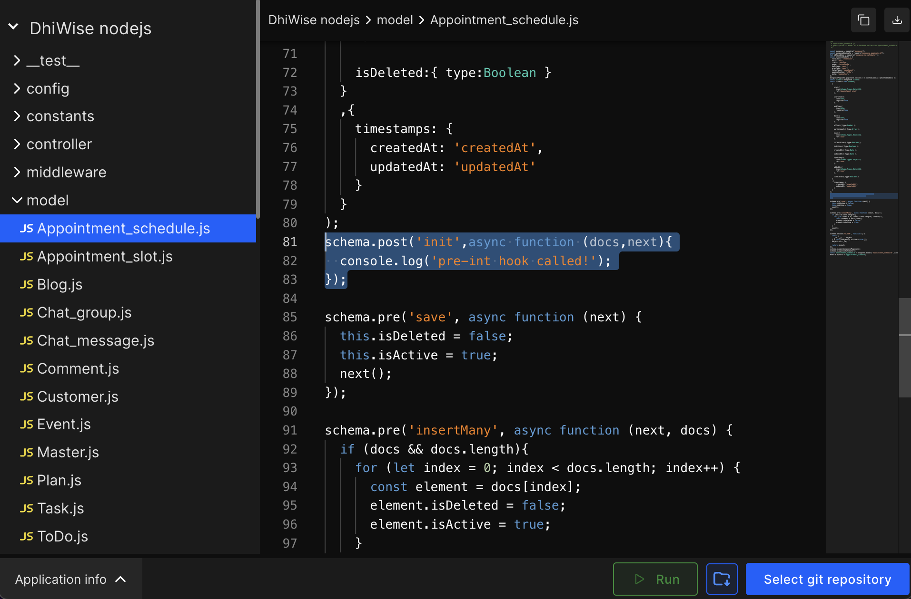
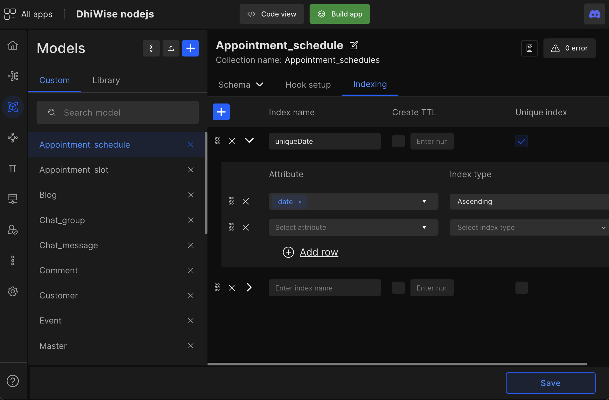
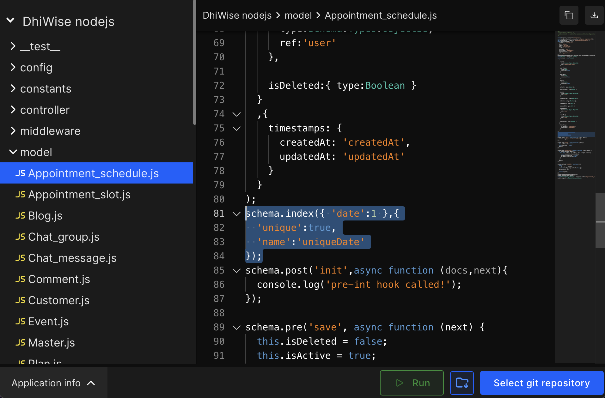

# Hook and Indexing

The hook setup helps developers manipulate data before and after it goes to the database. DhiWise provides a lot of post and pre-hook setup.

Indexing easily index a large number of data with just a few simple configurations. 

## **Hook setup**

Below are the **Hook setup** you will find on Node.js app builder.

`pre-save |  pre-remove |  pre-validate |  pre-find  pre-init |  pre-update
One pre-aggregate | post-save   post-remove |  post-validate
post-findpost-init | post-update | Onepost-aggregate`

### Hook setup code

## **Indexing**

The indexing types we are providing in **Unique**, **Ascending**, **descending**, and **2dSphere**.

### Indexing code

 
 

Got a question? [**Ask here**](https://discord.com/invite/rFMnCG5MZ7).