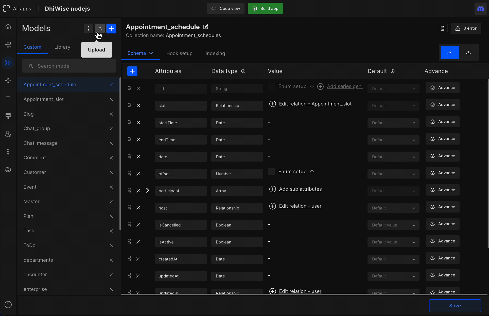
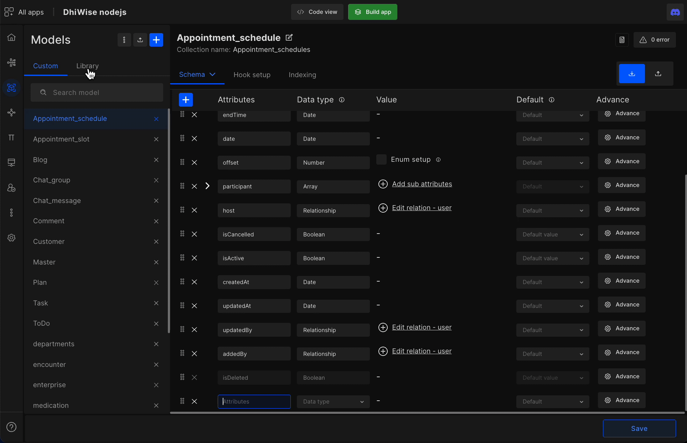
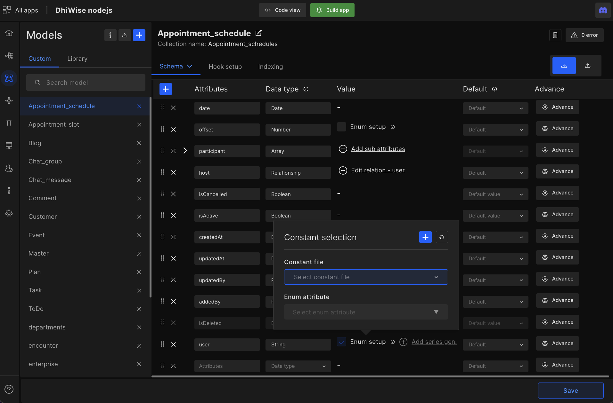
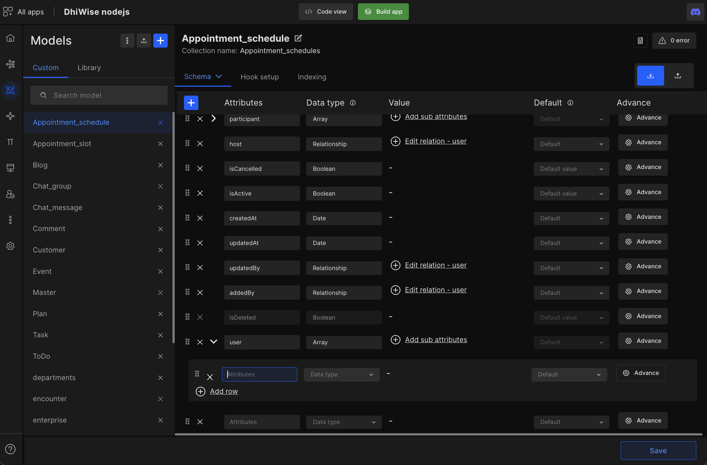
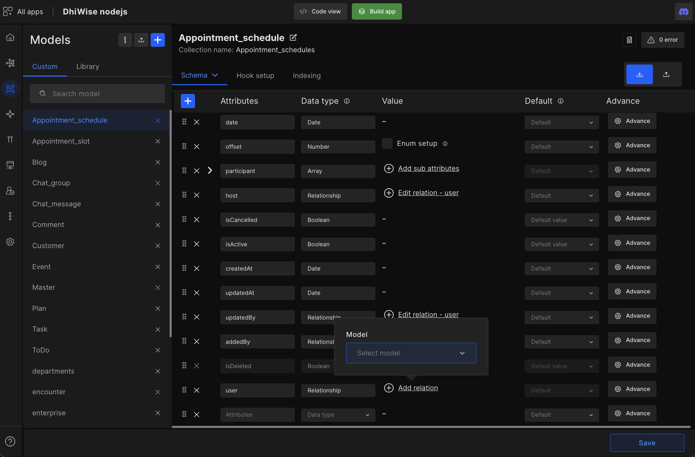
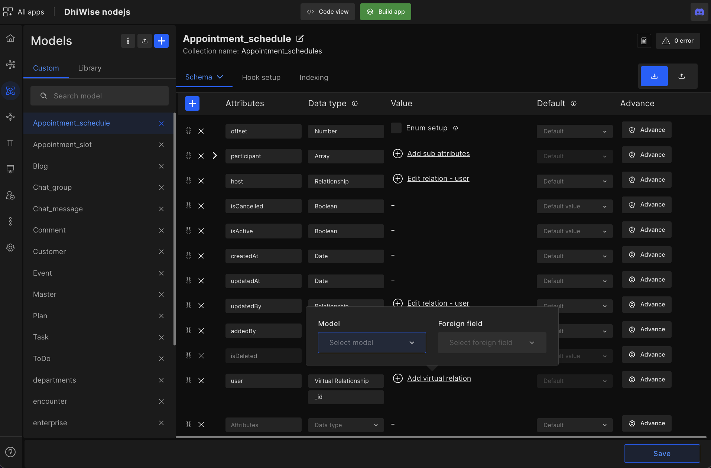

# Model

Models feature helps developers quickly (in minutes) define their model attributes or upload schema data, or paste model attributes then generates model-related CRUD APIs, routes, and more.

Models is an interactive UI with many features & configuration options like Hook setup, indexing, model library, different view settings, and more. 

## Create or upload schema models

The model framework we support are: sailsjs, totaljs, nestjs, loopbackjs, fastifyjs.

- Upload your **scheme data** for multiple or individual models. 

- Create new models on DhiWise.

- Or simply paste your model attributes (**new models > model attributes**) to create models.

## Pick models from our model library

Inside the library, you will find predefined models and their attributes for you to customize as per your needs to quickly create models.

## Configure your model attributes

<table>
    <tr>
        <th>Attributes Configuration</th>
        <th>Description</th>
    </tr>
    <tr>
        <td>Attributes</td>
        <td>Your model attribute names</td>
    </tr>
    <tr>
        <td>Data types</td>
        <td>Select the datatype for your attributes</td>
    </tr>
    <tr>
        <td>Value</td>
        <td>Set values to validate your attribute</td>
    </tr>
    <tr>
        <td>Default</td>
        <td>Set a default value or have it null</td>
    </tr>
    <tr>
        <td>Private</td>
        <td>The attribute will be excluded from the API response</td>
    </tr>
    <tr>
        <td>Require</td>
        <td>Set your attribute to be compulsory</td>
    </tr>
    <tr>
        <td>Unique</td>
        <td>Set your attribute to be unique</td>
    </tr>
    <tr>
        <td>Auto increment</td>
        <td>Set auto increment for you attribute list</td>
    </tr>
    <tr>
        <td>Minimum</td>
        <td>Set a minimum length of your attribute</td>
    </tr>
    <tr>
        <td>Maximum</td>
        <td>Set a maximum length of your attribute</td>
    </tr>
    <tr>
        <td>Low</td>
        <td>Convert attribute to Lowercase</td>
    </tr>
    <tr>
        <td>Trim</td>
        <td>Trim excess space</td>
    </tr>
    <tr>
        <td>Pattern</td>
        <td>Set a validation pattern for you attributes</td>
    </tr>
</table>

- If you have selected the MySQL database, then you can set model relation in "**edit relation**" with other model attributes from one to many or one to one. 

- Another feature of schema is you have three different view types to choose from such as **code view**, **tree view**, and **table view**. You can choose anyone between them.

- Additionally, simply type in your attribute, and DhiWise will auto-fill the appropriate data type for you.

The data type we have are:

`STRING, TEXT, CHAR, BOOL, INTEGER, BIGINT, FLOAT, REAL, DOUBLE, DECIMAL, DATE, DATEONLY, IMESTAMP, UUID, UUIDV4, BLOB, ENUM, JSON, JSONB, ARRAY, GEOMETRY, GEOGRAPHY, RANGE, TINYSTRING, TINYINTEGER, UnsignedBigInt`

## Insert data type values

**String** - enum setup > constant selection, & enum attribute.

**Array** - Add sub-attributes

<!--  -->

**Relationship** - select model

<!--  -->

**Virtual relationship** - Select referred Model and Foreign. 

<!--  -->

A virtual relationship is a property not stored in MongoDB. Virtuals are typically used for computed properties on documents.

 
 

Got a question? [**Ask here**](https://discord.com/invite/rFMnCG5MZ7).

