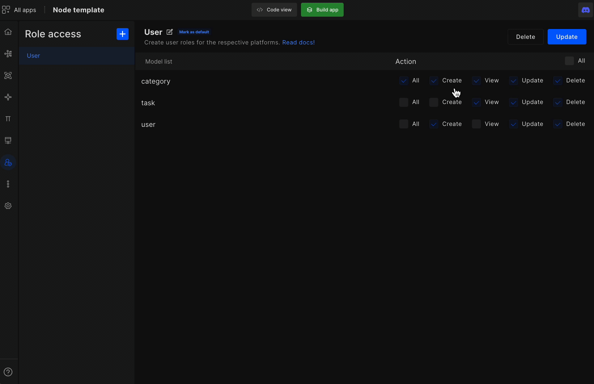

# Role Access

Role access feature helps developers give CRUD APIs access to the right user. However, such a simple task is a headache to code. But, with the help of DhiWise, now, it is easier than ever to rightfully give CRUD access to models without any error or hours of writing lengthy code. 

#### Go to Role access

Role access: Add and manage new roles in your application.

:::tip Example
In an online delivery services application, there are mainly three roles: a restaurant, a driver, and a customer. These are the three roles on the application and accordingly, the CRUD permission is given from the selected modules. 
:::

**Model list**: Will showcase your current models.

**Action**: Set up all or some CRUD permission for the model list.

Once you have selected the action you can update or you can even delete roles.

 
 

Got a question? [**Ask here**](https://discord.com/invite/rFMnCG5MZ7).