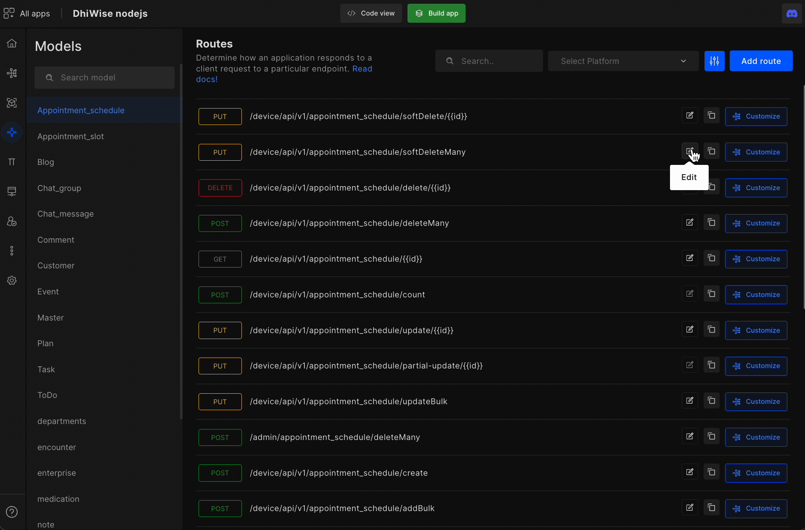
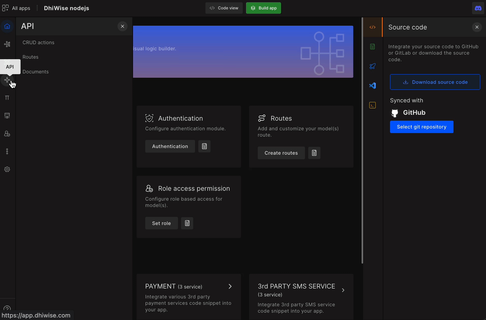
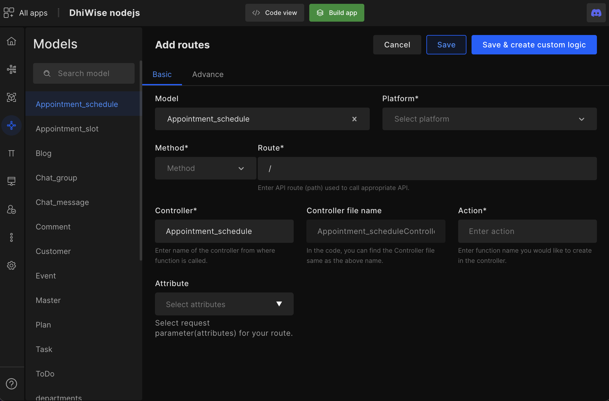
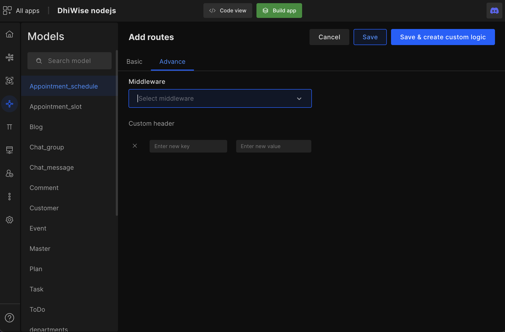
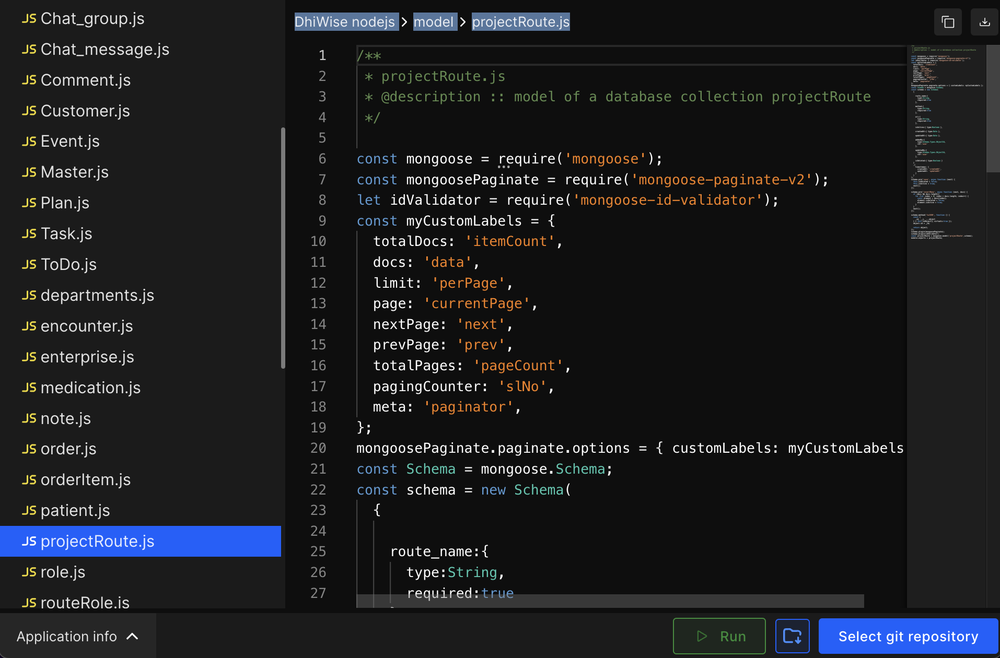
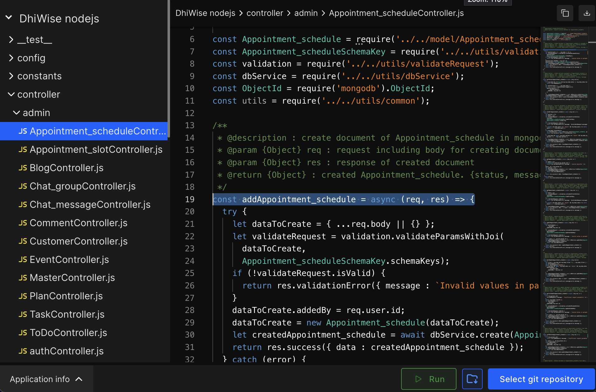
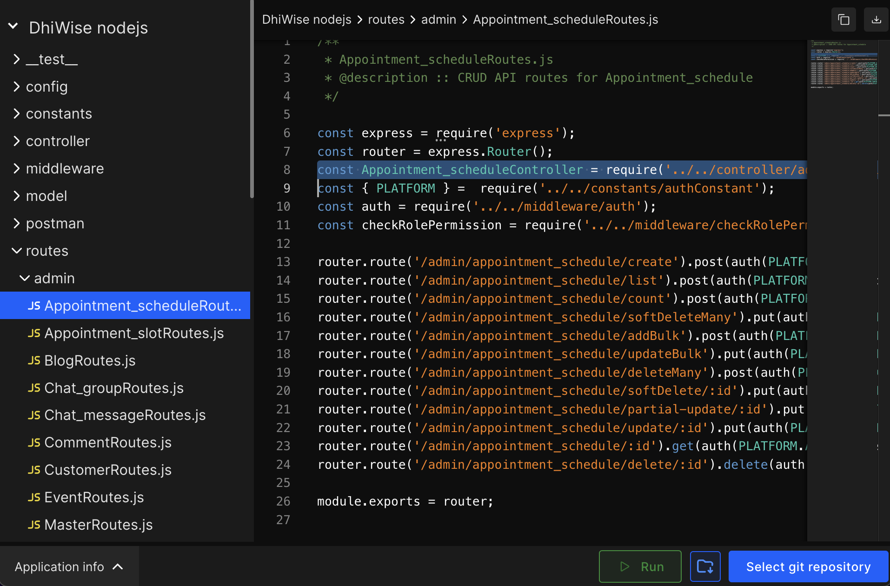

# Routes

Once the models are created, DhiWise auto-generates routes (The pathway of APIs). Furthermore, new routes can be added and edited with the help of logic builder and its advanced configuration options.  

Therefore, instead of writing lengthy code manually for routes, models, and APIs, developers can simply use the logic builder options to add, edit, manage and configure routes for multiple models and create custom business logic within minutes.

## Edit routes

Select the model route you want to **edit**, **clone**, **customize**, or create a **new route**.

Once you click on the `edit` you will get the option of model permission. 

## Model permission

You can select the **middleware** you want to apply for the operation and select the **attribute** of the model for which you desire the API response. Then click on **save** to successfully update your changes. 

:::info
For adding custom logic you can check out our <a href="">Logic Builder</a>
:::

<!--  -->

## Add route

Configure and add a route, you will see four categories such as basic and advanced.
In basic you have to input all the below details:

- **Models**: Choose your model.

- **Platform**: Here the platform that you have already selected will come up the platform such as **admin, mobile, front(website)**, and **desktop**. 

- **Methods**: Choose from the HTTP methods below 

`POST | GET | PUT | DELETE | PATH HEAD | OPTIONS | PURGE | LINK | UNLINK`

- **Routes**: Enter API route (path) used to call appropriate API.

- **Controller**: Enter the name of the controller from where the function is called.

- **Action**: Enter the function name you would like to create in the controller.

- **Attributes**: Select request parameters (attributes) for your route.

- **Descriptions**: Enter the description for the route here.

<!--  -->

## Advance

Select the **middleware** you want to apply for the operations and enter the **custom header** with a new key and new value. 

## Generated code snippet

 
 

Got a question? [**Ask here**](https://discord.com/invite/rFMnCG5MZ7).