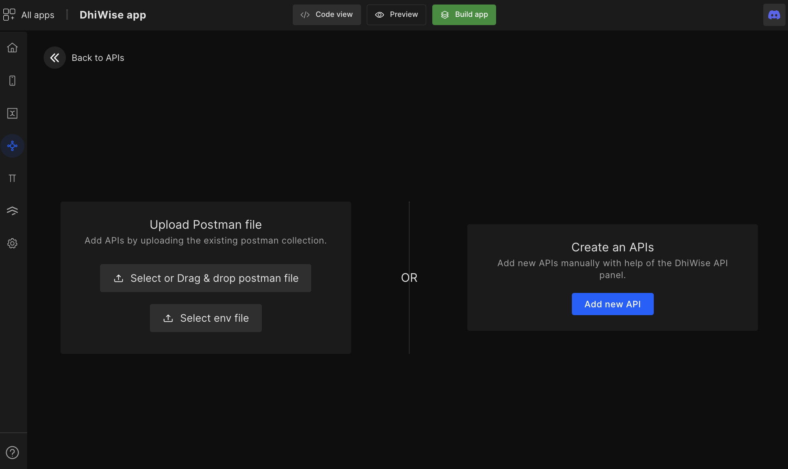
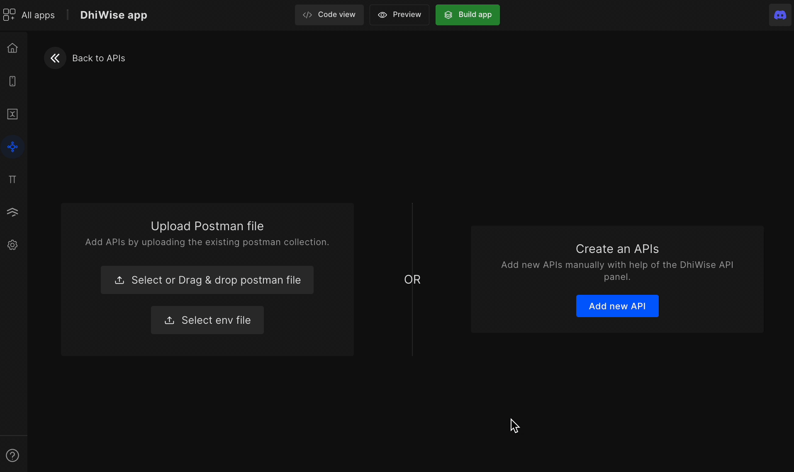

# Add APIs and Enviroment Variables

Easily add **APIs manually** or upload **Postman collection** to integrate API in your app later.

Go to your React app builder, on page list select **API integration**(icon) from the left menu. Here, you can `Add new API`, Delete or Edit an existing one.

To add a new one, click on `Add new API`

## **You can add APIs using two ways:**

### 1. Upload Postman file

Upload the API Postman collection & environment file to get the list of all the APIs from the postman file.

### 2. Create APIs manually
  - Add APIs manually by clicking on the `Add new API` button. It will redirect you to the API runner page.
    
    #### **Step 1:** 
    Select the **API method** from the top-left and enter the **URL**. Below is the list of methods that are supported;
    
    <!-- type2 -->
    | Method | Description |
    | --- | --- |
    | **<e className="put method">PUT</e>** | PUT method creates or updates a specified resource |
    | **<e className="get method">GET</e>** | GET method retrieves information from a specified resource |
    | **<e className="delete method">DELETE</e>** | DELETE method deletes the specified resource |
    | **<e className="post method">POST</e>** | POST request is used to send data to a server to create/update a resource |
    
    :::info
    If **Headers** and **Params** are already set into the Postman collection for an API then it will be auto-set here.
    :::
    
    #### **Step 2:** 
    The next step is to add Header, Params, and Body;
 
    

      <a className="Card">
        <h4>
            Header
        </h4>
        
Add header configuration by setting key values

      </a>
      <a className="Card">
        <h4 className="">
          Params
        </h4>
        
Add query parameters and sample values

      </a>
      <a className="Card">
        <h4 className="">
          Body
        </h4>
        
Add/ bind API request body

      </a>
    
   
     

    

    * **Send API request:** Once you `Send` the request. You will get the response and the API will be auto-saved for you. To send request click on `Send` or use shortcut `Ctrl + G`.
      
    JSON: Your API response will be formatted into JSON, which will be visible from here
    Raw: The raw API data which you got from the API response is available here
    Headers: The headers from the API response are stored here
    
    <!-- type1 -->
    <!-- typeaddicon -->

    :::info
    **Show code:** Get code for your API by clicking on Send > Show code or simply use shortcut S. You can select from a range of languages available.

    📑 **Import cURL:** Import API from cURL by clicking on Send > Import cURL or simply use shortcut C
    :::

## **Add Environment Variables**

- The environment variable `Global` comes as default. However, you can always create new variables. In the environment variable, you can add variables and its value as shown in the below GIF.
- To use those variables in the URL simply use curly braces `{{variable_name}}`
 

- Once you've built the app follow the TODO as shown below in your source code to change to different environment variables.

 
 

Got a question? [**Ask here**](https://discord.com/invite/rFMnCG5MZ7).
