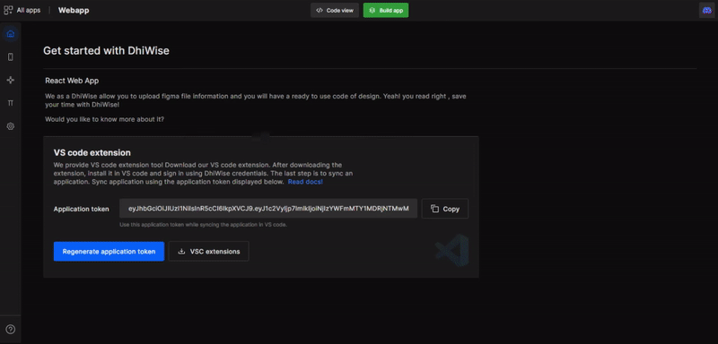
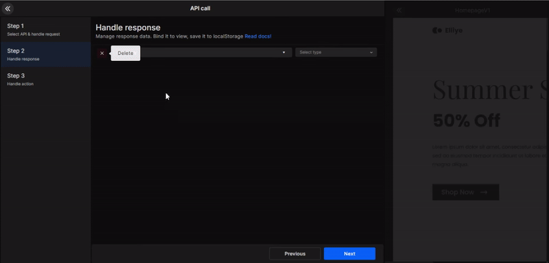
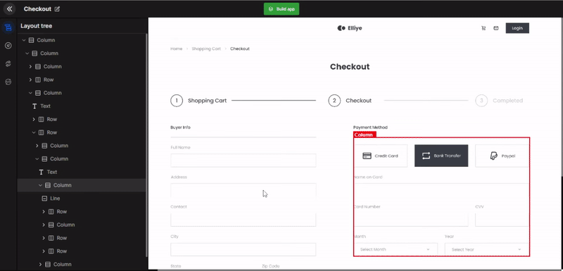
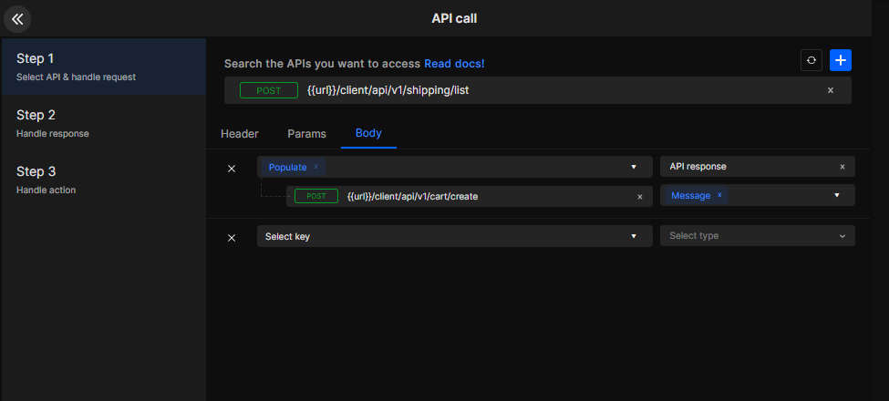
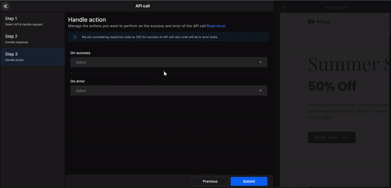
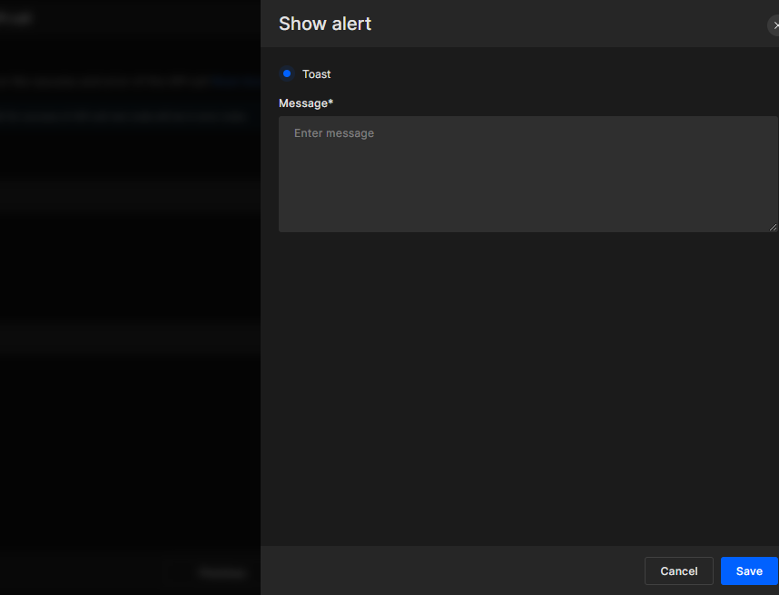

import navigationImg from "./img/navigation.png"
import ApiIntegrationImg from "./img/APIIntegration.png"
import AlertImg from "./img/Alert.png"

# API Integration

APIs play a vital role in making an application interactive. An application has to integrate a number of different APIs into it for its different functionalities to work. With DhiWise, setup these APIs easily for your application.

## How to integrate APIs to page components?

In the pages feature, select a page, then select a component to which you want to integrate the API. After that there are 3 steps to successfully integrate the API. 

1. Go to **pages** 

2. Select a **page**

3. Select a **component**

4. Click on <a href="/docs/react/create-action">Create action</a>

5. Select API Integration from the side-left panel

#### Step 1

Search for the API you want to access. Then select the required header, parameter, and body.

The types of API request supported are get, post, update, & delete.

#### GET

Developers can store the retrieve data in local storage or save it in manual input.

- Local storage - Store the data on the app.
- Manual input - Provide key for the data.

#### POST

Developers can send data via following ways:

- **View** - Send data received from user input.

- **Manual input** - Static data

- **Local storage** - Pass data saved on local storage.

- **API response** - Pass data received from API

- **Navigation arguments** - Share data between pages using navigation argument.

- **Constants** - Selected the constant file.

In the below gif, we have bind the user input "Address" to the API body.

In the below gif, we are sending data in the response body from an API call that is already integrated on the page.

#### Step 2

Manage the response data and bind it to the respective page component, then select the required key and UI component.

#### GET API response

- Local Storage - Store in browser cache
- Array - Get data in Array.
- View binding to List only.

#### POST API response

- LocalStorage - Store the data in your app.
- View binding - Bind the API data to the page components
- Parameterized Route -  Add parameters to your routes

#### Step 3
Manage the action you want to perform on the success or error of your API call. In drop box, you will see the options which we have already covered like Navigation, Show Alert, & API integration.

      <a className="Card" href="/docs/react/api-integration">
        
        <h4>API integration</h4>
      </a>
      <a className="Card" href="/docs/react/navigation">
        
        <h4>Navigation</h4>
      </a>
      

        
        <h4>Show Alert dialog, Toast, Snackbar</h4>
      

#### Navigation

After the API call is successful, select which page to navigate to next. 

##### Navigation argument

While setting up navigation action, you can also pass the data from the current page to the page you are navigating to via API response, Navigation argument, & constant files. 

- **API response**: If your current page has API integrated which is receiving data in response that you can share that data to the page you're navigating to via API response. 

- **Navigation argument**: If the current page already has Navigation argument set up. Then you can pass that same data to the page you're navigating to.

- **Constant**: If you have added constant files, then you can pass the constant data to the page you are navigating to.

#### Show Alert

On the success or error of the API call show a toast alert message.

#### API Integration

On the success or error of the API call, you can choose to do another API call. You will again have to repeat all the 3 steps. 

However, after this API call you won't be able to do another API call. The API nesting limit is only 2.

  

Got a question? [**Ask here**](https://discord.com/invite/rFMnCG5MZ7).