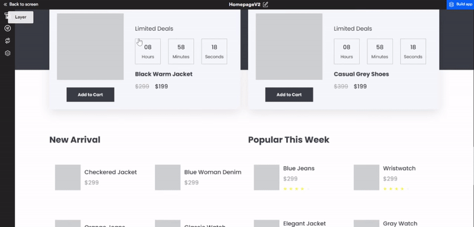
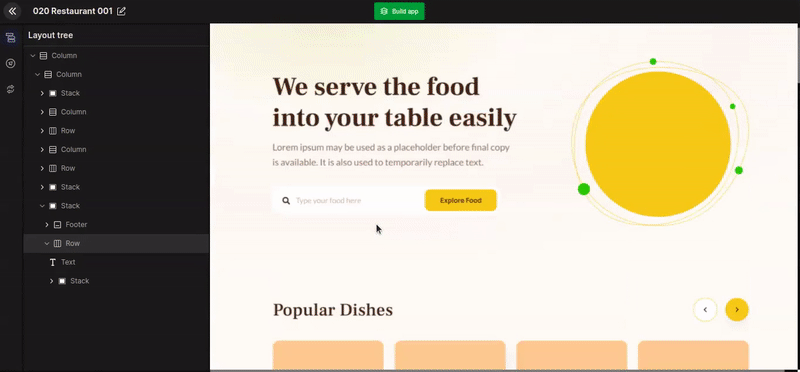
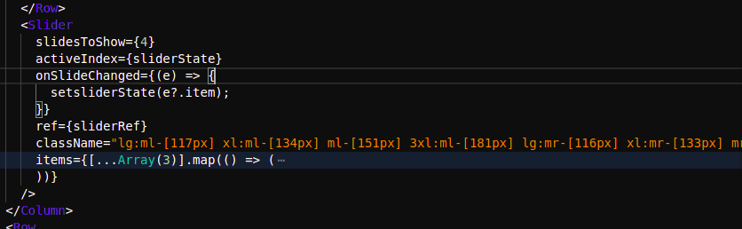
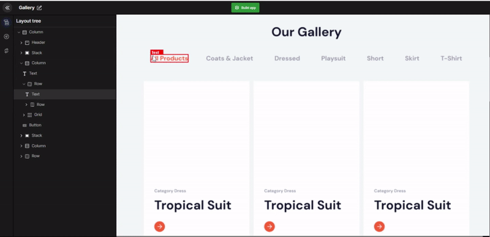
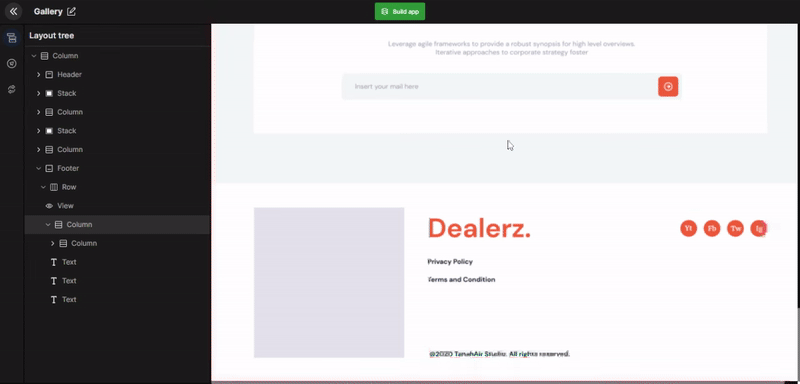

import Tabs from '@theme/Tabs';
import TabItem from '@theme/TabItem';

# Change View

After fetching your design, DhiWise identifies all the components in your webpage. The identified components can be checked under the layout tree. You can click on any component and change the component type from the component list that we support. 

:::tip Example
For example, if a component is unidentified or misidentified then with this feature its view type can be changed e.g. from a text view to a button.
:::

We support the change view feature for only the below components:

<Tabs groupId="tabs">
  <TabItem value="Column Inputs" label="Column Inputs">
  <div>
    Row | Chart | List | SearchView | TextImage | CircleImage | Stack | Grid | Line | Header | Footer | GoogleMap | Tab
  </div>
  </TabItem>
  <TabItem value="Form Inputs" label="Form Inputs">
  <div>
    Button | Input | Radio | Radio Group | CheckBox | DropDown | DatePicker | TextArea | Slider | Previous control | Next control | Page indicator
  </div>
  </TabItem>
    <TabItem value="Slider Inputs" label="Slider Inputs">
  <div> 
    Slider | Previous control | Next control | Page indicator
  </div>
  </TabItem>
</Tabs>


:::tip Example
For example, below we have changed an icon image to a button.
:::



Below are a few examples of change components.

## Change component to chart

If your web page has images of charts, then convert them into real charts following the below steps.

1. **Pick a component to convert**

2. **Select Change View**

3. **Select tab**

4. **Pick the chart type**

- Line | Bar | Pie | Scatter | Area | Radar | Bubble | Candlestick | Doughnut | Composed | Sankey | Treemap | Funnel | Radialbar 

5. **Select a library**

- recharts  | nivo | victory | react-chart-js-2 | react-google-charts

6. **Configure the chart view**

- Apply legend
- Apply tiny
- Apply tooptip
- Select the group type
- No of data set - Input the no of data set you require.
- Select layout type - Vertical or Horizontal


## Change component to slider

Convert a list component in your webpage into a slider. You require a list and two arrow-like images from the list to move forward & backward.  

1. **Select the component**

2. **Select Change view**

3. **Select the slider type**

4. **Select the page indicators > save**




#### Generated code snippet




## Convert component to Tab

The tab design on your webpage may be identified as a row component. However, you can convert it to a tab by following the below steps.

1. **Select the Tab Design**

2. **Select Change view**

3. **Select Tab**

- Pick any Tab content from the current webpage & save.



#### Generated code snippet

```js
import React from "react";
import { Tab, TabList, TabPanel, Tabs } from "react-tabs";
import "react-tabs/style/react-tabs.css";
import { Column } from "components/Column";
import { Text } from "components/Text";
import { Image } from "components/Image";
import { Grid } from "components/Grid";
const GalleryPage = () => {
  return (
    <>
      <Tabs
        selectedTabClassName="!text-deep_orange_A200 tracking-ls1 font-dmsans font-bold !opacity-100"
        selectedTabPanelClassName="mr-[832px] lg:mr-[647px] xl:mr-[740px] 3xl:mr-[998px] tab-panel--selected"
        className="w-[100%]"
      >
        <TabList className="flex flex-row items-center justify-start lg:mt-[43px] xl:mt-[49px] mt-[56px] 3xl:mt-[67px] mx-[auto] w-[82%]">
          <Tab className="font-bold opacity-100 text-bluegray_302 lg:text-fs18 xl:text-fs21 text-fs24 3xl:text-fs28 text-left tracking-ls1">
            <Text className="">{`All Products`}</Text>
          </Tab>
          <Tab className="font-bold lg:ml-[52px] xl:ml-[60px] ml-[68px] 3xl:ml-[81px] opacity-100 text-bluegray_302 lg:text-fs18 xl:text-fs21 text-fs24 3xl:text-fs28 text-left tracking-ls1">
            <Text className="">{`Coats & Jacket`}</Text>
          </Tab>
        </TabList>
        <Grid className="lg:gap-[12px] xl:gap-[14px] gap-[16px] 3xl:gap-[19px] grid grid-cols-3 lg:mt-[56px] xl:mt-[64px] mt-[72px] 3xl:mt-[86px] mx-[auto] w-[86%]">
          <div>
            {[...Array(2)].map(() => {
              return (
                <TabPanel className="w-[100%]">
                  <Text className="font-bold lg:mt-[315px] xl:mt-[361px] mt-[406px] 3xl:mt-[487px] lg:mx-[31px] xl:mx-[35px] mx-[40px] 3xl:mx-[48px] text-bluegray_302 lg:text-fs12 xl:text-fs14 text-fs16 3xl:text-fs19 text-left tracking-ls1">{`Category Dress`}</Text>
                </TabPanel>
              );
            })}
          </div>
        </Grid>
      </Tabs>
    </>
  );
};
export default GalleryPage;
```

## Convert a component to input

The input field on your webpage may be identified as a row. Therefore, convert it to the input component by following the below steps. 

1. **Select the input design**

2. **Select Change View**

3. **Select Input > Save**



#### Generated code snippet

```js 
      <Input
        className="placeholder:bg-transparent bg-white_A700 border-0 font-lato font-normal non-italic"
        name="Group6"
        placeholder=""{'Type your food here'}
      ></Input>
```


<br/><br/>

Got a question? [**Ask here**](https://discord.com/invite/rFMnCG5MZ7).