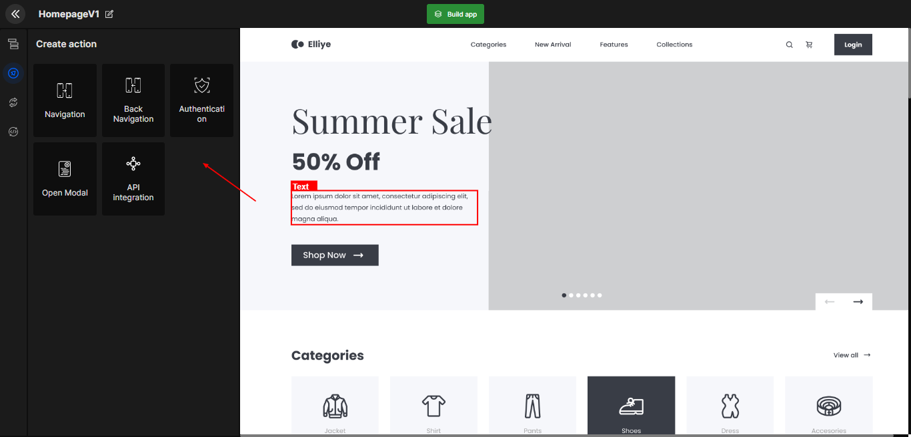

import navigationImg from "./img/navigation.png"
import ApiIntegrationImg from "./img/APIIntegration.png"
import SocialAuthImg from "./img/Authentication.png"

# Create Action

Configure the actions that design components (Buttons) preforms e.g. navigation & more.

## What is create action?

A website has multiple components, many of which perform some action e.g. button, slider, & more. The "Create action" configures which action those components will perform. It can be navigation, authentication, or any other.

Below are the types of actions you can set up on your web page components.

   

      <a className="Card" href="">
        
        <h4>Navigation</h4>
      </a>
      <a className="Card" href="">
        
        <h4>Open modal</h4>
      </a>
      <a className="Card" href="">
        
        <h4>Social Authentication</h4>
      </a>
      <a className="Card" href="">
        
        <h4>API Integration</h4>
      </a>
    

 
 

Got a question? [**Ask here**](https://discord.com/invite/rFMnCG5MZ7).
