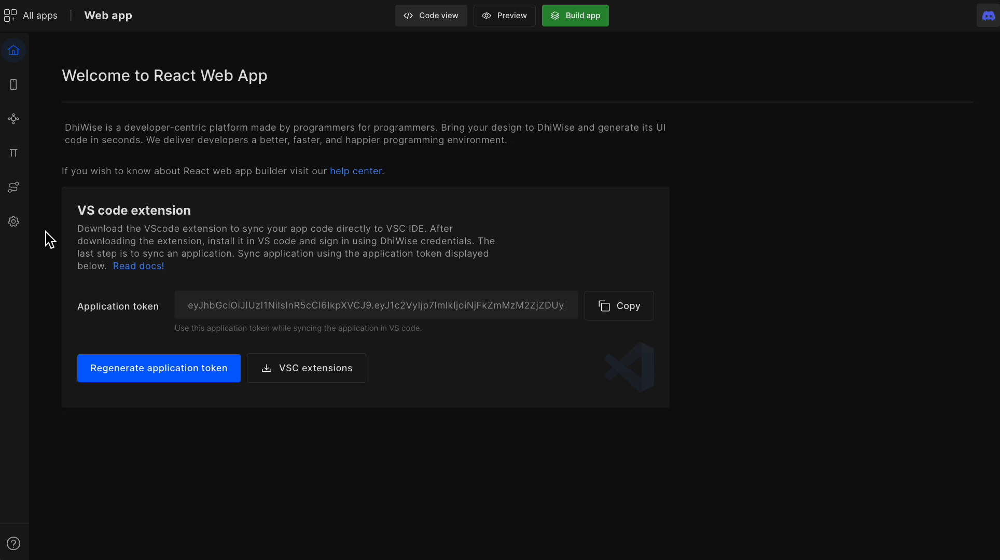
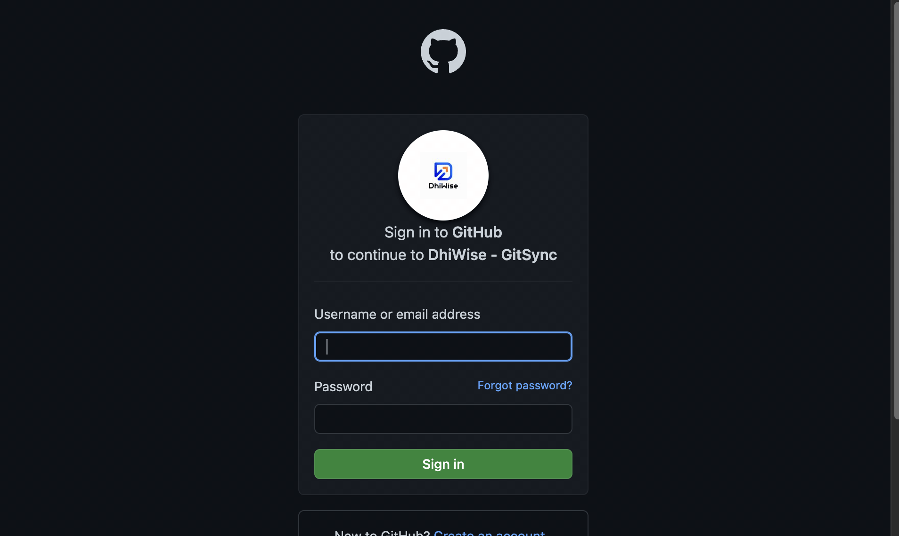
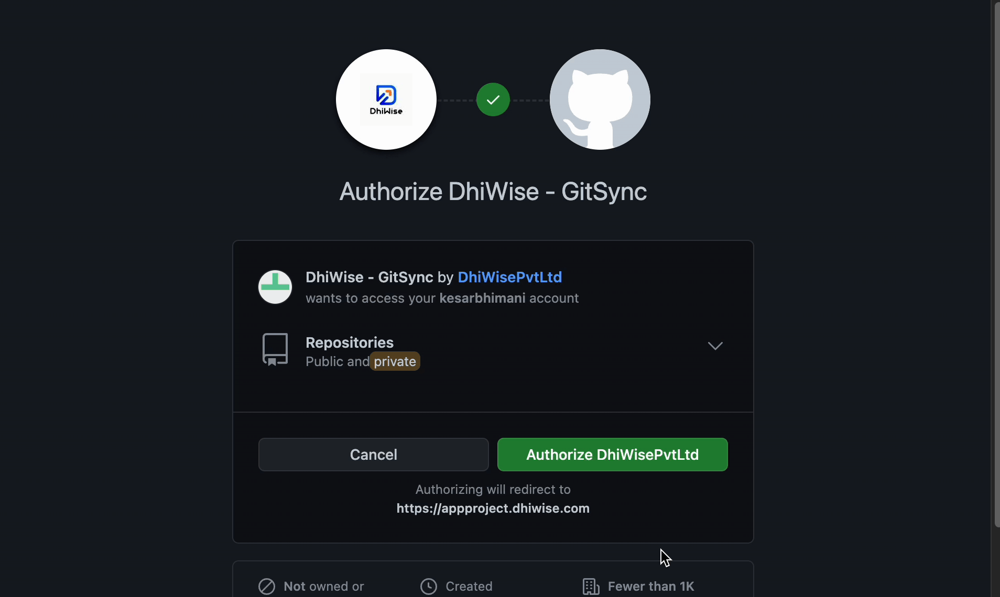
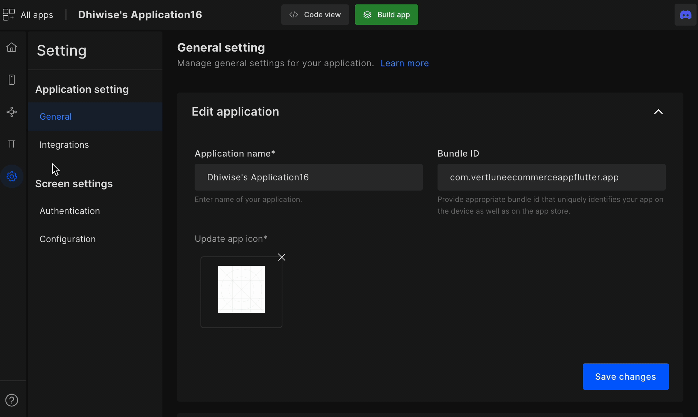
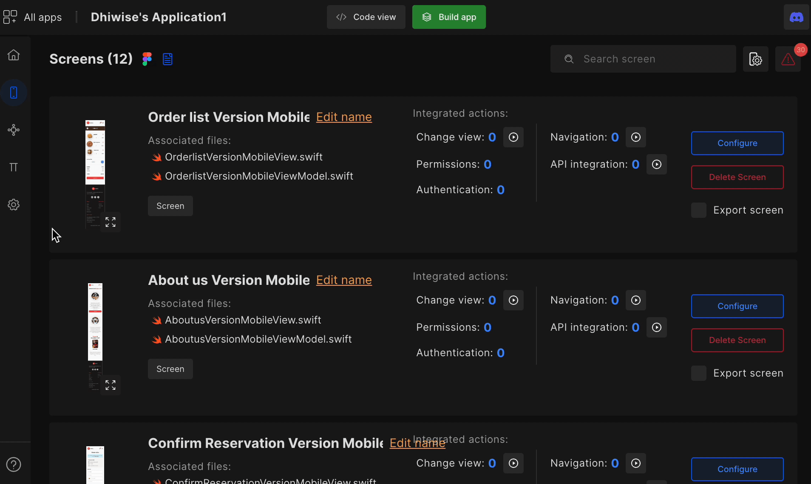
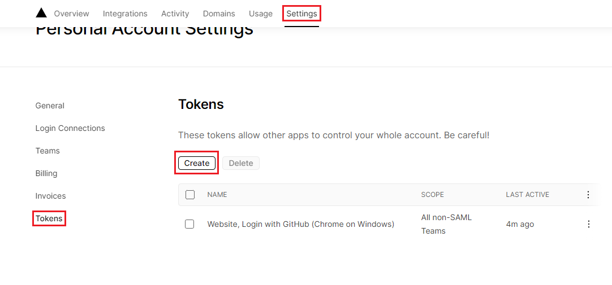
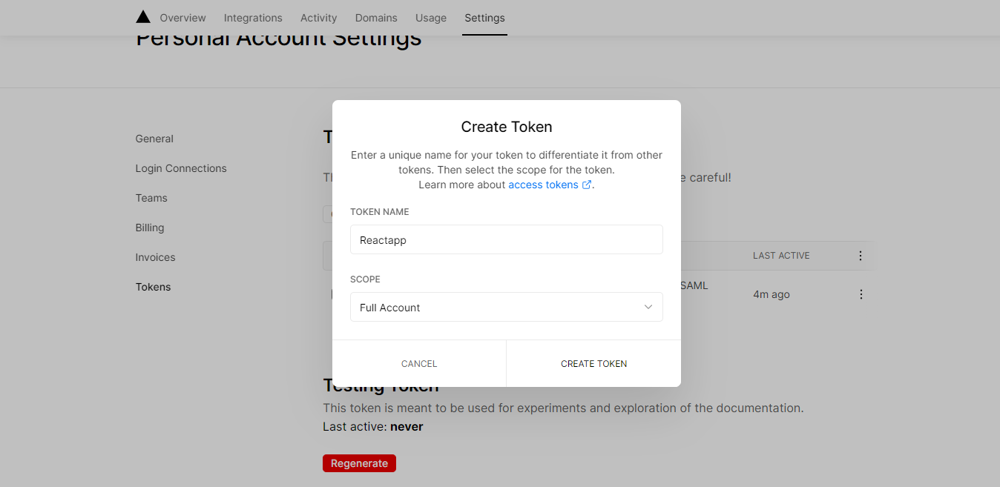
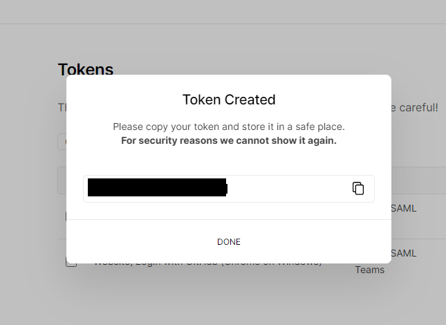
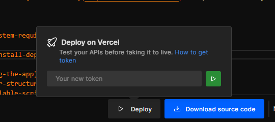

# Deploy on Vercel

## **Sync application code to GitHub**

Sync and manage your application code with GitHub after you <a href="/docs/react/build-app#build-app-to-generate-code">Build app</a>.

#### **Step 1:** 
Go to applications settings and click on Integrations from the left panel. And select **GitHub** option.

#### **Step 2:** 
You will be taken to the GitHub login screen, where you are asked to provide your GitHub **username/email** and **password**, or create a new GitHub account if you do not already have one.

#### **Step 3:** 
After entering your credentials, you will be redirected to the **authorization** page. Click on `Authorize DhiWisePvtLtd` button to authorize DhiWise to sync code in your GitHub account.

#### **Step 4:** 
When the authorization is completed, you will be taken to the DhiWise application settings page. Select integration and you will be able to see `Select repository` option. Please `select blank` repository; you will not be able to select a repository that already contains programming files. Also, a repository cannot be changed once is it committed.

#### **Step 5:** 
By clicking on `Select repository` button, you can either select an existing one or click on ➕ button to add a new repository. It will redirect you to GitHub, and you can `create new repository.` After creating a new repository, click on `Refresh` button and you can see the newly created repository in the list.

#### **Step 6:** 
After you select repository, you will see the GitHub repository name and URL. You can also switch repositories by clicking the `Change repository` button.

#### **Step 7:** 
To commit code to GitHub, first **build app** and then select `Code view`. The GitHub repository will be visible at the bottom of the code page. To push your application code to the GitHub repository, click `Commit`. You can also change the repository from here if necessary.

## **Sync application code to GitLab**

Sync and manage your application code with GitLab after you <a href="/docs/react/build-app#build-app-to-generate-code">Build app</a>.

#### **Step 1:** 
Go to applications settings and click on Integrations from the left panel. And select **GitLab** option.

**Step 2:** When you click on the sync with GitLab button, a dialogue will appear with two options: **SaaS** and **Self manage**. To move to the next step, select any of the options and provide the necessary information.

:::caution
To sync application code on GitLab, you need a Personal access token, click here to know how to generate personal access token on GitLab.
:::

### Sync GitLab Using SaaS

Choose **SaaS**, enter your **Personal access token**, and click `Submit`. The token will be verified when you provide the details, and you will be able to see the GitLab repository details.

### Sync GitLab Using Self manage

Select `Self manage` and enter **Domain URL**, **Username**, and **Personal access token** and click on `Submit`. After providing the information, the token will be validated and you will be able to view the GitLab repository details. The **personal access token** has to be of the administrator.

#### **Step 1:** 
When the authorization is complete, you will be returned to the DhiWise application settings page. Select integration and you will be able to see the `Select repository` option. Please select a **blank repository**; you will not be able to select a repository that already contains programming files.

#### **Step 2:** 
By clicking on `Select repository` button, you can either select an existing one or click on ➕ button to add a new repository. It will redirect you to GitLab, and you can `create new repository.` After creating a new repository, click on `Refresh` button and you can see the newly created repository in the list.

#### **Step 3:** 
After you select repository, you will see the GitLab repository name and URL. You can also switch repositories by clicking the `Change repository` button.

#### **Step 4:** 
To commit code to GitLab, first <a href="/docs/react/build-app">Build app</a> and then select `Code view`. The GitLab repository will be visible at the bottom of the code page. To push your application code to the GitLab repository, click `Commit`. You can also change the repository from here if necessary.

By following the above steps, you will be able to sync the app code with GitHub or GitLab. Now the next step is to input your Vercel access token.

## **Deploy on Vercel**

Tokens can be created and managed inside your account settings and can be scoped to only allow access for specific Teams.

### Create Access Token

intro

#### **Step 1:**
Navigate to the <a href="https://vercel.com/login?next=%2Faccount%2Ftokens" target="_blank">Account Tokens page</a>, also found under the Settings area of your Personal Account.

#### **Step 2:**
Provide appropriate Token name, select Scope and select Expiration time from the dropdown.

#### **Step 3:**
Copy the Token.

Click on `Deploy` and enter your Vercel token.

:::info
If your repository is private then the deploy option will not work. To successfully deploy your application to Vercel, you will have to sync <a href="/docs/react/deploy-on-vercel#sync-application-code-to-github">GitHub</a> or <a href="/docs/react/deploy-on-vercel#sync-application-code-to-gitlab">GitLab</a> account with Vercel.
:::

 
 

 Got a question? [**Ask here**](https://discord.com/invite/rFMnCG5MZ7).

