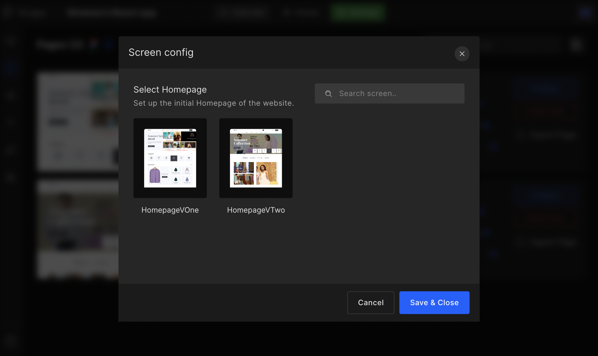
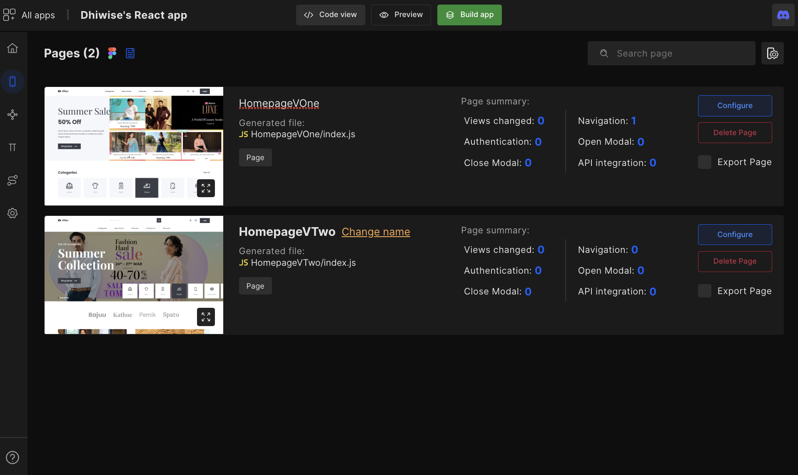
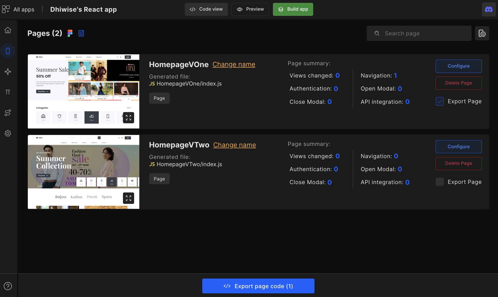
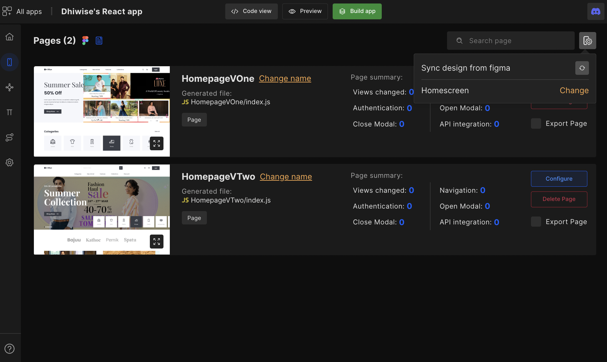
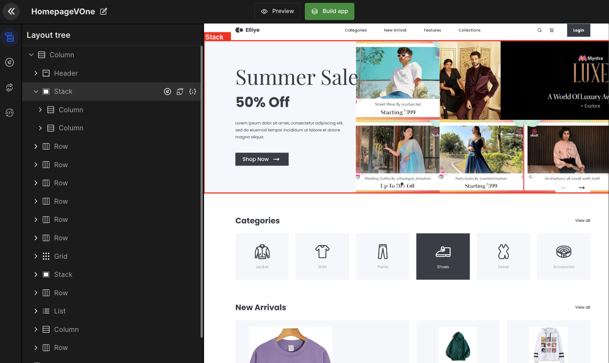

# Edit and Configure Pages

This document explains the features and function of the pages.

## **What is Pages?**

The Pages is the core of the React web app. In pages, developers can customize UI components like changing text to button, or map out actions like navigation to different pages, and setting up Google authentication.

### Introduction to pages - Configure components

Files fetched from Figma are displayed in pages. 

:::info
It might take a few minutes to fetch details of your Figma file on pages when creating a new app.
:::

### Set homepage 

The home screen is the first screen that appears when the app launches. They prepare the ground for your application while giving your app enough time to load.

#### **Step 1:** 
On the page list, click on the Settings ⚙️ available in the right corner.

#### **Step 2:** 
There you will have an option to set your **Homescreen**. Simply click on <code className="primary">Change</code> beside the **Homescreen** option and a dialog box will appear wherein you need to select a home page from the screens listed and click on <code className="primary">Save & Close</code> to save the selected page as your app’s Home screen.

### Change name 

Set an appropriate name for your page for better code readability. 

### Export page

The Export page allows you to generate the code for only selected pages. This way you can quickly get the UI code of your design and integrate it into your existing project. 

## **How to sync and refresh Figma design?**

The complete Figma design is available on Pages. However, if any changes are made to the original Figma file in the Figma account. Then developers need to click on the refresh icon to update those changes.

Upon refresh, the design in DhiWise is resynced with the design in Figma. However, any integrated actions are lost for the pages which were updated.

:::info
For example, if originally the page had a back slider component, but the updated design removed the slider component, then naturally the integrated action is removed as well.
:::

## **Configure components**

Most of your app development tasks happen in the page **configure** option, in which you get options such as <a href="/docs/react/change-view">change view</a> and <a href="/docs/react/create-action">create action</a>.

## **Layout tree**

The Layout tree identifies the webpage component type and structure e.g. In the below image, we have a section on the webpage that shows "Best Deals". The structure & components of this section are identified as **Column > List > Row > View > Column > Text > Text**

The components we detect are:

`Row | Column | Stack | Text | Image | Button | List | Grid | Line | Input | FloatingInput | CheckBox |  Radio | RatingBar | SelectBox | TextArea | Datepicker | Image | Switch | GoogleMap | PagerIndicator | Slider | RadioGroup | FloatingButton`

If you feel the detected component type is incorrect, then with <a href="/docs/react/change-view">"Change view"</a> you can change that component type into the correct one. For reference read  

 
 

Got a question? [**Ask here**](https://discord.com/invite/rFMnCG5MZ7).

