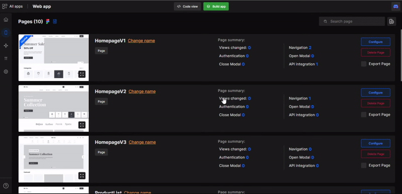
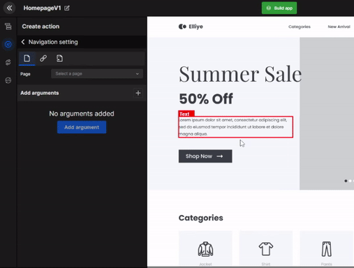
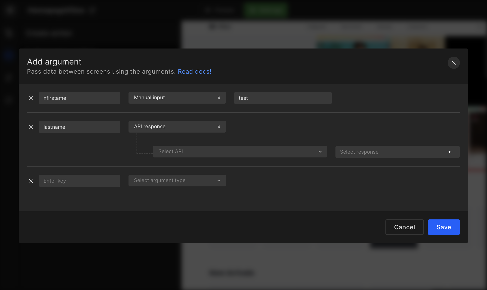
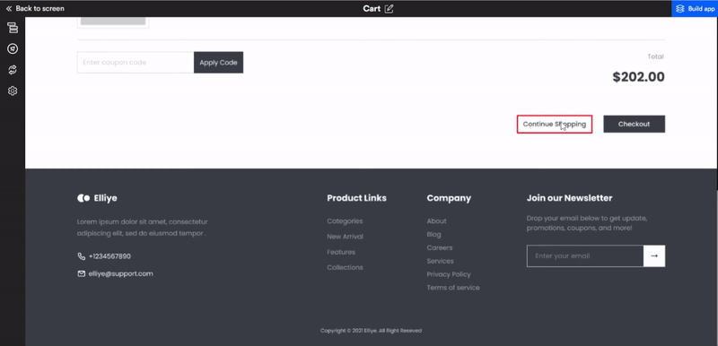

# Navigation

Navigation makes applications more interactive, which helps users navigate in, out, and across the app. Add such navigations to your React app in few simple steps:

## **Add Navigation**

:::tip Example
For example, navigate from one page to another, navigate to a different website, or navigate to the page with the select ID option
:::





| Type | Description |
| --- | --- |
| **Page Navigation** | Navigate to a specifically selected page from the application’s page list |
| **Link Navigation** | Provide an external link and navigate to it |
| **Section Navigation** | Navigate to a specifically selected section of the page |

## **Navigation argument**

While setting up navigation action, you can also pass the data from the current page to the page you are navigating to via API response, Navigation argument, & constant files. 

- **API response**: If your current page has API integrated which is receiving data in response that you can share that data to the page you're navigating to via API response. 

- **Navigation argument**: If the current page already has Navigation argument set up. Then you can pass that same data to the page you're navigating to.

- **Constant**: If you have added constant files, then you can pass the constant data to the page you are navigating to.


<!--  -->


## **Back navigation**

Navigate back to the previously visited pages of your application using back navigation.

:::tip Example
For example in the below gif we are configuring a button to take us to the previous page.
:::



#### Generated code snippet for Back Navigation

```js
import React from "react";
import { useNavigate } from "react-router-dom";
import { Text } from "components/Text";

const Page = () => {
  const navigate = useNavigate();
  const handleBackNavigation1 = () => navigate(-1);
  return (
    <>
      <Button
        className="common-pointer font-black text-center lg:text-fs26 xl:text-fs30 2xl:text-fs34 3xl:text-fs41 text-fs46 text-gray_900"
        
        onClick={handleBackNavigation1}
      >{`1200`}</Button>
    </>
  );
};

export default Page;
```


#### Generated code snippet for URL Navigation

```js
import React from "react";
import { Text } from "components/Text";

const Page = () => {
  const handleNavigate2 = () => {
    const win = window.open("https://www.google.com", "_blank");
    win.focus();
  };

  return (
    <>
      <Button
        className="common-pointer font-black text-center lg:text-fs26 xl:text-fs30 2xl:text-fs34 3xl:text-fs41 text-fs46 text-gray_900"
        
        onClick={handleNavigate2}
      >{`84`}</Button>
    </>
  );
};

export default Page;
```

#### Generated code snippet for Section Navigation

```js
//Util.js
export const handleSectionNavigation = (id) => {
  const element = document.getElementById(id);
  const offset = 45;
  const bodyRect = document.body.getBoundingClientRect().top;
  const elementRect = element?.getBoundingClientRect().top ?? 0;
  const elementPosition = elementRect - bodyRect;
  const offsetPosition = elementPosition - offset;

  window.scrollTo({
    top: offsetPosition,
    behavior: "smooth",
  });
};

//Page.js
import React from "react";
import { handleSectionNavigation } from "util";

import { Text } from "components/Text";

const Page = () => {
  return (
    <>
      <Image
        src="img_logo.svg"
        className="lg:h-[13px] xl:h-[15px] 2xl:h-[17px] 3xl:h-[20px] h-[22px] xl:my-[10px] 2xl:my-[11px] 3xl:my-[13px] my-[15px] lg:my-[8px] object-contain w-[11%]"
        id="block1"
        alt="logo"
      />
      <Button
        className="common-pointer font-black text-center lg:text-fs26 xl:text-fs30 2xl:text-fs34 3xl:text-fs41 text-fs46 text-gray_900"

        onClick={() => handleSectionNavigation("block1")}
      >{`16`}</Button>
    </>
  );
};

export default Page;

```

#### Generated code snippet for Page Navigation

```js
import React from "react";

import { useNavigate } from "react-router-dom";
import { Button } from "components/Button";

const Page = () => {
  const navigate = useNavigate();
  const handleNavigate3 = () => navigate("/aboutus");
  return (
    <>
      <Button
        className="bg-gradient2  p-[1px] rounded-radius4 w-[40%]"
  
        onClick={handleNavigate3}
      >
        <div className="common-pointer bg-white_A700 border-solid font-bold lg:py-[10px] xl:py-[12px] 2xl:py-[13px] 3xl:py-[16px] py-[18px] rounded-radius4 text-center xl:text-fs10 2xl:text-fs12 3xl:text-fs14 text-fs16 lg:text-fs9 text-red_500 tracking-ls1">{`About us`}</div>
      </Button>
    </>
  );
};

export default Page;
```


<br/>
<br/>

Got a question? [**Ask here**](https://discord.com/invite/rFMnCG5MZ7).
