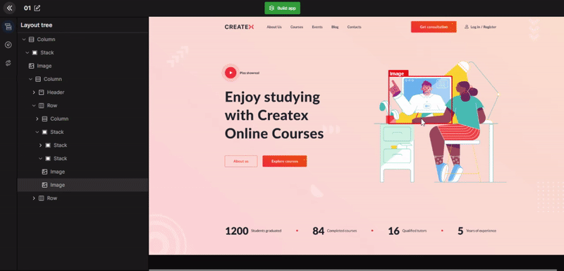

# Open Modal

Set up open modal action to webpage components

A model is any type of box that is displayed on top of your page. To integrate a modal design on your page use the open modal action. 

:::tip Example
On many sites especially on blogs or news sites we get a pop up display that ask us to input our email to sign up for newsletters and such. 
:::

1. Select button component
2. Select Create Action
3. Pick the open modal page

:::info
The open model design should be present in Figma.
:::




#### Generated code snippet

```js
import React from "react";
import ModalModal from "modals/Modal";
import { Button } from "components/Button";

const Page = () => {
  const [isOpenModalModal, setModalModal] = React.useState(false);
  const handleOpenModalModal = () => {
    setModalModal(true);
  };
  const handleCloseModalModal = () => {
    setModalModal(false);
  };

  return (
    <>
      <Button
        className="common-pointer bg-gradient3  border-bw font-bold lg:ml-[14px] xl:ml-[16px] 2xl:ml-[18px] 3xl:ml-[21px] ml-[24px] lg:px-[20px] xl:px-[23px] 2xl:px-[26px] 3xl:px-[31px] px-[35px] lg:py-[10px] xl:py-[12px] 2xl:py-[13px] 3xl:py-[16px] py-[18px] rounded-radius4 text-center xl:text-fs10 2xl:text-fs12 3xl:text-fs14 text-fs16 lg:text-fs9 text-white_A700 tracking-ls1 w-[54%]"
        onClick={handleOpenModalModal}
      >{`Explore courses`}</Button>

      {isOpenModalModal ? (
        <ModalModal
          isOpen={isOpenModalModal}
          onRequestClose={handleCloseModalModal}
        />
      ) : null}
    </>
  );
};

export default Page;
```