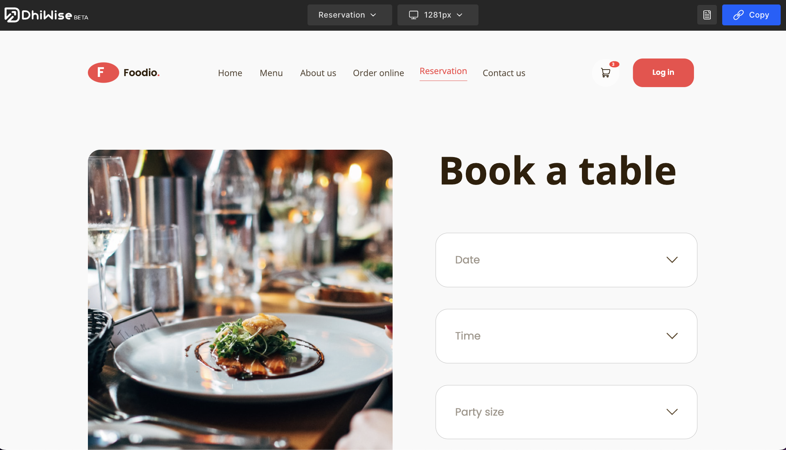

# Preview App

Preview your complete React app design right here to see your app’s generated design results and make changes priorly again to get your design results more accurately.

As you are done with your React app design setup or want to check out the design results of screens, follow the below steps;

#### Step 1:
Go to the pages list, and click on `Preview` button.

#### Step 2:
As you click on it, it will start to build your design code, within a few minutes it will show you a page where you can check or preview your app design, as shown below;

:::info
Switch between different screen resolutions easily, and check how it fits on every screen.
:::

On the Preview page, you can switch between different pages and preview them live here and check each screen’s UI easily.

## Shareable Preview

Easily share the generated preview with your teams for your React app in DhiWise, by simply **copying** the generated link from here in the top right corner.

  

Got a question? [**Ask here**](https://discord.com/invite/rFMnCG5MZ7).