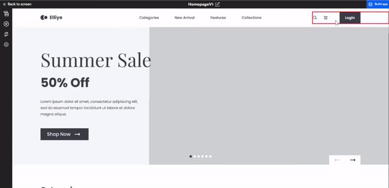

# Social Authentication


Social media authentication allows users to access the app without going through the tedious process of account registration. When a you choose a specific social media for login on the login page, you will be redirected to the login page of that social media, and with the help of that credentials you will be able to login into the app.

Set up social authentication for login and similar actions on your webpage.

Select the **UI component > Create Action > Authentication** 

The pop-up shows integration for social authentication. You can integrate Google authentication with a single click.



#### Generated code snippet


```js
import { GoogleOAuthProvider } from "@react-oauth/google";
import Routes from "./Routes";

function App() {
  return (
    <GoogleOAuthProvider clientId={process.env.REACT_APP_GOOGLE_CLIENT_ID}>
      <Routes />
    </GoogleOAuthProvider>
  );
}

```

```js
import React from "react";
import { useGoogleLogin } from "react-google-login";
import { Button } from "components/Button";

const Page = () => {
  const googleSignIn = useGoogleLogin({
    onSuccess: (res) => {
      console.log("res", res);
      alert("Login successfull. 😍");
    },
    onFailure: (err) => {
      alert(err?.details ?? "Failed to login. 😢");
    },
  });
    clientId: process.env.REACT_APP_GOOGLE_CLIENT_ID,
    accessType: "offline",
    cookiePolicy: "single_host_origin",
  });

  return (
    <>
      <Button
        className="common-pointer bg-gradient3  font-bold lg:ml-[14px] xl:ml-[16px] 2xl:ml-[18px] 3xl:ml-[21px] ml-[24px] lg:py-[10px] xl:py-[12px] 2xl:py-[13px] 3xl:py-[16px] py-[18px] rounded-radius4 text-center xl:text-fs10 2xl:text-fs12 3xl:text-fs14 text-fs16 lg:text-fs9 text-white_A700 tracking-ls1 w-[54%]"

        onClick={googleSignIn}
      >{`Explore courses`}</Button>
    </>
  );
};

export default Page;
```

<br/>
<br/>

Got a question? [**Ask here**](https://discord.com/invite/rFMnCG5MZ7).