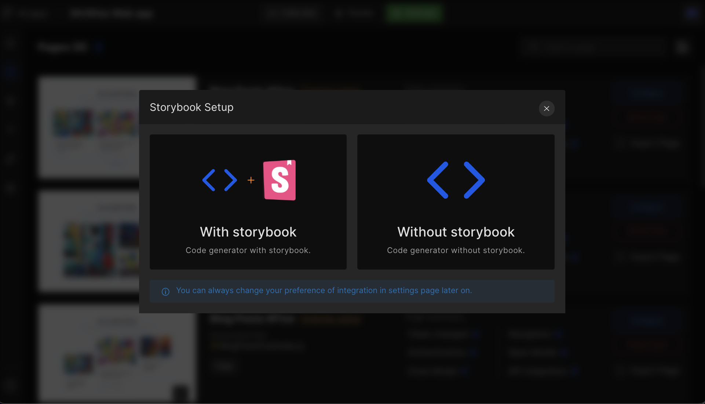
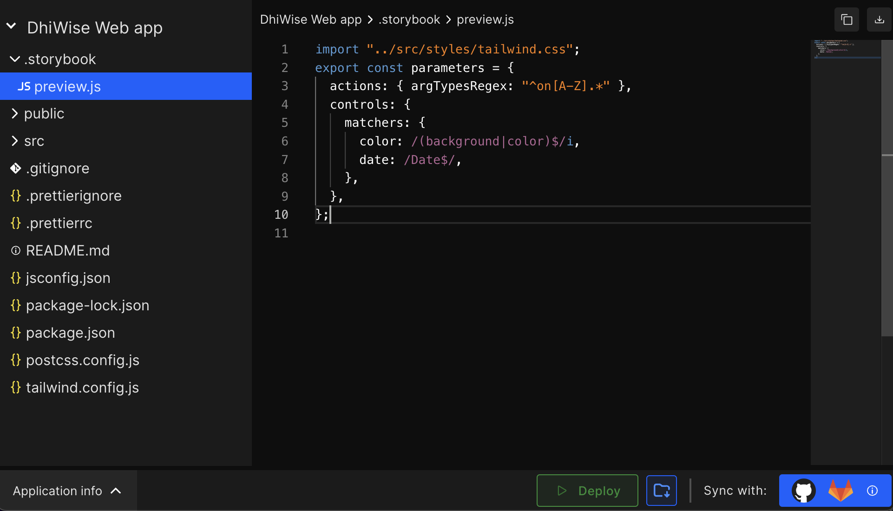
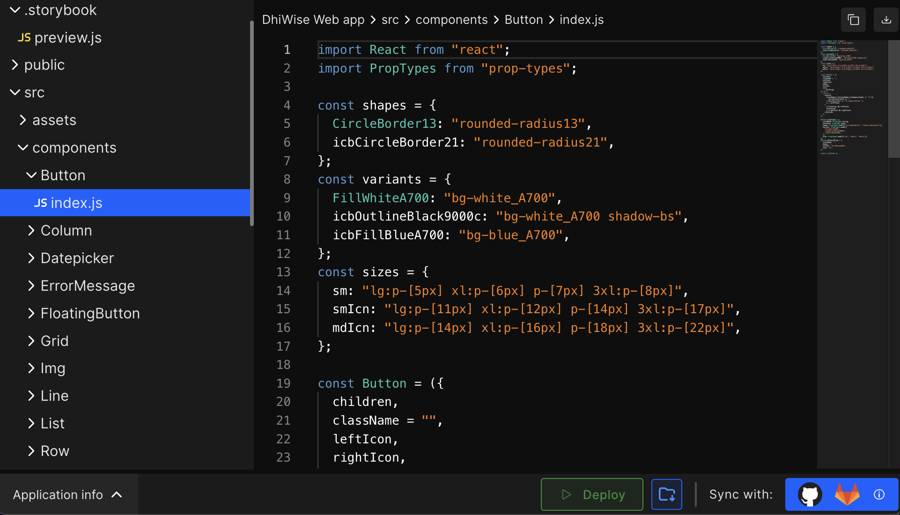

# Storybook Integration

<a href="https://storybook.js.org/docs/ember/get-started/introduction">Storybook</a> creates an interface where you can visualise your React app’s components easily and play with them by modifying its properties and making changes for better design.

 
 

:::info
Supported Components for Storybook: 

Input

Radio

Button

- LeftIconButton

- RightIconButton

Checkbox

SelectArea

TextArea
:::

#### **Step 1:** 
<a href="/docs/react/intro#create-an-application">Create a react app</a> using DhiWise.

#### **Step 2:** 
Once your app is setup, click on `Build App`.

#### **Step 3:** 
A dialog box will appear for **Storybook Setup**, there are two options: 

1. **With storybook**: Code generator with Storybook
2. **Without storybook**: Code generator without Storybook

#### **Step 4:** 
Click on `With storybook` to integrate Storybook into your application. Once you click there, your project will start to build.

<!--  -->

#### **Step 5:**  
Once your application is built, download your code.

#### **Step 6:** 
To install and initialize dependencies, run the below command:

    npx storybook init

#### **Step 7:** 
To run Storybook use the following command:

    npm run storybook

#### **Step 8:** 
As you run your code,

Here you can see a list of common components of your application.

Easily configure the **Actions**, **Controls**, and **Interactions** on a button, and also modify them from **Canvas** area.

You can see in detail the properties description from **Docs** area.

At this stage, you have successfully integrated Storybook into your React app.