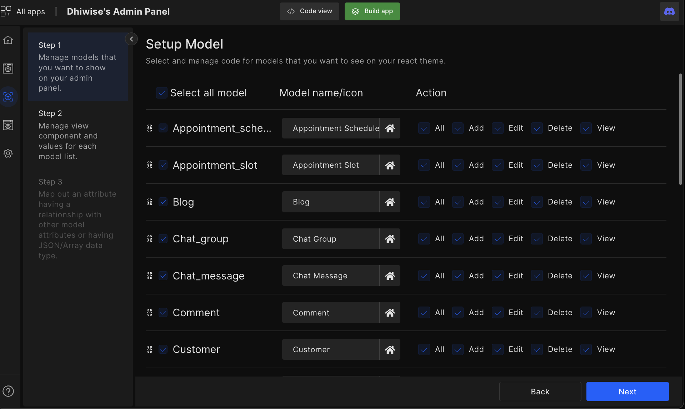
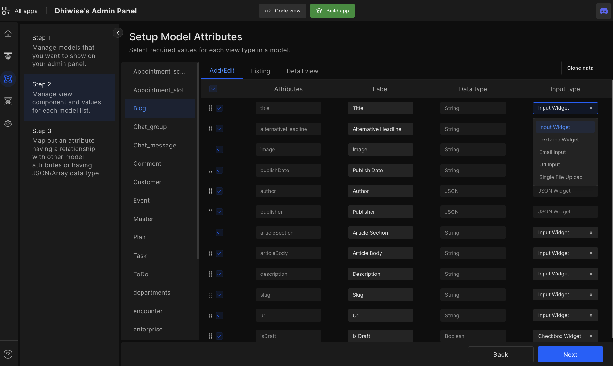
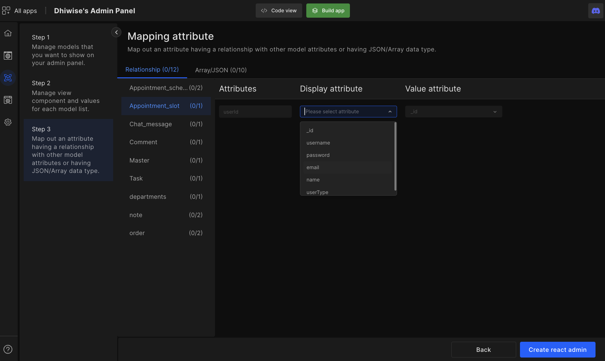

# Configure Model

Select models (from the auto-populated backend models) to showcase on your React admin panel, as well as configure CRUD operations for those models. Furthermore, configure model attributes, and how the model attributes should look. Also, link model attributes to other models according to its requirements. 

## Step 1: Showcase models

Select which models to show on your admin panel and configure their CRUD operations, as well as set up custom action icons.

## Step 2 - Set up model attributes

Select the attributes to display on React admin panel for each model & select action. For example, select which attributes to display in detail view or add/edit form. 

A model can have several attributes with different data types but depending on the view type you have the functionality to choose the required attributes input widget (form components). 

Developers will get view type options such as add/edit, listing, and detail view to your model list.

- <e className="hightlight">Add/Edit</e>

    Configure attributes, labels, data type, input type (form components), and read-only. In input type, you can select which form component you want to input such as input widget, text area widget, email input, URL input, radio button, check box, etc.

- <e className="hightlight">Listing</e>

    In listings, you can label the way your data is shown. You can configure attributes, tables, and data types. Additionally, you have the option of search and sorting. To set up specific attributes, for searching and sorting.

- <e className="hightlight">Detail view</e>

    Select attributes you want to show in detail view with label customization feature.

- <e className="hightlight">Clone data</e>

    Clone the data attribute configuration you have already set in any action then replicate it in other actions.  

## Step 3 - Configure relationship among attributes/ Array & JSON

<h4><e className="hightlight">Relationship</e></h4>

If developers have mapped out relations between models in their Node.js application those same models will be available in step 3 to configure those model relations (attributes projection) in the React admin panel as well. 

:::tip Example
Product model attributes will have a relation with the purchase order model. 
:::

<h4><e className="hightlight">Array/JSON</e></h4>

If developers have selected JSON or array data type in their node.js models the Array/JSON option will appear. In the JSON ARRAY feature, developers can define sub-attributes. 

:::tip Example
A customer can have a single attribute such as “address” with JSON data type then sub-attributes will be like "addressLine1", "addressLine2", "city", "pincode".
:::

Therefore, configure which model attributes are required to connect with other models. Also, define sub-attributes, for Node.js model attributes containing data type JSON or ARRAY

:::info
Once all the configurations are complete developers can click on `Built app` and get the code within a few seconds. 
:::

 
 

Got a question? [**Ask here**](https://discord.com/invite/rFMnCG5MZ7).