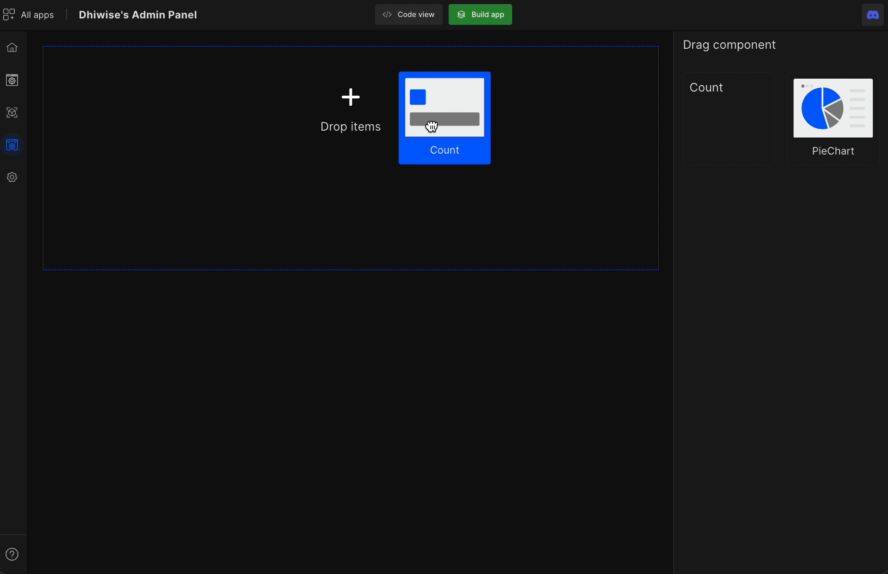
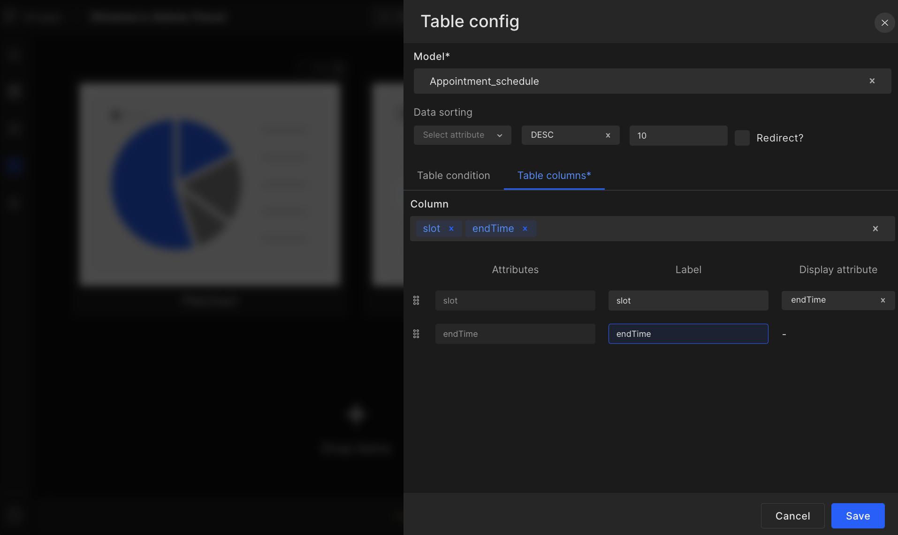
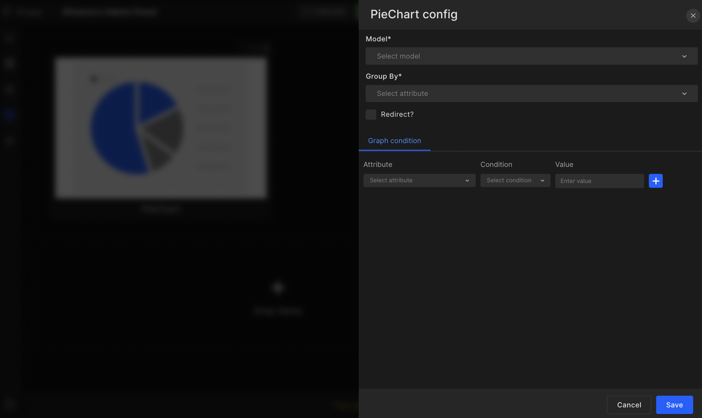

# Dashboard Setup

The Dashboard setup feature will help developers easily set up their React admin panel dashboard with visual analytics of their data. 

The dashboard widgets we provide are <a href="#count">Count</a>, <a href="#table">Table</a>,  and <a href="#pie-chart">Pie chart</a>.

## **Count**

### Model 

Select the model you wish to showcase.

### Redirect

This will allow redirection to a different model when the user clicks on the widget.

### Count condition

Count condition helps developers filter out the essential information easily and shows accurate data on the dashboard.

<table>
    <tr>
        <th>Attribute</th>
        <th>Condition</th>
        <th>Value</th>
    </tr>
    <tr>
        <td>email</td>
        <td>Contains</td>
        <td>gmail</td>
    </tr>
    <tr>
        <td>mobileNumber</td>
        <td>Includes</td>
        <td>+91</td>
    </tr>
    <tr>
        <td>country</td>
        <td>Not includes</td>
        <td>India</td>
    </tr>
    <tr>
        <td>city</td>
        <td>Equals</td>
        <td>Delhi</td>
    </tr>
    <tr>
        <td>userType</td>
        <td>Not equals</td>
        <td>2</td>
    </tr>
    <tr>
        <td>cartItems</td>
        <td>Greater than equal to</td>
        <td>4</td>
    </tr>
    <tr>
        <td>productsBought</td>
        <td>Less than equal to</td>
        <td>1</td>
    </tr>
    <tr>
        <td>loggedInCount</td>
        <td>Greater than</td>
        <td>5</td>
    </tr>
    <tr>
        <td>searchedForProduct</td>
        <td>Less than</td>
        <td>5</td>
    </tr>
</table>

## **Table**

### Model
Select the model you wish to showcase.

### Data sorting
Select attribute, ascending or descending, number of models.

### Redirect
This will allow redirection to a different model when the user clicks on the widget.

### Table condition
Table condition helps developers filter out the essential information easily and shows accurate data on the dashboard.

<table>
    <tr>
        <th>Attribute</th>
        <th>Condition</th>
        <th>Value</th>
    </tr>
    <tr>
        <td>email</td>
        <td>Contains</td>
        <td>gmail</td>
    </tr>
    <tr>
        <td>mobileNumber</td>
        <td>Includes</td>
        <td>+91</td>
    </tr>
    <tr>
        <td>country</td>
        <td>Not includes</td>
        <td>India</td>
    </tr>
    <tr>
        <td>city</td>
        <td>Equals</td>
        <td>Delhi</td>
    </tr>
    <tr>
        <td>userType</td>
        <td>Not equals</td>
        <td>8</td>
    </tr>
    <tr>
        <td>cartItems</td>
        <td>Greater than equal to</td>
        <td>3</td>
    </tr>
    <tr>
        <td>productsBought</td>
        <td>Less than equal to</td>
        <td>4</td>
    </tr>
    <tr>
        <td>loggedInCount</td>
        <td>Greater than</td>
        <td>2</td>
    </tr>
    <tr>
        <td>searchedForProduct</td>
        <td>Less than</td>
        <td>6</td>
    </tr>
</table>

### Table sorting

Select the column you want to show in the table widget.

## **Pie chart**

### Model
Select the model you wish to showcase.

### Group By
Select the model attribute you wish to show as a group by in the piechart

### Redirect
This will allow redirection to a different model when the user clicks on the widget.

### Graph condition
Graph condition helps developers filter out the essential information easily and shows accurate data on the dashboard.

<table>
    <tr>
        <th>Attribute</th>
        <th>Condition</th>
        <th>Value</th>
    </tr>
    <tr>
        <td>email</td>
        <td>Contains</td>
        <td>gmail</td>
    </tr>
    <tr>
        <td>mobileNumber</td>
        <td>Includes</td>
        <td>+91</td>
    </tr>
    <tr>
        <td>country</td>
        <td>Not includes</td>
        <td>India</td>
    </tr>
    <tr>
        <td>city</td>
        <td>Equals</td>
        <td>Delhi</td>
    </tr>
    <tr>
        <td>userType</td>
        <td>Not equals</td>
        <td>4</td>
    </tr>
    <tr>
        <td>cartItems</td>
        <td>Greater than equal to</td>
        <td>3</td>
    </tr>
    <tr>
        <td>productsBought</td>
        <td>Less than equal to</td>
        <td>5</td>
    </tr>
    <tr>
        <td>loggedInCount</td>
        <td>Greater than</td>
        <td>2</td>
    </tr>
    <tr>
        <td>searchedForProduct</td>
        <td>Less than</td>
        <td>6</td>
    </tr>
</table>

 
 

Got a question? [**Ask here**](https://discord.com/invite/rFMnCG5MZ7).