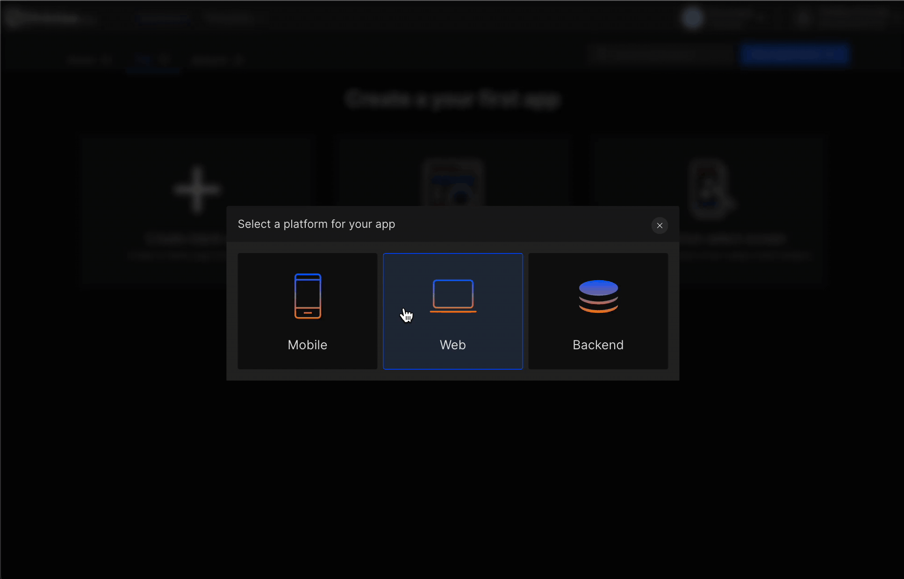
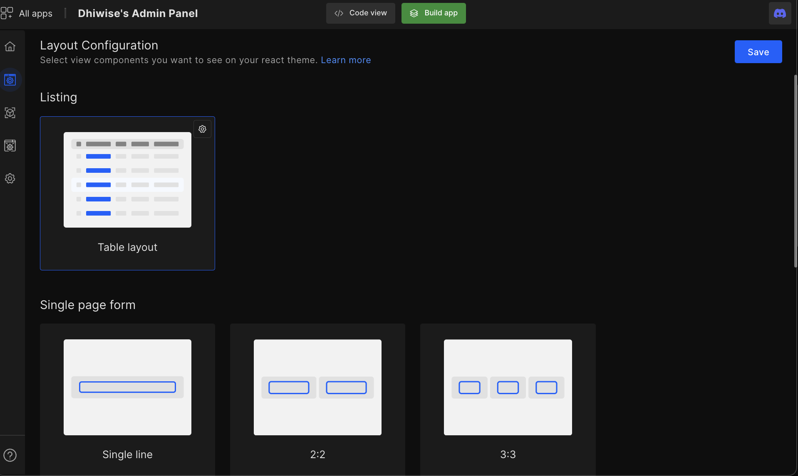
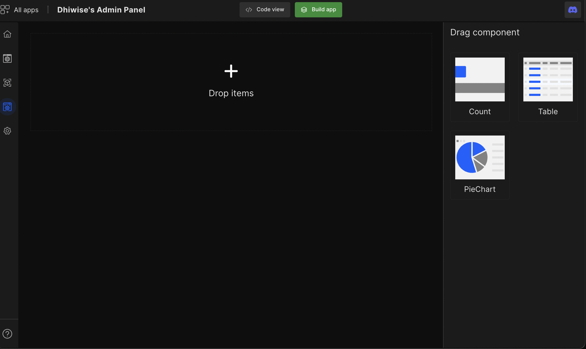
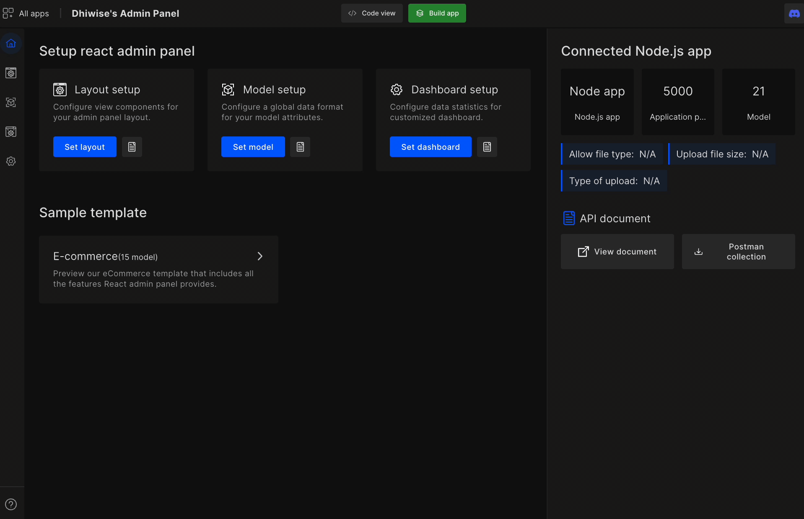
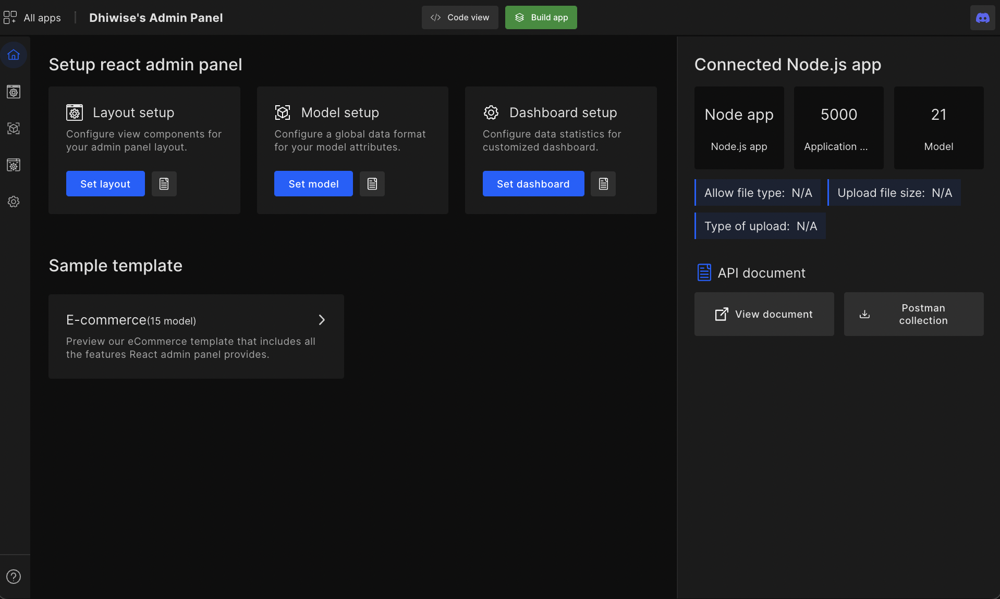

# Build React Admin Panel

In a world full of libraries and paradoxes of choice for the right package, we provide developers an efficient solution to get started with pre-built features such as configuring model-wise tables, custom actions, mapping attributes, and more.

DhiWise's React admin panel gives developers a solid foundation, code consistency, & production-ready code in minutes.  

:::caution
To create a React admin panel on DhiWise, developers first need to have;

- Node.js application already built on DhiWise.

- Backend application created with MongoDB & MySQL database.
:::

## Create a new app

#### **Step 1:** 
Select platform as **Web** to create a React admin panel app. Next, enter your `Application name` and select `Technology` from the drop-down as **React admin panel** also, select a **Node.js** application from dropdown.

:::caution
To access disabled node applications, please add the platform "**admin**" in platform configuration of disabled node applications.
:::

#### **Step 2:**
Click <code className="primary">Create a new app</code>

React admin panel provides the below features:

## Layout setup

Configure how your React theme looks and certain features from the different view component selection we provide. <a href="/docs/reactadminpanel/layout-configuration">Learn more</a>

## Model setup

Developers will get access to all their Node.js models which they can configure to add into their React admin panel. Developers can configure models, their attributes, and model relations along with CRUD operations to fully develop your React admin panel in 3 simple steps. <a href="/docs/reactadminpanel/configure-model">Learn more</a>

## Dashboard setup

The Dashboard setup feature will help developers easily set up their React admin panel dashboard with visual analytics of their data. <a href="/docs/reactadminpanel/dashboard-setup">Learn more</a>

## Sample template

Check out our sample template which showcases all the default selections we provide to get a clear idea of the features we provide. 

## API documentation 

API documentation will provide developers a clear idea of all the APIs used in the selected Node.js application along with the postman collection file.

 
 

Got a question? [**Ask here**](https://discord.com/invite/rFMnCG5MZ7).