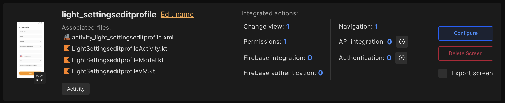
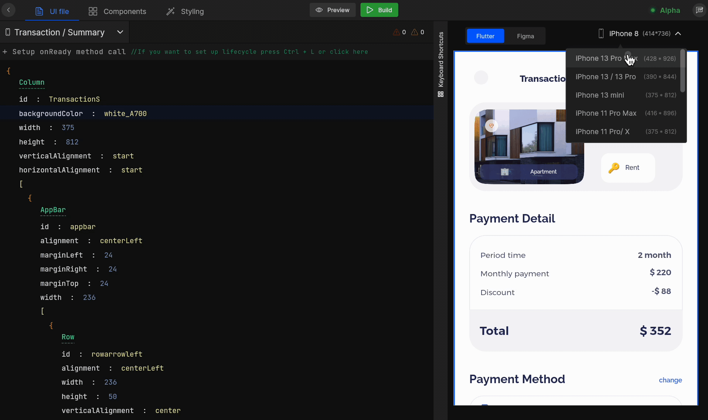
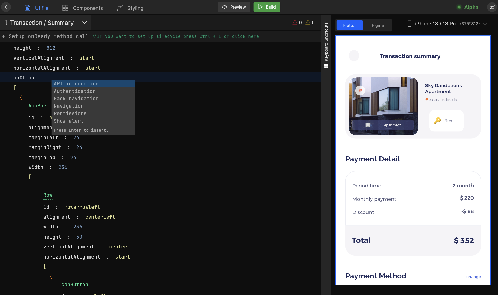

import Tabs from '@theme/Tabs';
import TabItem from '@theme/TabItem';
import navigationImg from "./img/navigation.png"
import editor from "./img/smart-editor-screen.png"
import ApiIntegrationImg from "./img/APIIntegration.png"
import AppConstantImg from "./img/Constant.png" 
import ChangeWidget from "./img/ChangeComponent.png"
import FileUploadImg from "./img/FileUpload.png"
import FirebaseImg from "./img/FileUpload.png" 
import OpenDrawerImg from "./img/Drawer.png"
import PermissionImg from "./img/Permission.png"
import HyperLinkImg from "./img/Link.png" 
import AlertImg from "./img/Alert.png"
import SocialAuthImg from "./img/Authentication.png"

# Getting Started

**Smart Editor** helps you customise your application UI, with live design changes right here. Continue below to know how it helps in **customising** your UI design and get familiar with Smart Editor.

## **How it works?**

To open the Smart editor, select a screen from the screen list for which you want to customise UI, and click on `Configure` option.

## **Get familiar with Smart Editor**

This section will help you to get the Smart Editor interface and will guide you on how it helps to customise your complete app UI.

  

    

   A complete creative space with easy-to-go <b>declarative syntax</b> where you can customise your UI by editing, modifying, deleting, or grouping components. Also, add properties, and modify their value easily. Also, it allows you to set up the below action right from here with <code>onClick</code> property;
    

    
1

  

  

    

    Switch and manage easily between <b>UI file</b>, <b>Components</b>, and <b>Styling</b> support added to your entire application.
    

    
2

  

  

    

Navigate between application screens, select the one and make changes to it.
    

    
3

  

  

    

   Easily preview your applications using <code className="accept">Preview</code> and once your application is set up with everything, <code className="accept">Build</code> it and obtain the source code.
    

    
4

  

  

    

  This area shows information about errors and warnings related to that screen while you make your changes, prior you build your application. So you can improve your design and make it correct while you are customising that screen and get accurate design results.
    

    
5

  

  

    

   Changes you make to your screen, like modifying a component or removing a component are previewed here immediately, without the need to rebuild the application.
    

    
6

  

  

    

   Keyboard shortcuts increase your productivity for most of the features like grouping components together, ungrouping the components, deleting a component, changing a component, and many more. Memorizing these hotkeys can help you stay more productive by keeping your hands on the keyboard.
    

    
7

  

  

    

   Preview your screen design on your desired viewport size by selecting the one right here.
    

    
8

  

  

 

### 1. Editor Area
A complete creative space with easy-to-go <b>declarative syntax</b> where you can customise your UI by editing, modifying, deleting, or grouping components. Also, add properties, and modify their value easily. Also, it allows you to set up the below action right from here with <code>onClick</code> property;

<!-- typewhite  -->

<Tabs groupId="tabs">
  <TabItem value="Flutter" label="Flutter">
   

      <a className="Card" href="/docs/flutter/api-integration">
        
        <h4>API Integration</h4>
      </a>
      <a className="Card"  href="/docs/flutter/add-app-constants">
        
        <h4>App Constants</h4>
      </a>
      <a className="Card" href="/docs/flutter/change-widget">
        
        <h4>Change Widget</h4>
      </a>
      <a className="Card" href="/docs/flutter/file-upload">
        
        <h4>File Upload</h4>
      </a>
      <a className="Card" href="/docs/flutter/firebase-integration">
        
        <h4>Firebase Integration</h4>
      </a>
      <a className="Card" href="/docs/flutter/navigation">
        
        <h4>Navigation</h4>
      </a>
      <a className="Card" href="/docs/flutter/open-drawer">
        
        <h4>Open Drawer</h4>
      </a>
      <a className="Card" href="/docs/flutter/add-permissions">
        
        <h4>Permissions</h4>
      </a>
      <a className="Card" href="/docs/flutter/set-hyperlink">
        
        <h4>Set Hyperlink</h4>
      </a>
      <a className="Card" href="/docs/flutter/show-alert">
        
        <h4>Show Alert</h4>
      </a>
      <a className="Card" href="/docs/flutter/social-authentication">
        
        <h4>Social Authentication</h4>
      </a>
      <a className="Card" href="/docs/flutter/supabase-integration">
        
        <h4>Supabase Integration</h4>
      </a>
    

  </TabItem>
  <TabItem value="React" label="React">
   

      <a className="Card" href='/docs/react/api-integration'>
        
        <h4>API Integration</h4>
      </a>
      <a className="Card" href="/docs/react/change-view">
        
        <h4>Change Component</h4>
      </a>
      <a className="Card" href="/docs/react/edit-and-configure-pages">
        
        <h4>Edit and Configure Web Pages</h4>
      </a>
      <a className="Card" href='/docs/react/navigation'>
        
        <h4>Navigation</h4>
      </a>
      <a className="Card" href="/docs/react/open-modal">
        
        <h4>Open modal</h4>
      </a>
      <a className="Card" href="/docs/react/social-authentication">
        
        <h4>Social Authentication</h4>
      </a>
    

  </TabItem>
</Tabs>

#### **Setup app lifecycle** 

Setup how your application state should change by managing the app lifecycle of your app. <a href="/docs/flutter/manage-app-lifecycle">Learn more</a>.
 

### 2. Editor Tab Bar 
Switch and manage easily between <b>UI file</b>, <b>Components</b>, and <b>Styling</b> support added to your entire application.

#### **Styling:**
Styling is used to manage the theme of an app. Styling includes the app’s colors, fonts and images used in it. In Styling, you can add, edit or view all your app’s colors, fonts and images easily.
#### **Color:**

- On this screen, the colors used in your application are listed for both 🌞️ **Light theme** and 🌙 **Dark theme**.
- Also, you can search colors by color name.
- To Edit color, click on 📝 icon and update it as per your requirements.
- On click of **Create new color style**, You can quickly create new colors by providing the color a name and selecting a color from color picker, or by providing the color code for both the 🌞️ Light and 🌙 Dark themes. You can also change the opacity of the color and click on `Submit`.

#### **Fonts:**

- On this screen, the fonts used in your application are listed along **Weight**, **Style** and **Type**.
- Also, you can search fonts by font name.
- To Edit font, click on `Replace font`.
- On click of **Upload custom fonts**, You can quickly create new font by providing font file and enter **font family** and select **weight** for font and click on <code className="primary">Submit</code>.

#### **Assets:**

- On this screen, the assets used in your application are listed along with Type.
- Also, you can search for an image.
- To Edit asset, click on `Replace Image`.
- On click of **Add new assets**, you can quickly create new asset by providing Asset name and uploading asset file and click on `Submit`.

 

### 3. Screen Navigation Bar
Navigate between application screens, select the one and make changes to it.

#### **Refresh:**
Open the Screen Navigation Bar on the topmost left corner, and Click on the 🔄 icon in the screen selection dropdown to apply the latest Figma design changes to the old design in DhiWise.

- Once you click it, you will get a list of screens available in your Figma design. Also, the last synced screens will be displayed for your convenience.
- Also all the new screens added in Figma file will be displayed right here, `New added in Figma` and `Deleted in Figma` with different colors, to refer easily. The screens can even be filtered based on status.
<!-- typeyellow -->
- Next, you need to select the screens you wish to resync. You will be prompted to `Accept` or `Discard` such changes. Then, click `Next`.
- Once you sync your Figma with DhiWise, if there are any conflicts it will detect them, a popup will appear that you can choose to `Skip` or use to `Resolve` the issues.
- If you go with the `Skip`, you will be redirected to the Editor page, and screens with conflict will be highlighted in **Red**.
- If you click on `Resolve`, conflicts for the particular screen will be displayed, where you can resolve them, and then clicking on `Apply` will add new changes to the design.

 

### 4. Build or Preview
Easily preview your applications using <code className="accept">Preview</code> and once your application is set up with everything, <code className="accept">Build</code> it and obtain the source code.

<!-- typewhite -->

#### **Build**

- After changes, **Build** your app and get your app code within a single click on the `Build` button which is above in the Smart Editor in the center, you can also download it or sync code directly with GitHub or GitLab.

#### **Preview**

- You can also **Preview** your complete app’s screens and see the generated UI output with the `Preview` option, you can also switch between all the app screens from here.

 

### 5. Errors and Warnings
This area shows information about errors and warnings related to that screen while you make your changes, prior you build your application. So you can improve your design and make it correct while you are customising that screen and get accurate design results.

 

### 6. Live Rendering
Changes you make to your screen, like modifying a component or removing a component are previewed here immediately, without the need to rebuild the application.

#### Easy design switch
Easily switch between Figma screen and Editor preview for a screen, which would be easy for you to see what changes are made, while you modify that screen.

 

### 7. Keyboard Shortcuts
Keyboard shortcuts increase your productivity for most of the features like grouping components together, ungrouping the components, deleting a component, changing a component, and many more. Memorizing these hotkeys can help you stay more productive by keeping your hands on the keyboard.

:::caution Note

If your keyboard has a layout other than English, DhiWise may not detect all the shortcuts correctly.

:::

<Tabs groupId="tabs">
  <TabItem value="Window" label="Window" default>
      <table className="keyboard-shortcute">
        <tbody>
          <tr>
            <th>Shortcut</th>
            <th>Action</th>
          </tr>
          <tr>
            <td>
            <kbd>Ctrl + K</kbd>
            </td>
            <td>Change widget</td>
          </tr>
          <tr>
            <td>
            <kbd>Ctrl + G</kbd></td>
            <td>Group widget</td>
          </tr>
          <tr>
            <td>
            <kbd>Ctrl + Shift + G</kbd></td>
            <td>Ungroup Widget</td>
          </tr>
          <tr>
            <td>
            <kbd>Ctrl + S</kbd></td>
            <td>Save changes</td>
          </tr>
          <tr>
            <td>
            <kbd>Ctrl + Space</kbd></td>
            <td>Quick suggestions</td>
          </tr>
          <tr>
            <td><kbd>Delete</kbd></td>
            <td>Delete widget</td>
          </tr>
        </tbody>
      </table>
  </TabItem>
  <TabItem value="Mac" label="Mac">
      <table className="keyboard-shortcute">
        <tbody>
          <tr>
            <th>Shortcut</th>
            <th>Action</th>
          </tr>
          <tr>
            <td>
            <kbd>⌘ + K</kbd>
            </td>
            <td>Change widget</td>
          </tr>
          <tr>
            <td>
            <kbd>⌘ + G</kbd></td>
            <td>Group widget</td>
          </tr>
          <tr>
            <td>
            <kbd>⌘ + Shift + G</kbd></td>
            <td>Ungroup Widget</td>
          </tr>
          <tr>
            <td>
            <kbd>⌘ + S</kbd></td>
            <td>Save changes</td>
          </tr>
          <tr>
            <td>
            <kbd>⌘ + Space</kbd></td>
            <td>Quick suggestions</td>
          </tr>
          <tr>
            <td><kbd>Delete</kbd></td>
            <td>Delete widget</td>
          </tr>
        </tbody>
      </table>
  </TabItem>
</Tabs>

 

### 8. Viewport Selection
Preview your screen design on your desired viewport size by selecting the one right here.

<!-- - `src/pages/index.js` → `localhost:3000/`
- `src/pages/foo.md` → `localhost:3000/foo`
- `src/pages/foo/bar.js` → `localhost:3000/foo/bar` -->

## **Smart Editor in Action**

Here is a go-through of how you can start working with Smart Editor. From changing components to API integration all can be done with ease. Watch out for a quick video to learn about how to use Smart Editor.

  

Got a question? [**Ask here**](https://discord.com/invite/rFMnCG5MZ7).